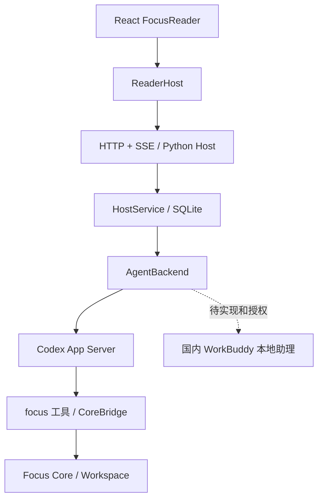

# FOCUS 项目结构与网页 Agent 接入

核实于 2026-09-17，基于当前工作区（包含已有未提交改动）。

## 代码地图

| 路径 | 职责 |
| --- | --- |
| `.agents/core/` | Source Library、Reading Plan/Chunk/Record、Cursor、Notes/Topic 的领域实现与文件存储 |
| `.agents/skills/` | Parser、focus-map、focus-read、paper2blog 工作流；也含 UI 开发辅助 Skills |
| `ui/packages/reader-contracts/` | `ReaderHost` 操作契约和 `ReadingWindow`，隔离宿主协议 |
| `ui/packages/reader-ui/` | React Reader、阅读/聊天流、附件、Agent 选择、审批和执行记录 |
| `ui/apps/standalone/` | Vite 网页入口与 HTTP/SSE Adapter；`prototypes/` 为保留的设计实验 |
| `host/server.py` | 同源静态页面、HTTP/SSE、登录、上传、来源图片 |
| `host/service.py` | 单 Workspace 任务编排、切换、停止、审批、流式快照和会话归档 |
| `host/backends/` | 统一事件词汇与 Codex App Server；国内 WorkBuddy 为不可用状态，CodeBuddy 实验未注册 |
| `host/runtime.py` | 固定版本 Codex stdio JSON-RPC 进程传输 |
| `host/core_bridge.py` | Agent 的 `focus` 工具与浏览器可读 Core 投影 |
| `host/store.py` | SQLite 保存聊天、运行状态、请求去重、provider 恢复键；与阅读资产分开 |
| `workspace/` | 私人来源、解析产物、阅读进度及笔记；不属于公开代码 |
| `tests/`、UI `*.test.tsx` | Core、Host 协议、UI 交互与边界验证 |
| `docs/`、`research/`、`.scratch/` | 使用说明/决策、调研、忽略提交的任务与实验 |

## 请求链路

普通消息由后台 Agent 执行工具，事件进入统一队列，再通过 SSE 更新聊天、执行记录、审批。
浏览器提交审批后由 adapter 回复对应运行时。停止调用原生中断，并保留已有超时终止保护。
后台执行发生在 Host 机器。Codex 使用独立 thread；用户选定的国内 WorkBuddy 本地助理尚未接通。

## 切换规则

输入框上方已提供 Agent 选择器和 `POST /reader/backend`。目前仅 Codex 可用；国内 WorkBuddy 显示待接入，不能选择。以下为通过模拟测试的通用切换机制。
运行、等待审批和停止期间禁止切换；依赖预检查失败不会丢掉当前会话。
成功切换会归档旧聊天、创建新 Host session，并清空 runtime resume key；不会把旧厂商会话 ID 传给另一家。
归档保存在 Host SQLite，目前没有归档浏览 UI。未发送草稿会随新会话清空。
材料、Reading Plan、Notes 与 Cursor 原样保留，可点“继续上次阅读”恢复显示。
旧页面携带旧 sessionId 发来的消息会被拒绝。

选择持久化，重启默认恢复；显式 `--backend` / `FOCUS_BACKEND` 可覆盖。
`FOCUS_CODEX_MODEL`、`FOCUS_WORKBUDDY_MODEL` 分别配置模型；`--model` 只覆盖启动时选中的后端。
代理按子进程环境传递，避免后续不同运行时互相污染代理配置。

## 部署边界

见 [启动说明](FOCUS_Web_Agent_Quickstart.md)。部署单元是构建后的网页 + Python Host + 两个运行时，
不是单独上传静态页面。服务器持久挂载 Workspace、Host data 及受保护的运行时登录目录。
当前服务面向一个可信使用者、一个 Workspace；没有多租户隔离或每用户账号体系。
远程访问需要 `FOCUS_HOST_TOKEN`、准确的 `FOCUS_PUBLIC_ORIGIN` 和 HTTPS 反向代理；SSE 不应缓冲。
国内 WorkBuddy 的本地助理执行在用户 PC；本地审批与停止边界待核实，不能沿用 CodeBuddy SDK 的假设。
需要主机隔离时在受限容器/专用运行账户运行。

## 本次验证

- Python 全量 100 项：99 通过；一项现有 Skill 枚举约束失败（要求仅五个，仓库已含另十二个开发 Skills）。未修改该测试或删除用户 Skills。
- 前端 20 项通过；TypeScript 检查与 Vite production build 通过。
- Codex 0.154.0，复用 ChatGPT CLI 登录：真实 `focus catalog` 完成、真实文件工具创建隔离工作区 `agent-smoke.txt`，内容经宿主文件系统读取核实；同一 runtime 会话恢复也执行成功。
- CodeBuddy SDK 0.3.258 实验返回 Authentication required；用户随后明确不是 CodeBuddy，故该实验不计为 WorkBuddy 验证。国内 WorkBuddy 未注册应用，未进行真实 API 任务调用。
- 修正版本在 `http://127.0.0.1:8875/` 使用独立测试 Workspace 预览，浏览器确认国内 WorkBuddy 选项禁用、Codex 可选。原 `8765` 进程仍是旧后端：自动审批拒绝终止/重启操作，需用户自行重启才能加载新后端；不要使用旧进程的 WorkBuddy 选项。远程服务器部署未执行（尚无部署目标）。
- 模拟协议测试覆盖切换/恢复键隔离、忙碌拒绝、失败不改状态、旧 session 拒绝、审批、中断及 Core 写入；不将其计为 WorkBuddy 真机通过。
