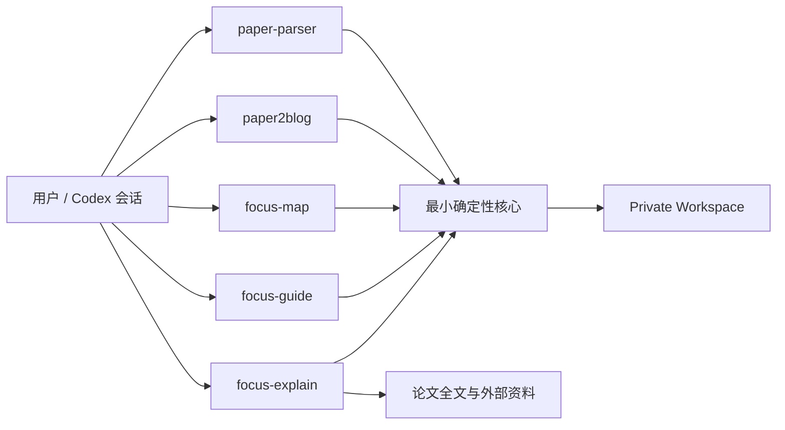

# FOCUS Phase 1：Skills 快速跑通与阅读工作台原型

> 状态：Accepted Design，等待实现
>
> 决策日期：2026-08-24
>
> 适用范围：DeepSeek Harness 接入之前
> 产品语义：[FOCUS Reading Workspace](../CONTEXT.md)

## 1. 目标

Phase 1 用三个显式 Skill 验证一个最小、真实可用的论文阅读闭环：

```text
按专题组织论文
→ paper-parser 直接生成 Workspace 内的 Parser Bundle
→ focus-map 建立稳定 Reading Plan
→ focus-guide 逐片段翻译、记录备注并推进 Reading Cursor
→ 新会话恢复同一论文、计划和片段
→ focus-explain 独立检索并持久化解释问答
→ paper2blog 独立生成粗读文章
```

Phase 1 是可推翻的交互与数据原型，不承诺其文件格式直接成为 Phase 2 的兼容协议。它只保留防止状态被模型任意改写所需的最小确定性核心。

## 2. 产品边界

FOCUS 是专题驱动的论文阅读工作台，不是学习评估系统。

系统管理：

- Topic 与 Paper；
- Parser Bundle 与 Blog Output；
- Reading Plan、Chunk Record、Plan Glossary；
- 当前 Paper、Plan、Chunk 和 Explanation Session 指针；
- 翻译缓存、Reader Note、Discussion Note、Emphasis Note；
- 原始 Explanation Session 问答。

系统不管理：

- Scout、Study、Mastery 或其他阅读模式；
- “理解确认”、checkpoint、测试、复测或答辩；
- 用户能力、薄弱项、等级、画像或评价结论；
- 认知证据、掌握状态或长期保持；
- 自动论文推荐、跨论文知识图、向量库或 RAG；
- 多用户、协作权限、并发写入或复杂迁移。

“继续”必须由当前 Skill 上下文解释：

- `focus-guide` 中是 Continue Reading，只推进 Reading Cursor；
- `focus-explain` 中是 Continue Explanation，只追加解释问答。

内部命令和持久化字段不得使用无上下文的裸 `continue`。

## 3. 公开能力

Phase 1 保留五个相互独立的公开能力：

| Skill | 职责 | 明确不做 |
|---|---|---|
| `paper-parser` | 经逐篇授权调用 MinerU 托管精准解析 API，直接生成规范 Parser Bundle 并注册 Paper | 阅读规划、翻译、解释、Blog |
| `paper2blog` | 从 Parser Bundle 生成独立中文技术 Blog | 修改任何 Reading 数据 |
| `focus-map` | 为已注册 Paper 创建或重新初始化 Reading Plan | 解析 PDF、翻译片段、推进游标 |
| `focus-guide` | 展示当前片段、缓存翻译、记录 Notes、推进 Reading Cursor | 创建 Explanation Session、评价用户 |
| `focus-explain` | 检索论文全文及必要外部资料，创建或恢复解释问答 | 修改 Reading Cursor、生成用户评价 |

不设置统一公共路由 Skill。用户显式进入 `focus-map`、`focus-guide` 或 `focus-explain`，避免“继续”在带读与解释之间产生隐藏路由。

## 4. 架构



边界如下：

- Skills 负责自然语言理解、切片建议、翻译、问答和解释；
- 确定性核心负责目录分配、文件校验、指针更新和受控字段写入；
- Workspace 是本地论文资产和私人阅读数据的权威；
- Phase 1 假设每篇 Paper 同时只有一个写入者；
- 不实现锁、revision、事务日志、事件回放或自动恢复框架。

## 5. Workspace

```text
workspace/
├── pointers.yaml
├── topics/
│   └── configurable-systolic-array/
│       └── topic.yaml
└── papers/
    └── flexsa/
        ├── paper.yaml
        ├── parser-bundle/
        │   ├── source.pdf
        │   ├── paper.md
        │   ├── images/
        │   ├── metadata.json
        │   └── validation.json
        ├── blog/
        └── reading/
            ├── plans/
            │   ├── plan-001/
            │   │   ├── chunks.jsonl
            │   │   └── glossary.tsv
            │   └── plan-002/
            └── explanations/
                ├── explanation-001.jsonl
                └── explanation-002.jsonl
```

整个 `/workspace/` 必须被 Git 忽略。它包含可能受版权保护的论文、翻译、用户备注和私人问答，不得进入公开仓库。

## 6. Workspace 指针

Workspace 使用一个根级 `pointers.yaml`：

```yaml
current_paper_id: flexsa
papers:
  flexsa:
    current_plan_id: plan-002
    current_chunk_id: chunk-018
    current_explanation_id: explanation-003
  another-paper:
    current_plan_id: plan-001
    current_chunk_id: null
    current_explanation_id: null
```

语义：

- `current_paper_id` 选择默认活动 Paper；
- `current_plan_id` 选择该 Paper 当前 Reading Plan；
- `current_chunk_id` 是唯一 Reading Cursor；
- `current_explanation_id` 只是当前 Explanation Session 文件引用，不是解释进度；
- 切换 Paper 不清除其他 Paper 的三个指针；
- 未初始化：`current_plan_id` 与 `current_chunk_id` 都为 `null`；
- 已读完：保留 `current_plan_id`，将 `current_chunk_id` 设为 `null`。

## 7. Topic 与 Paper

### 7.1 Topic

`topic.yaml` 只保存最小展示数据：

```yaml
topic_id: configurable-systolic-array
title: 可配置脉动阵列
description: 可选的专题说明
papers:
  - flexsa
  - another-paper
```

列表顺序就是展示顺序。同一 Paper 可以属于多个 Topic，Topic 不复制论文资产。

### 7.2 Paper

`paper.yaml`：

```yaml
paper_id: flexsa
title: "FlexSA: Flexible Systolic Array Architecture"
topics:
  - configurable-systolic-array
```

Parser Bundle、Blog 和 Reading 路径由目录约定确定，不在 YAML 中重复。Paper 不保存阅读位置、哈希、标签或运行状态。

Paper ID 从标题生成可读 slug。若冲突，依次使用 `-002`、`-003`。ID 创建后不随标题改变。系统不自动判断两个 PDF 是否相同；用户明确指定现有 Paper 时才复用，否则分配新 ID。

## 8. Parser Bundle

`paper-parser` 经用户对该 PDF 的明确云端解析授权后运行，并直接在最终 Paper 目录生成唯一 Parser Bundle。它不导入外部 bundle，也不把临时路径登记为规范资产。

解析成功后才注册 Paper 与 Topic。失败时不留下活动 Paper 记录。已存在的 Parser Bundle 不覆盖；再次解析创建新的 Paper ID。

Phase 1 实施时必须从 `paper-parser` 删除所有内容哈希：

- 不计算 SHA-256；
- metadata 不保存 source hash；
- validation 不做哈希一致性检查；
- 远端任务名不依赖 hash；
- Paper、Plan 和 Chunk 身份也不依赖 hash。

最小结构门：

- `source.pdf` 存在；
- `paper.md` 非空；
- `images/` 包含 `paper.md` 实际引用的本地图片；
- `metadata.json.parser=mineru-precision-api`；
- `validation.json.ok=true`。

Parser Bundle 成功生成后按约定不可变。Phase 1 不进行 PDF/Markdown 页级比对、公式抽检或全文覆盖评分。

MinerU Token 仍只能来自 `MINERU_API_TOKEN` 环境变量或被 Git 忽略的 `.env`，不得进入聊天、命令行、日志或产物。异步解析可使用非敏感 `batch_id` 恢复。

## 9. Blog Output

`paper2blog` 读取规范 Parser Bundle，写入同一 Paper 下的 `blog/`：

```text
papers/<paper_id>/
├── parser-bundle/
├── blog/
└── reading/
```

Blog 可以保留自身需要的 Evidence Map、Markdown、HTML 和 assets，但不得读取或修改：

- `pointers.yaml`；
- Reading Plan 或 Plan Glossary；
- Chunk Record、翻译或 Notes；
- Explanation Session。

## 10. Reading Plan 与 Chunk Record

每次初始化创建顺序编号目录 `plan-001/`、`plan-002/`。普通重复调用复用当前计划；只有用户显式要求重新初始化才创建新计划并切换指针。旧计划原样保留。

每个计划包含：

- `chunks.jsonl`：该计划全部 Chunk Record；
- `glossary.tsv`：该计划固定术语译法。

Chunk ID 在每个计划内从 `chunk-001` 重新编号，完整身份是 `plan_id + chunk_id`。

`chunks.jsonl` 每行：

```json
{"chunk_id":"chunk-001","index":1,"section_path":["Abstract"],"source_lines":[1,14],"images":[],"translation":null,"notes":[]}
```

字段约束：

- `index` 严格递增；
- `source_lines` 是不可变 `paper.md` 的闭区间；
- `images` 保存绑定图片相对路径；
- `translation` 初始为 `null`，首次带读后缓存中文翻译；
- `notes` 只包含三种 Note；
- 不保存时间、哈希、revision、状态、评价或理解结论。

Notes：

```json
{"kind":"reader","content":"用户明确要求保存的原始备注"}
{"kind":"discussion","content":"对 Guide 内简短问答的中性概括"}
{"kind":"emphasis","content":"用户明确标记为重要的观点"}
```

Discussion Note 可以记录“用户询问 X 是否意味着 Y；回复确认并补充 Z”，但不能写“用户理解了 X”“用户仍不理解 Y”。Emphasis Note 只能由用户显式触发，模型不得主动判定重要性。

确定性核心更新翻译或追加 Note 时，读取当前计划的完整 `chunks.jsonl`，按 `chunk_id` 找到唯一一行并安全替换文件。它不创建行版本或事件日志。

## 11. Plan Glossary 与重新翻译

`glossary.tsv` 只保存原文术语与固定中文译法。用户明确指定新译法时，`focus-guide` 更新当前计划的 glossary；新译法只影响尚未缓存的片段。

用户显式要求重新翻译当前片段时，只替换该 Chunk 的 `translation`。来源定位、Notes 和所有指针保持不变。不保留多个翻译版本，也不自动重译其他 Chunk。

## 12. `focus-map`

输入：

- 已注册 `paper_id`；
- 可选阅读范围，例如是否包含附录或参考文献；
- 可选显式“重新初始化”。

行为：

1. 校验规范 Parser Bundle；
2. 读取完整 `paper.md` 与图片清单；
3. 以章节、段落、公式、表格、caption 和图片引用为边界建立连续片段；
4. 用 `source_lines`、章节路径和图片路径写入 Chunk Record；
5. 生成 Plan Glossary；
6. 普通调用发现当前计划时直接复用；
7. 重新初始化时创建下一个计划目录，不删除旧计划；
8. 只有新目录完整生成后才切换当前计划和第一个 Chunk 指针。

`focus-map` 不生成翻译、不展示第一片、不创建解释会话。

## 13. `focus-guide`

无操作参数时：

- 读取当前 Paper、Plan 和 Chunk；
- 缓存不存在时生成当前片段中文翻译；
- 展示章节、位置和翻译；
- 有绑定图片时展示原图和原文 caption，但不主动生成图片机制解释。

用户操作：

| 用户行为 | 结果 |
|---|---|
| 继续阅读 | 游标推进一个 Chunk，然后展示新 Chunk |
| 简短追问 | 直接回答，追加中性 Discussion Note，游标不动 |
| 明确保存备注 | 追加 Reader Note，游标不动 |
| 明确强调观点 | 追加 Emphasis Note，游标不动 |
| 修正术语 | 更新当前 Plan Glossary，游标不动 |
| 重新翻译 | 替换当前翻译缓存，游标不动 |

在最后一个 Chunk 上继续时，将 `current_chunk_id` 设为 `null` 并返回已完成。完成后再次调用只报告完成，不自动重置。

只有 Continue Reading 可以移动 Reading Cursor。普通问题不会自动唤起 `focus-explain`。

## 14. `focus-explain`

新建 Explanation Session 时分配 `explanation-001.jsonl`、`explanation-002.jsonl`，并更新当前解释引用。同一解释上下文中的追问和 Continue Explanation 追加到当前文件；显式新建创建下一个文件；显式指定旧 ID 可以恢复。

每行严格只有：

```json
{"role":"user","content":"为什么这里要重新排列 ACT？"}
{"role":"assistant","content":"这里的重新排列是为了……"}
```

不保存时间、Chunk ID、Paper ID、来源、模型、状态或评价。恢复旧解释时只使用该 JSONL 已保存的问答，不读取当前 Reading Cursor。若旧问答不足以恢复原始上下文，用户需要补充原文或新建解释。

解释检索采用以下内部纪律：

1. 按标题、关键词和正文引用扫描完整 `paper.md`；
2. 按需读取相关段落、公式、表格、图片和 caption；
3. 必要时研究外部一手资料；
4. 形成自己的综合解释后直接回复用户；
5. 不强制展示来源分类、引用清单或检索过程；
6. 不建立来源账本或检索审计；
7. 无法形成可靠解释时直接拒绝，不猜测。

Phase 1 不建设全文向量库或 RAG。Explanation Session 的任何操作都不得读取后再写回 Reading Cursor。

## 15. 最小确定性核心

核心只需要支持：

- 初始化 Workspace；
- 创建 Topic、分配 Paper ID、注册解析成功的 Paper；
- 读取和更新 `pointers.yaml`；
- 创建新 Plan 目录；
- 读取当前 Chunk；
- 写翻译、追加 Note、更新 glossary；
- Continue Reading；
- 创建、选择和追加 Explanation Session；
- 返回小型 JSON 成功或失败结果。

错误格式：

```json
{"ok":false,"error":"PLAN_NOT_FOUND","message":"当前论文尚未初始化阅读计划"}
```

只需覆盖 Workspace、Topic、Paper、Bundle、Plan、Chunk、Explanation 不存在和 Reading Completed。Skills 不解析面向人的调试日志。

基本写入顺序：

- 新计划完整生成后才切换指针；
- 找到下一个 Chunk 后才推进游标；
- 翻译或 Note 写入失败时保留原行；
- Explanation 回复失败时可以保留已写入的用户消息，后续继续补回答。

这些是正常写入顺序，不扩展成锁、revision、事务日志或自动恢复系统。

## 16. 公开与私人数据

公开 Git 允许：

- Skills 和确定性脚本；
- README、架构文档、ADR 和研究说明；
- 不含真实论文或用户内容的合成 fixtures；
- Parser 与 Blog 工具测试。

公开 Git 禁止：

- `/workspace/`；
- PDF、Parser Bundle、Blog 产物；
- 翻译、Notes、Explanation Sessions 和指针；
- `.env`、Token、签名 URL 或其他凭据；
- 真实用户阅读数据。

## 17. 实施顺序

### M0：删除旧产品语义

- 在旧发布提交 `f776d8a` 创建 `paper-companion-v0.2` tag；
- 删除 `ask-paper`、`paper-map`、`paper-study`、`paper-assess`；
- 删除旧状态内核、旧状态测试和旧学习模型文档；
- 不创建 `legacy/`；
- 重写 README 和活动设计文档。

### M1：调整现有工具

- 从 `paper-parser` 删除所有哈希逻辑和旧 `paper-map`/学习状态引用；
- 让解析成功直接创建 Paper、Topic 引用和最终 Parser Bundle；
- 将 `paper2blog` 输出固定到 Paper 下的 `blog/`；
- 保留 MinerU 授权、Token 和异步 resume 边界。

### M2：最小核心与 Workspace

- 实现 Topic、Paper、指针和简单 JSON 错误；
- 实现版本化 Plan 目录、Chunk Record 和 Plan Glossary；
- 实现受控 JSONL 行更新与 Explanation 追加。

### M3：三个公开 Skill

- 实现 `focus-map`；
- 实现 `focus-guide`；
- 实现 `focus-explain`；
- 使用一篇真实论文完成跨会话试读。

## 18. Phase 1 完成标准

只有同时满足以下场景，原型才算跑通：

1. PDF 经授权直接解析并注册进一个 Topic；
2. `focus-map` 生成第一份计划；
3. `focus-guide` 缓存翻译并记录三类 Notes；
4. 只有 Continue Reading 推进 Reading Cursor；
5. 新会话恢复同一 Paper、Plan 和 Chunk；
6. `focus-explain` 检索全文及必要外部资料，持久化并恢复问答；
7. 解释前后 Reading Cursor 完全一致；
8. 重新初始化生成新计划目录，旧翻译和 Notes 原样保留；
9. `paper2blog` 生成同级 `blog/` 且不修改 Reading；
10. 运行时不出现用户评价、用户画像、内容哈希或旧学习 Skill；
11. `/workspace/` 不进入公开 Git。

## 19. 当前实现状态

本文是已接受的目标设计。M0 已完成：旧 Paper Companion 运行时代码和学习测试已退出活动主线，并由 `paper-companion-v0.2` Git tag 保留历史。Reading Workspace 的后续运行时切片仍待实现；当前仅保留 `paper-parser` 与 `paper2blog`。

现行规范以本文、根级 `CONTEXT.md` 和相关 ADR 为准。
