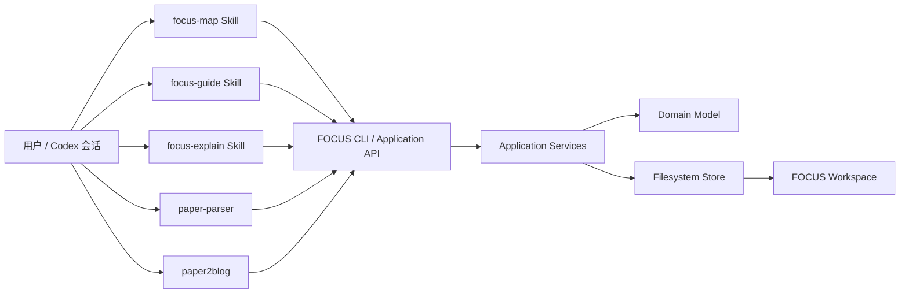

# FOCUS 第一阶段：Skills 快速跑通与系统骨架方案

> 状态：Revised Proposed（已按 2026-08-23 讨论结论校正）
>
> 基线日期：2026-08-23
>
> 适用范围：DeepSeek Harness 正式接入之前
>
> 当前仓库基线：`kongxiangcong/focus@e8d8a2ad377459810e4b0749baa66cc3dc952bdb`

## 1. 文档目的

第一阶段不建设完整 Web 工作台，只验证论文阅读工作台最核心的闭环是否真实可用：

```text
专题组织论文
→ paper-parser 生成 Markdown、表格和图片
→ paper2blog 提供粗读
→ 对感兴趣论文初始化精读
→ 按稳定片段逐段翻译
→ 用户确认后推进阅读游标
→ 新会话恢复同一进度
→ 遇到疑问时开启独立解读会话
```

第一阶段同时建立未来系统需要的数据目录、领域边界、命令接口和测试基线。Skills 只是临时交互适配器，不能成为状态格式和业务规则的所有者。

## 2. 核心决策

> **新主线不定义阅读模式或用户学习状态。** 活动 Schema、CLI、Skills 和 DSH 接口只允许使用专题、论文、精读计划、片段、阅读游标、操作事件和会话引用等工作台领域对象。历史实现中的流程和状态不得进入新接口。

### 2.1 产品定位

FOCUS 定位为“专题驱动的论文阅读工作台”。系统只管理论文资产、精读规划、阅读位置、用户操作和会话上下文，不评价用户。

系统只记录客观行为和阅读位置：

- 当前读到哪个片段；
- 哪些片段已由用户明确确认；
- 用户在哪个片段暂停、重译或提出问题；
- 当前论文是否完成精读初始化；
- 当前论文是否已读完规划范围。

系统不维护任何用户能力模型或学习评价状态，也不根据用户回答生成等级、薄弱项、画像或后续测试任务。

### 2.2 三个精读能力

第一阶段新增三个能力：

| 能力 | 形态 | 职责 |
|---|---|---|
| `focus-map` | 初始化 Skill + 应用服务 | 通读解析产物，生成稳定片段、图片绑定、轻量术语表和初始进度 |
| `focus-guide` | 主流程 Skill | 读取当前片段，翻译；有绑定图片时展示并解释；确认后推进游标 |
| `focus-explain` | 独立解释 Skill | 从当前内容和片段加载上下文，逐步解释用户指定问题，不修改阅读进度 |

已有能力继续保留：

| 能力 | 第一阶段定位 |
|---|---|
| `paper-parser` | 经用户明确授权后调用 MinerU 托管精准解析 API，生成唯一、可复用且已校验的 `parser-bundle/` |
| `paper2blog` | 从已验证的 `parser-bundle/` 先建立 Evidence Map，再生成 `blog.md` 和 `blog.html`；与精读状态相互独立 |

`paper-parser` 上传 PDF 前必须取得用户对该论文的明确云端解析授权。Token 只从 `MINERU_API_TOKEN` 环境变量或当前工作目录下被 Git 忽略的 `.env` 读取，不得进入聊天、命令行、日志或产物。解析是异步操作；超时或中断时保留非敏感 `batch_id`，通过 `resume` 继续而不重复上传。上传成功或任务创建成功不等于解析完成，只有 MinerU 返回 `done` 并形成一个通过校验的 `parser-bundle/` 才算完成。

唯一稳定的 `parser-bundle/` 包含字节一致的 `source.pdf`、`paper.md`、按正文首次引用顺序命名的 `images/image-001.*` 等图片、`metadata.json` 和 `validation.json`。下载 ZIP 与 raw extraction tree 只允许临时存在，规范化后丢弃。

`paper2blog` 要求 `validation.json.ok=true` 且 `metadata.json.parser=mineru-precision-api`。它先完成 `evidence-map.md`，再写 `blog.md` 并渲染 `blog.html`；Blog 工作区只消费 bundle 中的 Markdown、顺序图片、metadata 和 validation evidence，不复制也不读取 `source.pdf`。

不设置统一的论文学习路由 Skill。每个能力由用户显式触发，减少错误路由和功能漂移。

### 2.3 初始化与带读必须拆开

精读初始化是全文级任务，需要稳定决定：

- 章节顺序；
- 片段边界；
- 表格、公式、caption 的完整性；
- 图片与正文片段的绑定；
- 固定术语译法；
- 阅读范围。

带读是局部、重复任务，只消费已经安装的 Reading Plan。带读过程中不得自动重新切片、改变图片绑定或重建术语表。

因此：

> `focus-map` 生成静态精读定义；`focus-guide` 只读取该定义并推进动态游标。

### 2.4 带读以纯翻译为主

`focus-guide` 可以在内部读取章节标题、前一片段、图片 caption 和术语表，但正常输出保持克制：

```text
论文位置与进度

当前片段的中文翻译

仅当当前片段绑定论文图片时：
- 展示论文原图
- 解释图中的组件、箭头、坐标、图例以及正文/caption 明确表达的关系
```

默认不输出：

- 片段概括；
- 关键点；
- 关键术语列表；
- 论文评价；
- 外部观点；
- 主动生成的 Mermaid；
- 未经原文支持的推演。

### 2.5 “理解并继续”只是进度操作

用户点击或表达“理解了，继续”时，系统记录：

```text
用户确认当前片段，可以推进到下一片段。
```

它只表示用户允许系统推进阅读位置。内部统一使用 `chunk_confirmed`，不把确认动作映射成任何用户评价。

### 2.6 解读会话不拥有阅读游标

`focus-explain` 可以：

- 读取当前论文、当前片段、相邻上下文、相关图片和术语表；
- 逐步解释用户明确提出的问题；
- 根据用户反馈换表达、换例子或继续下一步；
- 按用户要求生成图示。

它不能：

- 确认当前片段；
- 推进、回退或重置阅读游标；
- 修改 Reading Plan；
- 修改术语表；
- 建立独立的理解状态机。

解释过程由当前会话历史承载。第一阶段不创建 `explanation-progress.yaml`。

## 3. 第一阶段范围

### 3.1 必须完成

1. 专题目录与论文目录管理。
2. 注册并复用 `paper-parser` 解析包。
3. 保持 `paper2blog` 独立可用。
4. 对单篇论文生成稳定精读计划。
5. 按计划逐片段翻译。
6. 绑定图片的片段支持原图展示和图片解释。
7. 用户确认后可靠推进进度。
8. 任意新会话可以恢复当前论文和当前片段。
9. 解读 Skill 可以加载当前片段上下文，但不能改变进度。
10. 所有状态写入通过确定性应用服务完成，不由 Skill 任意改 YAML/JSONL。

### 3.2 明确不做

- DeepSeek Harness 插件和 Web UI；
- 自动论文搜索、下载和推荐；
- 向量数据库、RAG、跨论文知识图；
- 用户能力评估、测试、复测和画像；
- Agent 主动总结每个片段；
- Agent 主动画 Mermaid；
- 自动评价论文质量；
- 多用户权限与远程协作；
- 复杂状态迁移、失效传播和事务恢复框架；
- 历史版本状态数据向新进度模型的自动转换。

## 4. 总体架构



架构约束：

- Skills 负责语言交互和模型生成；
- 应用服务负责用例、状态转移和权限边界；
- 领域模型定义稳定术语和数据结构；
- 文件存储负责读写、校验和原子替换；
- Workspace 是论文资产和阅读状态的本地权威；
- 后续 DSH 插件必须调用同一应用接口，而不是复制 Skill 逻辑。

## 5. 仓库组织方案

```text
focus/
├── README.md
├── pyproject.toml
├── docs/
│   ├── phase-1-skills-quickstart.md
│   └── phase-2-dsh-migration.md
│
├── schemas/
│   ├── workspace.schema.json
│   ├── topic.schema.json
│   ├── paper.schema.json
│   ├── reading-plan.schema.json
│   ├── reading-chunk.schema.json
│   ├── reading-progress.schema.json
│   └── reading-event.schema.json
│
├── src/focus/
│   ├── domain/
│   │   ├── ids.py
│   │   ├── models.py
│   │   ├── errors.py
│   │   └── ports.py
│   ├── application/
│   │   ├── workspace.py
│   │   ├── topics.py
│   │   ├── papers.py
│   │   ├── reading_init.py
│   │   ├── reading.py
│   │   └── explain_context.py
│   ├── infrastructure/
│   │   ├── fs_store.py
│   │   ├── jsonl_store.py
│   │   ├── markdown_blocks.py
│   │   └── parser_bundle.py
│   └── cli/
│       └── main.py
│
├── .agents/skills/
│   ├── paper-parser/
│   ├── paper2blog/
│   ├── focus-map/
│   ├── focus-guide/
│   └── focus-explain/
│
├── tests/
│   ├── unit/
│   ├── integration/
│   ├── contracts/
│   └── fixtures/
│
├── legacy/
│   └── paper-companion-v0.2/
│
└── workspace/                       # gitignored，用户数据
```

### 5.1 历史实现隔离

在新主线开发前，先为当前仓库创建冻结标签，并把现有论文学习主链路整体移动到 `legacy/paper-companion-v0.2/`。活动目录只保留本方案定义的五个能力和新系统核心；历史代码不参与 Skill 发现、运行时导入、状态读写或测试装配。

具体归档文件清单由一次性迁移脚本或 archive manifest 记录，不进入新系统的领域模型和公开方案。

## 6. Workspace 目录结构

```text
workspace/
├── workspace.yaml
├── topics/
│   ├── configurable-systolic-array-compiler/
│   │   └── topic.yaml
│   └── 3d-stacked-compiler/
│       └── topic.yaml
│
└── papers/
    └── FlexSA-Reconfigurable-Systolic-Array--9c31ad/
        ├── paper.yaml
        ├── parser-bundle/
        │   ├── source.pdf
        │   ├── paper.md
        │   ├── images/
        │   ├── metadata.json
        │   └── validation.json
        ├── outputs/
        │   └── blog/
        │       ├── paper.md
        │       ├── metadata.json
        │       ├── assets/
        │       ├── evidence-map.md
        │       ├── blog.md
        │       └── blog.html
        ├── reading/
        │   ├── plan.yaml
        │   ├── chunks.jsonl
        │   ├── glossary.tsv
        │   ├── progress.yaml
        │   └── events/
        │       └── 2026-08.jsonl
        └── notes/
```

### 6.1 目录命名

论文目录以可读论文标题为主体，并追加短哈希避免同名冲突：

```text
<safe-title>--<source-hash-prefix>
```

UI 和 Skill 对用户只显示正式标题，不要求用户操作哈希。

### 6.2 专题与论文的关系

专题通过 `paper_id` 和相对目录引用论文，不复制论文资产。同一论文可以属于多个专题。

```yaml
schema_version: 1
topic_id: configurable-systolic-array-compiler
title: 可配置脉动阵列编译器设计
description: 面向可重构脉动阵列的映射、切分、数据流和编译策略
papers:
  - paper_id: p-flexsa-9c31ad
    path: ../../papers/FlexSA-Reconfigurable-Systolic-Array--9c31ad
    tags: [architecture, mapping, systolic-array]
    order: 10
```

## 7. 数据权威与文件拆分

| 文件 | 类型 | 权威内容 | 是否频繁修改 |
|---|---|---|---|
| `parser-bundle/source.pdf` | 不可变来源 | 与用户授权上传的输入逐字节相同 | 否 |
| `parser-bundle/paper.md` | 静态来源 | MinerU 解析后的正文、公式和表格 | 否 |
| `parser-bundle/images/` | 静态来源 | 仅包含 `paper.md` 引用、按首次引用顺序重命名的论文图片 | 否 |
| `parser-bundle/metadata.json` | 静态来源 | 来源 hash 与 Parser/API provenance，不含凭据或签名 URL | 否 |
| `parser-bundle/validation.json` | 静态校验 | bundle 结构检查与 warning | 否 |
| `outputs/blog/evidence-map.md` | 静态解释产物 | Blog 主张、机制、图表和实验的来源映射 | 否 |
| `outputs/blog/blog.md` | 静态解释产物 | 来源忠实的中文技术博客正文 | 否 |
| `outputs/blog/blog.html` | 静态解释产物 | 从 `blog.md` 渲染并通过 freshness 检查的最终页面 | 否 |
| `reading/plan.yaml` | 静态定义 | 精读计划版本、来源指纹、阅读范围 | 否 |
| `reading/chunks.jsonl` | 静态定义 | 稳定片段顺序和来源区间 | 否 |
| `reading/glossary.tsv` | 轻量静态表 | 固定术语译法 | 少量人工修改 |
| `reading/progress.yaml` | 动态快照 | 当前阅读游标和待确认片段 | 是，但始终很小 |
| `reading/events/*.jsonl` | 追加历史 | 用户确认、暂停、重译、提问等客观操作 | 只追加 |

不建立独立“理解追踪表”。用户反馈进入事件日志，阅读位置进入进度快照，二者不混写。

## 8. 关键数据契约

### 8.1 `workspace.yaml`

```yaml
schema_version: 1
workspace_id: focus-local
language:
  source: en
  translation: zh-CN
paths:
  topics: topics
  papers: papers
reading_defaults:
  include_appendix: true
  include_references: false
  image_explanation: when-bound
```

### 8.2 `paper.yaml`

```yaml
schema_version: 1
paper_id: p-flexsa-9c31ad
title: FlexSA: Flexible Systolic Array Architecture
aliases: [FlexSA]
tags: [systolic-array, accelerator, compiler-mapping]
topic_refs:
  - configurable-systolic-array-compiler
source:
  pdf: parser-bundle/source.pdf
  sha256: <sha256>
parsed:
  markdown: parser-bundle/paper.md
  images: parser-bundle/images
  metadata: parser-bundle/metadata.json
  validation: parser-bundle/validation.json
outputs:
  blog: outputs/blog
reading:
  directory: reading
```

`paper.yaml` 不复制具体阅读进度。工作台状态由文件存在性和 `progress.yaml` 计算。

### 8.3 `reading/plan.yaml`

```yaml
schema_version: 1
paper_id: p-flexsa-9c31ad
plan_id: rp-001
created_at: 2026-08-23T16:00:00+08:00
source_fingerprint:
  markdown_sha256: <sha256>
  image_inventory_sha256: <sha256>
reading_scope:
  include: [abstract, main-text, appendix]
  exclude: [references]
chunk_policy:
  unit: semantic-source-blocks
  target_words: 250
  max_words: 600
  preserve_tables: true
  preserve_equations: true
  preserve_captions: true
chunks_file: chunks.jsonl
glossary_file: glossary.tsv
total_chunks: 126
warnings: []
```

这些长度是规划提示，不是机械切分规则。片段边界优先服从语义完整性。

### 8.4 `reading/chunks.jsonl`

每行一个稳定片段：

```json
{"index":1,"chunk_id":"c0001","section_path":["Abstract"],"source":{"start_line":1,"end_line":14,"content_sha256":"..."},"images":[]}
{"index":18,"chunk_id":"c0018","section_path":["3 Architecture","3.2 Reconfigurable PE Array"],"source":{"start_line":418,"end_line":431,"content_sha256":"..."},"images":[{"path":"../parser-bundle/images/image-007.png","caption_lines":[432,435],"role":"figure"}]}
```

约束：

- `index` 严格递增；
- `chunk_id` 唯一且生成后稳定；
- 来源区间单调、不重叠；
- 正文规划范围不得静默遗漏；
- 图片路径必须存在；
- 表格、公式和 caption 不得被不完整切开；
- 文件不保存摘要、关键点、观点或用户评价目标。

### 8.5 `reading/glossary.tsv`

```text
source_term	zh_translation	first_chunk	note
processing element	处理单元	c0008	
output stationary	输出驻留	c0014	dataflow
reconfiguration	重配置	c0018	
```

术语表只用于保持翻译一致。它不记录用户状态或跨论文关系。

### 8.6 `reading/progress.yaml`

```yaml
schema_version: 1
paper_id: p-flexsa-9c31ad
plan_id: rp-001
status: reading
total_chunks: 126
confirmed_through_index: 17
pending_chunk_id: c0018
pending_presented_at: 2026-08-23T16:20:00+08:00
last_conversation_ref: null
revision: 24
updated_at: 2026-08-23T16:20:00+08:00
```

含义：

- `c0001` 到 `c0017` 已由用户明确确认；
- `c0018` 已展示但尚未确认；
- `c0019` 及之后尚未展示。

`progress.yaml` 始终保持小型，不保存每个片段的完整状态数组。

### 8.7 用户操作事件

```json
{"event_id":"ev-001","type":"chunk_presented","paper_id":"p-flexsa-9c31ad","chunk_id":"c0018","progress_revision":24,"conversation_ref":null,"at":"2026-08-23T16:20:00+08:00"}
{"event_id":"ev-002","type":"question_raised","paper_id":"p-flexsa-9c31ad","chunk_id":"c0018","user_text":"为什么这里要重新排列 ACT？","conversation_ref":null,"at":"2026-08-23T16:24:00+08:00"}
{"event_id":"ev-003","type":"chunk_confirmed","paper_id":"p-flexsa-9c31ad","chunk_id":"c0018","user_text":"理解了，继续","progress_revision":25,"conversation_ref":null,"at":"2026-08-23T16:35:00+08:00"}
```

事件按月轮转，避免单个日志无限增长。事件只记录客观操作，不生成用户评价。

## 9. 精读初始化流程

```text
1. 校验唯一 `parser-bundle/` 的 `validation.json.ok=true`、Parser provenance、来源 hash 和本地引用
2. 构建确定性的 Markdown block inventory
3. Agent 通读全文和图片清单
4. Agent 生成片段分组提案和轻量术语表
5. 应用服务验证提案
6. 安装 plan.yaml / chunks.jsonl / glossary.tsv
7. 初始化 progress.yaml
8. 返回总片段数、章节范围和非阻塞警告
```

### 9.1 确定性 Block Inventory

应用服务先把 Markdown 解析为顺序 block：

- heading；
- paragraph；
- equation；
- table；
- caption；
- list；
- code/algorithm；
- image reference。

Agent 只决定连续 block 如何组合为片段，不直接任意重写来源位置。

### 9.2 图片绑定

优先使用以下证据：

1. Markdown 中显式图片引用；
2. parser metadata 中的 caption 和位置；
3. 正文中的 `Figure N` 引用；
4. 文件顺序与 caption 顺序。

若图片只能依靠文件顺序猜测且无法形成稳定绑定，初始化可以记录 warning，并暂不绑定该图片；不得在带读时临时猜测。

### 9.3 安装验证

只保留必要验证：

- 规划范围覆盖完整；
- block 顺序单调；
- 无重叠和非法跳跃；
- chunk ID 唯一；
- 图片存在；
- 来源指纹一致。

不建设复杂的事务、迁移和依赖失效系统。来源指纹变化时，阅读状态直接标记为 `needs-reinit`。

## 10. 带读运行流程

### 10.1 获取当前阅读包

应用服务返回：

```json
{
  "paper_id": "p-flexsa-9c31ad",
  "plan_id": "rp-001",
  "chunk_id": "c0018",
  "index": 18,
  "total": 126,
  "section_path": ["3 Architecture", "3.2 Reconfigurable PE Array"],
  "source_text": "...",
  "previous_context": "...",
  "glossary": {"processing element": "处理单元"},
  "images": [{"path": ".../0007.png", "caption": "..."}],
  "progress_revision": 24
}
```

`previous_context` 和 `glossary` 只供模型保持衔接和译名一致，不要求展示给用户。

### 10.2 正常展示

```text
进度：18 / 126
章节：3 Architecture > 3.2 Reconfigurable PE Array

[中文翻译]

[仅在有绑定图片时展示原图和图片解释]

等待用户：理解并继续 / 暂停 / 重新翻译 / Hold on 解释问题
```

### 10.3 用户确认

确认命令必须携带：

- `paper_id`；
- `chunk_id`；
- `expected_revision`。

应用服务只在以下条件同时满足时推进：

- `pending_chunk_id` 等于当前 chunk；
- `expected_revision` 等于当前 revision；
- Reading Plan 仍绑定相同来源指纹。

重复提交同一个确认请求应返回已有结果，不重复推进。

### 10.4 跨会话恢复

新会话执行“继续阅读”时：

- 若有 `pending_chunk_id`，恢复并重新展示该片段，不自动确认；
- 若无 pending，则展示 `confirmed_through_index + 1`；
- 若已读完，明确返回 `completed`；
- 若来源已变化，返回 `needs-reinit`。

## 11. 解读上下文流程

`focus-explain` 默认从当前活跃内容和 `pending_chunk_id` 加载：

- 当前片段；
- 前后相邻片段；
- 绑定图片及 caption；
- 当前章节标题；
- 论文级术语表；
- 用户明确问题。

它可以追加 `question_raised` 或 `explanation_started` 事件，但调用接口中不暴露 `confirm_chunk`、`set_cursor` 或 `reset_progress`。

输出协议：

```text
每轮只解释一个子问题
→ 停下来等待用户反馈
→ 用户确认后继续下一步
→ 用户要求图示时才生成 Mermaid 或其他图
```

新的解释会话结束后，用户回到主阅读会话；主会话仍停留在原来的 pending chunk。

## 12. CLI / Application API

建议第一阶段提供以下命令：

```text
focus workspace init <path>
focus topic create --id <id> --title <title>
focus topic add-paper <topic> <paper>
focus paper register-bundle <parser-bundle> --title <title>

focus reading init-inventory <paper> --json
focus reading install-plan <paper> --proposal <json>
focus reading status <paper> --json
focus reading current <paper> --json
focus reading mark-presented <paper> <chunk> --expected-revision <n>
focus reading confirm <paper> <chunk> --expected-revision <n> --event-id <id>
focus reading pause <paper> --event-id <id>

focus explain context <paper> --chunk current --question <text> --json
focus interaction record-question <paper> <chunk> --text <text> --event-id <id>
```

CLI 输出稳定 JSON，Skills 不解析面向人的日志文本。错误使用稳定错误码，例如：

```text
WORKSPACE_NOT_FOUND
PAPER_NOT_FOUND
READING_NOT_INITIALIZED
SOURCE_CHANGED
PENDING_CHUNK_MISMATCH
REVISION_CONFLICT
PLAN_INVALID
IMAGE_NOT_FOUND
READING_COMPLETED
```

## 13. Skills 契约

### 13.1 `focus-map`

读取：

- 已验证的唯一 `parser-bundle/`；
- `paper.md`、顺序图片、parser metadata 和 validation evidence；
- block inventory。

允许写入的业务产物仅由 CLI 安装：

- `reading/plan.yaml`；
- `reading/chunks.jsonl`；
- `reading/glossary.tsv`；
- `reading/progress.yaml`。

禁止生成摘要、测试任务、用户评价状态和 Agent 观点。

### 13.2 `focus-guide`

读取：

- current reading packet；
- 术语表的局部命中；
- 绑定图片。

允许操作：

- 展示当前片段；
- 记录 presented；
- 确认当前片段；
- 暂停；
- 记录问题；
- 获取下一片段。

禁止直接编辑任何状态文件。

### 13.3 `focus-explain`

读取：

- explanation context packet。

允许操作：

- 记录用户问题事件；
- 在当前会话内逐步解释。

禁止调用阅读游标写接口。

## 14. 测试方案

### 14.1 契约测试

- 所有 YAML/JSONL 满足 Schema；
- Markdown 来源指纹变化可被发现；
- chunk 来源区间合法；
- 图片引用可解析；
- 术语表可加载且列固定。

### 14.2 状态测试

覆盖：

```text
not-initialized
→ ready
→ chunk presented
→ chunk confirmed
→ next chunk presented
→ completed
```

以及：

- pending chunk 跨进程恢复；
- 重复确认幂等；
- 错误 chunk 不推进；
- revision 冲突不推进；
- `focus-explain` 调用前后 progress 文件完全一致；
- 来源变化进入 `needs-reinit`。

### 14.3 集成测试

至少准备三类固定论文 fixture：

1. 纯文本、单栏论文；
2. 双栏、公式和表格密集论文；
3. 架构图和实验图较多论文。

验证：

- 初始化结果顺序稳定；
- 表格和公式未被破坏；
- 图片绑定正确；
- 新会话能够从同一 pending chunk 恢复；
- `paper2blog` 与精读目录互不覆盖。

## 15. 实施里程碑

### M0：建立新主线边界

- 创建当前版本冻结标签；
- 把现有论文学习主链路整体移入 `legacy/`；
- 建立活动 Skill allowlist 和新系统入口；
- 更新 README，明确新产品定位。

### M1：系统骨架与数据契约

- 建立 `src/focus` 分层；
- 建立 schemas；
- 实现 workspace、topic、paper 注册；
- 建立文件存储和 JSON 输出 CLI。

### M2：精读初始化

- 实现 Markdown block inventory；
- 实现 plan proposal 安装与必要校验；
- 实现 chunks、glossary 和 progress 初始化；
- 完成 `focus-map` Skill。

### M3：带读闭环

- 实现 current/present/confirm/pause；
- 实现跨会话恢复；
- 实现图片绑定读取；
- 完成 `focus-guide` Skill。

### M4：解读支线

- 实现只读 explanation context；
- 实现问题事件记录；
- 完成 `focus-explain` Skill；
- 验证解读不修改游标。

### M5：整体验收

- 串通专题、解析、粗读、初始化、带读、解读；
- 使用真实论文完成端到端试读；
- 固化 DSH 迁移所需的 JSON 接口和数据格式。

## 16. 风险与处理

### 16.1 图片只有顺序、没有位置

这是最主要的来源风险。优先改进 parser bundle，使 Markdown 或 metadata 能提供图片引用、caption 和位置。初始化无法稳定绑定时，宁可暂不绑定，不在带读阶段临时猜测。

### 16.2 初始化模型每次切片不同

通过“一次生成、验证安装、后续只读”消除运行期漂移。只有用户显式重新初始化时才生成新计划。

### 16.3 多个会话同时推进同一论文

不引入长期锁。使用小型 `revision` 和 `pending_chunk_id` 条件写即可。冲突会话重新读取最新进度。

### 16.4 翻译结果跨会话略有差异

第一阶段不持久化每个片段的翻译正文。已确认片段不需要重新生成；pending 片段恢复时可以重新翻译。若真实使用表明差异造成问题，再增加可选 presentation cache，不预先建设。

### 16.5 DSH 接口未来变化

第一阶段只冻结领域数据和 JSON 应用接口，不引用 DSH 类型。第二阶段通过独立适配器接入。

## 17. 第一阶段完成标准

只有同时满足以下条件，第一阶段才算完成：

1. 用户能以专题查看和选择论文；
2. 解析包和博客产物被统一整理到论文目录；
3. 用户可以显式初始化一篇论文的精读计划；
4. 同一计划在不同会话中保持相同片段顺序；
5. 带读输出默认只有位置、翻译以及必要的论文原图解释；
6. “理解并继续”可靠推进一个片段且不会重复推进；
7. 新会话可以恢复 pending chunk；
8. 解读会话能加载当前上下文且无法修改进度；
9. 不生成用户评价、用户画像和主动 Mermaid；
10. Skills 仅调用稳定 CLI/API，没有直接维护状态文件；
11. 同一 Workspace 可以被后续 DSH 插件原样复用。

## 18. 基线来源

本方案根据以下仓库状态制定：

- FOCUS：`kongxiangcong/focus@e8d8a2ad377459810e4b0749baa66cc3dc952bdb`；
- 当前 `paper-parser` 使用 MinerU 托管精准解析 API；经逐篇授权后异步运行，可用 `batch_id` 恢复，并只保留包含 `source.pdf`、`paper.md`、顺序图片、metadata 和 validation 的唯一 `parser-bundle/`；
- 当前 `paper2blog` 不读取 `source.pdf`，先建立 `evidence-map.md`，再生成并检查 `blog.md` 与 `blog.html`；
- 当前活动实现将整体冻结为历史版本；新主线只采用本文定义的专题、论文、精读计划、阅读片段、进度快照和操作事件模型。
