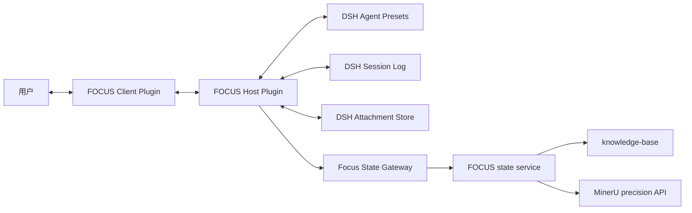

# FOCUS 第二阶段：DeepSeek Harness 接入与部署方案

> 状态：Proposed
>
> 基线日期：2026-08-23
>
> 前置条件：[第一阶段 Skills 基线](FOCUS_Phase1_Skills_Quickstart_Architecture.md)通过真实论文验收
>
> DSH 本地参考检出：`D:\dsh-proj\deepseek-harness`
>
> DSH 基线：`deepseek-ai/deepseek-harness@b150a551b8d465e31e418e1b2eaf5e79bbb7d28e`（`0.1.1-rc.2`）

## 1. 文档目的

第二阶段把 DeepSeek Harness 作为 FOCUS 的会话、模型、工具和 Web 呈现宿主，同时保持 FOCUS v0.2 的学习语义与本地数据权威：

- `ask-paper` 仍是唯一普通用户学习入口；
- Scout/Study/Mastery 仍决定阅读投入和验证强度；
- `paper-map`、`paper-study` 和 `paper-assess` 仍是内部语义模块；
- `paper.yaml`、原始回答和 evidence 仍是学习状态权威；
- DSH Session Log 保存对话、模型输入、工具调用、分支和 UI 重放事实；
- DSH Client 提供论文入口、状态投影、待回答交互、附件和会话切换。

接入不是把 Skills 降级成若干 Prompt，也不以“分片阅读进度”替换学习证据。DSH 承担运行和呈现生命周期，FOCUS 状态服务承担领域状态转移。

## 2. 已核对的 DSH 基线

本方案以本地 `D:\dsh-proj\deepseek-harness` 检出为事实源。该检出具有以下能力：

- Cordis 驱动的插件体系，Profile 由有序 Bundle 组成；
- out-of-tree Bundle 可安装到指定 Profile；
- `web` Profile 由 `@deepseek-ai/dsh-base` 和 `@deepseek-ai/dsh-web-app` 组成；
- Session 使用追加式事件日志，并从日志投影消息和状态；
- Session 支持在稳定 seq 边界 fork；
- Web Client 提供自定义 Conversation Node、typed Slot 和 finalized assistant-message action strip；
- Workspace、Session、Remote API、附件和 Client plugin 均有现成扩展位置；
- DSH 仍处于 developer preview，插件 API 和前端扩展点可能发生破坏性变化。

所有 DSH 类型和 imports 必须留在 DSH adapter 层。FOCUS 状态核心、artifact schema 和 JSON 协议不能依赖 Cordis、SessionEvent 或 Client Slot。

本地绝对路径只用于开发期核对和联调，不写入发布包、Session Event 或用户 Workspace。CI 和发布通过精确 package 版本与 commit 元数据复现依赖。

## 3. 领域与宿主的权威边界

| 信息 | 权威 | 可重建投影 |
|---|---|---|
| 论文来源、解析正文、图片和 source map | FOCUS `knowledge-base/` | DSH attachment cache |
| 阅读模式、当前节点、pending interaction、blocker 和 paper revision | FOCUS `paper.yaml` 与状态内核 | DSH 状态卡和 Conversation Node |
| 用户原始回答、评估和学习证据 | FOCUS 追加式记录与 evidence ledger | `profile.yaml`、DSH 进度视图 |
| 认知画像 | evidence 派生 | `profile.yaml`，可丢弃 |
| 对话正文、模型输入、工具调用、会话历史和 fork lineage | DSH Session Log | Client conversation view |
| 进入 DSH 会话的图片对象 | DSH Attachment Store | Client 图片组件 |
| 插件配置与启用顺序 | DSH Profile / Bundle | dump-config 输出 |

同一事实只能有一个可写权威。DSH 事件只保存呈现和关联所需的稳定 ID、revision 和结果摘要；它们不复制完整 `paper.yaml`、用户回答或 evidence。

## 4. 目标架构



### 4.1 Focus State Gateway

Gateway 在 `.agents/skills/ask-paper/scripts/focus_state.py` 外提供版本化 JSON request/response，映射当前语义操作：

```text
resolve
inspect
next
commit
cancel-route
validate
rebuild-profile
```

首版允许 Host 为每次短操作启动 Python 子进程。只有测量证明启动延迟影响交互时，才引入长驻 stdio JSON-RPC worker；两种 transport 使用同一协议。

Gateway 必须：

- 将协议 JSON 与 stderr 诊断分离；
- 使用明确的 schema/version；
- 保留 event ID 幂等和 expected revision；
- 对未来 schema、来源变化、锁冲突、无效 artifact、超时和进程退出返回稳定错误；
- 不把 Token、绝对论文路径或无关用户内容写入日志；
- 不向 Host 暴露直接修改 manifest、ledger、lock 或 transaction 的操作。

### 4.2 Host Plugin

Host Plugin 负责：

- 将用户请求交给 `ask-paper` 语义入口；
- 根据 `next` 返回的动作选择 map、study 或 assess Preset；
- 把有界 action packet 注入模型轮次；
- 调用 Gateway 提交用户回答、模块结果和诊断；
- 注册 FOCUS Session Event 和 Remote API；
- 将 FOCUS 图片导入 durable attachment；
- 从稳定事件 seq 创建解释或诊断分支；
- 将 FOCUS 当前状态转换为不含敏感数据的 Client projection。

Host 不自行推断阅读模式、节点状态或证据等级，也不直接读写 YAML/JSONL 来“补救”Gateway 错误。

### 4.3 Client Plugin

Client Plugin 负责：

- 论文列表和当前状态卡；
- Scout 去向、继续学习、回答待处理检查点、开始答辩、补缺和查看进度的入口；
- 知识树与证据层级的只读投影；
- 自定义 FOCUS Conversation Node；
- finalized assistant message 下的上下文动作；
- PDF 图片和附件呈现；
- 父子 Session 切换；
- revision 冲突、来源变化和恢复警告的明确反馈。

Client 不自行改变 paper state，不根据按钮文字授予证据，也不持久化第二份学习进度。

## 5. 插件仓库结构

FOCUS 继续作为独立仓库；DSH 只作为精确固定的开发与运行依赖。建议结构：

```text
focus/
├── .agents/skills/                   # 当前 Codex 入口和语义模块
├── tests/                            # 当前 Python 状态回归
├── dsh/
│   ├── package.json
│   ├── pnpm-workspace.yaml
│   ├── tsconfig.json
│   ├── packages/
│   │   ├── protocol/                 # 不依赖 DSH 的 JSON schema 和 branded ids
│   │   ├── state-gateway-python/     # Python transport
│   │   ├── host/                     # Cordis Host plugin
│   │   ├── client/                   # Web Client plugin
│   │   └── bundle/                   # out-of-tree Bundle
│   └── tests/
│       ├── gateway/
│       ├── host/
│       ├── client/
│       ├── replay/
│       └── packaging/
└── knowledge-base/                   # gitignored；用户本地数据
```

DSH imports 只允许出现在 `host`、`client` 和 `bundle`。`protocol` 与 Python 状态核心保持宿主无关。开发时可以使用 `D:\dsh-proj\deepseek-harness` 的 workspace packages 联调；发布包不得依赖该绝对路径。

## 6. Bundle 与 Profile

FOCUS 作为 out-of-tree Bundle 安装，不直接修改 DSH 仓库。Bundle manifest 精确声明它的 patch：

```json
{
  "name": "@focus/dsh-focus-bundle",
  "version": "0.1.0",
  "type": "module",
  "dsh": {
    "bundle": {
      "patch": "./cordis.patch.yml"
    }
  }
}
```

首版安装到官方 `web` Profile，以复用完整 Web host 和 Client runtime：

```powershell
dsh plugin --profile web add .\focus-dsh-focus-bundle-0.1.0.tgz
dsh --profile web --dump-config
dsh --profile web
```

在入口、打包和升级验证稳定前，不创建专用 `focus` Profile。若后续发布专用 Profile，其 Bundle 顺序必须显式包含：

```text
@deepseek-ai/dsh-base
@deepseek-ai/dsh-web-app
@focus/dsh-focus-bundle
```

## 7. Agent Preset 与工具权限

### 7.1 Router Preset

Router Preset 承载 `ask-paper` 的用户界面规则：识别意图、选择最低足够模式、恢复持久状态、呈现一个下一动作。它只能通过 Gateway 解析和提交状态。

### 7.2 Map / Study / Assess Preset

Host 根据 `next` 的语义 action 选择一个 Preset：

- Map：只处理来源、Scout 或最小论文模型动作；
- Study：只处理一个教学、检查、critique 或 remediation 动作；
- Assess：只处理即时闭卷、延迟保持、诊断或 projection 动作。

每个 Preset 只收到一个有界 action packet。它们看不到 route 生命周期、lock、transaction 和其他模块的写工具。

### 7.3 Parser / Blog Preset

Parser Preset 只有在用户明确授权将指定 PDF 上传 MinerU 后才可调用；Token 通过 Host 子进程环境传递，不进入模型上下文或 Session Event。Blog Preset 只消费已验证 parser bundle，不写学习证据。

### 7.4 能力隔离

| 会话类型 | 允许操作 | 禁止操作 |
|---|---|---|
| 普通学习 | resolve、inspect、next、提交当前语义动作 | 直接写文件、任意设置证据等级 |
| 闭卷评估 | 读取冻结提示、提交原始回答和 rubric 判定 | 获取答案提示、修改来源或计划 |
| 解释分支 | 读取已呈现来源和图片、解释用户问题 | 提交 checkpoint、推进节点、授予证据 |
| 诊断 | inspect、validate、只读 evidence summary | 自动破坏性修复 |

权限由注册工具和 Remote API 限制，不依赖 Prompt 自律。

## 8. Session 事件与模型可见性

FOCUS 扩展 `SessionEventMap` 时只记录 UI 重放和跨会话关联需要的事实。建议事件族：

```ts
interface FocusSessionEventMap {
  'focus/action/opened': {
    interactionId: string
    paperRef: string
    operation: 'map' | 'study' | 'assess' | 'diagnostic'
    paperRevision: number
  }

  'focus/action/presented': {
    interactionId: string
    assistantMessageId: string
    paperRevision: number
  }

  'focus/action/committed': {
    interactionId: string
    eventId: string
    resultingPaperRevision: number
    outcome: string
  }

  'focus/explanation/forked': {
    interactionId: string
    childSessionId: string
    boundarySeq: number
  }
}
```

实际实现前必须从当前 DSH 类型生成或核对 declaration merging，不允许文档中的示意声明成为复制粘贴的接口权威。

任何发送给模型的来源片段、图片、rubric、先前回答摘要或工具结果，都必须进入可重放的 Session 事件或 durable attachment；不能只留在 Host 内存。包含个人学习内容的事件采用最小字段，并遵循本地存储和导出边界。

## 9. 交互流程

### 9.1 开始或继续

```text
1. 用户选择论文或输入自然语言请求
2. Host 调用 resolve / inspect
3. Router 选择模式并调用 next
4. Host 持久化 pending interaction 后释放 route 和锁
5. Host 选择一个语义 Preset
6. Preset 执行并呈现一个动作或问题
7. 用户回答后，Host 使用 eventId + expected revision 调用 commit
8. Client 从新的 FOCUS 状态重建投影
```

`继续` 不能跳过已有 pending interaction。若 profile 投影损坏，Host 触发 fail-soft rebuild；重建失败则返回 evidence 派生进度和警告。

### 9.2 回答检查点或答辩题

用户原始回答先进入 DSH Session Log，并作为 `commit` payload 的业务输入。模型判定必须引用冻结 rubric、来源和问题版本。只有 commit 成功后 Client 才显示新的证据层级；按钮的乐观状态不能冒充领域提交成功。

### 9.3 分支解释

解释分支用于追问术语、方法、图表或误解，不自动成为 checkpoint：

```text
1. 当前 assistant message 完成并出现稳定 turn/end seq
2. Client 发送 interactionId、parentSessionId、boundarySeq 和问题
3. Host 在明确 seq 处 fork
4. 子会话选择 explanation Preset
5. 子会话读取所需来源和 attachment
6. 子会话不注册 commit-checkpoint 或 evidence 工具
7. 用户返回父会话继续原 pending interaction
```

模型流式输出期间禁用 fork action。不能使用“当前日志末尾”猜边界。若用户希望把解释后的理解用于验证，父会话必须重新提供符合证据契约的无提示问题。

### 9.4 Scout 去向

Scout 卡片可以呈现 `advance / park / reject`，但选择仍通过 FOCUS commit 写入 paper state。`advance` 根据用户意图升级到 Study 或 Mastery；UI 不自行推导模式。

## 10. 图片与论文资产

FOCUS Workspace 保存论文原图和来源关系；DSH Attachment Store 保存进入会话的持久图片对象。Host 维护可重建映射：

```text
paper stable ref + relative image path + source sha256
→ DSH attachment id
```

映射丢失时从 Workspace 重新导入。Session Event 不保存任意本地绝对路径，Client 不直接读取文件系统。

涉及图片解释时，Host 必须检查当前模型是否声明 image input：

- 支持视觉：把 durable image block 与来源 caption 一起提供；
- 不支持视觉：仍可展示图片和翻译来源文字，但明确阻塞视觉解读；
- 不能只根据文件名、caption 或 OCR 猜测图片内容。

## 11. 一致性与故障恢复

### 11.1 FOCUS 先提交，DSH 再确认投影

跨系统无法形成单一原子事务。对改变学习状态的操作采用：

```text
FOCUS commit(eventId, expectedRevision)
→ 读取已提交结果
→ 追加 DSH focus/action/committed
→ 刷新 Client projection
```

若 DSH 事件追加失败，Host 可按同一 event ID 查询 FOCUS 结果并补写投影事件。不得先显示或记录证据升级，再尝试修改 FOCUS。

### 11.2 幂等与并发

- 每个用户动作携带稳定 `eventId`；
- 重试只接受相同 payload；
- commit 检查 expected paper revision；
- 冲突后重新 inspect，不自动覆盖另一个会话的结果；
- 文件锁只覆盖短时 inspect/commit，不跨模型请求或用户等待。

### 11.3 来源与 schema 变化

来源 hash 变化时保留旧来源，阻塞受影响动作并将关联证据标记为 stale。未来 schema 只读诊断，不自动降级。只运行状态服务声明的兼容 additive migration。

## 12. 迁移阶段

### D0：兼容性 Spike

- 从本地 `D:\dsh-proj\deepseek-harness` 构建并启动 `web` Profile；
- 安装最小 out-of-tree FOCUS Bundle；
- Host 调用一个只读 `inspect`；
- Client 渲染一张只读论文状态卡；
- 自定义事件在 Session 重载后可重放；
- finalized message action 可以从稳定 seq fork 只读子会话。

D0 不改变真实 `knowledge-base/`。

### D1：只读工作台

- 列出论文和阅读模式；
- 展示 paper state、pending interaction、blocker 和 evidence 派生进度；
- 打开 parser/blog 产物；
- profile 缺失时验证 fail-soft projection。

### D2：Scout 主链路

- 新论文认领与授权提示；
- `paper-map` Scout 输出；
- `advance / park / reject` 提交；
- 新 Session 恢复结果。

### D3：Study 主链路

- key mechanism action；
- 来源锚定解释和综合检查点；
- 原始回答、判定和 evidence 提交；
- revision 冲突与 pending interaction 恢复。

### D4：Mastery 与分支

- 冻结闭卷题和 rubric；
- remediation；
- 稳定边界 explanation fork；
- 子会话无证据写权限；
- `verified-now` 与 `retained` 显示严格区分。

延迟七天的 retained 验收必须等待真实条件满足；D4 可先验证它在条件不足时被拒绝。

### D5：Parser、Blog 与图片

- 云端解析授权和 Token 隔离；
- async parse/resume 状态；
- parser bundle 真实性检查；
- blog 输出入口；
- durable image attachment 和模型能力检查。

### D6：打包与默认入口

- tarball 安装到干净 `web` Profile；
- `--dump-config` 验证 Bundle 顺序；
- 固定 DSH 版本与 commit；
- 一个真实专题完成 Scout、Study 或 Mastery 的相应闭环；
- Codex Skills 保留为调用同一状态内核的 fallback，不形成双写实现。

## 13. 测试方案

### 13.1 Gateway

- request/response schema 和协议版本；
- UTF-8、Windows 路径和 stderr 隔离；
- timeout、退出码和无效 JSON；
- event ID 幂等、payload mismatch 和 revision conflict；
- future schema、source changed 和 profile fail-soft；
- 日志中没有 Token、绝对论文路径和不必要的原始回答。

### 13.2 Host

- action 到 Preset 的唯一映射；
- 工具权限隔离；
- pending interaction 在等待前持久化；
- 无锁跨用户等待；
- FOCUS-first commit 顺序和补写；
- stable boundary fork；
- attachment cache 重建。

### 13.3 Replay 与 Client

- full replay、分页补载和 live append 得到相同 FOCUS node；
- paper revision 变化使旧 action 失效；
- profile 重建不改变 evidence；
- Scout/Study/Mastery 卡片不会混淆证据层级；
- streaming 时禁用 fork；
- explanation child 无提交证据入口；
- 父子 Session 切换不改变 pending interaction。

### 13.4 FOCUS 回归与真实验收

现有 Python 单元测试持续运行。关键用户可见链路增加 DSH keyless snapshot。涉及真实 MinerU 或模型的测试在缺少凭据时明确跳过，但发布前必须保存一次经授权的真实验收结果；夹具不能证明云端解析、视觉理解或七天保持。

### 13.5 DSH 仓库检查

开发期对 `D:\dsh-proj\deepseek-harness` 的扩展点核对至少运行：

```powershell
pnpm run typecheck
pnpm run doc-sync
pnpm run website:build
```

实际 FOCUS 插件实现应优先运行自身 focused tests、typecheck、打包 smoke 和 DSH snapshot，而不是每轮执行 DSH 全仓库测试。

## 14. 配置与安全

建议配置：

```text
FOCUS_WORKSPACE=<用户选择的 knowledge-base 路径>
FOCUS_PYTHON=<Python 3.11+ 可执行文件>
MINERU_API_TOKEN=<仅 parser 子进程可见>
DSH_HOME=<DSH 自身配置目录>
```

约束：

- Bundle 配置保存 Workspace 句柄或受控路径，不写入 Session Event；
- Client 只通过 Host Remote API 访问论文资产；
- Host 对所有文件访问做 Workspace 根约束和相对路径解析；
- MinerU Token 不进入 chat、Session、命令行参数、日志或解析产物；
- 本地论文、解析结果和个人学习记录不进入 Git 或公开发布包；
- DSH 导出会话时明确提示其中可能包含论文摘录和个人回答。

## 15. 版本、升级与回滚

1. `package.json` 固定精确 DSH 版本，不使用范围版本；
2. 发布元数据保存 DSH commit SHA；
3. DSH imports 只存在于 adapter packages；
4. 每次升级先重跑 D0 和 replay/packaging tests；
5. 重点核对 Bundle/Profile、Session event、fork、Remote API、Client Slot 和 attachment；
6. 升级失败时继续使用上一固定版本，不同时修改 FOCUS artifact schema。

插件回滚：

```powershell
dsh plugin --profile web remove @focus/dsh-focus-bundle
```

移除插件不修改 `knowledge-base/`。Codex 仍可通过现有 Skills 调用同一状态内核继续学习；不需要反向迁移数据。

## 16. 第二阶段完成标准

1. FOCUS Bundle 可安装到基线 DSH `web` Profile 并启动；
2. 普通用户仍从一个 FOCUS 入口开始或继续；
3. Scout/Study/Mastery 与当前 Skills 的路由语义一致；
4. 三个内部模块一次只获得一个有界 action packet；
5. DSH 不直接写 `paper.yaml`、原始回答、evidence 或 profile；
6. 待回答交互可在新 Session 恢复；
7. 用户回答通过 event ID 和 expected revision 幂等提交；
8. UI 只在 FOCUS commit 成功后显示状态变化；
9. 解释 fork 使用稳定 seq，且没有证据写权限；
10. Session replay 后论文卡、交互和附件关系一致；
11. parser 授权、Token 和真实性检查边界不变；
12. `paper2blog` 不改变学习状态；
13. profile 损坏时 fail-soft，不阻塞学习；
14. `retained` 仍要求真实跨会话七天证据；
15. 插件移除或 DSH 回滚不需要迁移 Workspace；
16. 发布包不依赖 `D:\dsh-proj\deepseek-harness` 绝对路径。

## 17. 基线来源

FOCUS：

- [README](../README.md)；
- [ask-paper Skill](../.agents/skills/ask-paper/SKILL.md)；
- [artifact contracts](../.agents/skills/ask-paper/references/artifact-contracts.md)；
- [state machine](../.agents/skills/ask-paper/references/state-machine.md)；
- [paper-parser Skill](../.agents/skills/paper-parser/SKILL.md)；
- [paper2blog Skill](../.agents/skills/paper2blog/SKILL.md)。

DSH 本地参考检出 `D:\dsh-proj\deepseek-harness`：

- `AGENTS.md`；
- `docs/architecture.md`；
- `docs/subsystems/session.md`；
- `docs/cookbook/adding-a-conversation-node.md`；
- `docs/user/develop/basic/publish.md`；
- `packages/bundle/base/README.md`；
- `packages/bundle/web-app/README.md`；
- `packages/client/ui-conversation/src/client/contract/slots.ts`；
- `packages/client/runtime/src/client/contract/sessions.ts`。
