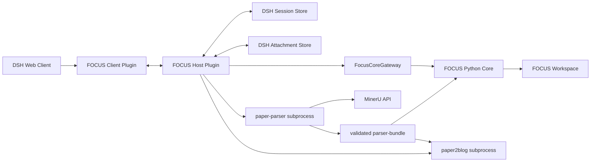

# FOCUS 第二阶段：DeepSeek Harness 部署迁移方案

> 状态：Revised Proposed（已按 2026-08-23 讨论结论校正）
>
> 基线日期：2026-08-23
>
> 前置条件：第一阶段 Skills 闭环已经通过真实论文验收
>
> DSH 基线：`deepseek-ai/deepseek-harness@b150a551b8d465e31e418e1b2eaf5e79bbb7d28e`
>
> DSH 版本：`0.1.1-rc.2`

## 1. 文档目的

第二阶段把已经通过验证的 FOCUS 领域核心和 Workspace 迁入 DeepSeek Harness，形成真正的论文阅读工作台：

- 专题和论文导航；
- 解析、粗读和精读入口；
- 可渲染 Markdown 与论文图片的会话界面；
- “理解并继续”按钮；
- `Hold on` 按钮和独立解释分支会话；
- 不污染主阅读上下文的会话切换；
- DSH Session 日志、fork、attachment 和插件 UI 的原生集成。

迁移的目标不是把 Skills 原样搬进 Web，而是把 Skills 降级为提示模板和兼容入口，由 DSH 插件承担会话、UI、按钮、fork 和部署生命周期。

## 2. DSH 基线与约束

截至本方案基线：

- DSH 采用“Everything is a Plugin”架构，底层使用 Cordis；
- Profile 由有序 Bundle 组成，插件可以作为 out-of-tree bundle 安装；
- Session 是追加式 `SessionEvent` 日志，消息历史从日志派生；
- 插件可以扩展 `SessionEventMap`；
- `ctx.sessions.fork(source, boundary?, childSessionId?)` 支持在稳定事件边界创建子会话；
- Web Client 支持自定义 Conversation Node 和 Slot；
- 当前存在 finalized assistant message action slot，可用于挂载 `Hold on` 和“理解并继续”；
- DSH 支持持久化图片 attachment 和历史图片渲染；
- DSH 官方明确处于 developer preview，未来存在兼容性破坏。

因此所有 DSH 依赖必须集中在适配层，并固定版本或 commit，不允许领域核心直接依赖 Cordis、SessionEvent 或 Client Slot 类型。

## 3. 迁移原则

> **迁移对象是第一阶段论文阅读工作台，而不是历史论文学习流程。** DSH 插件不得导入历史流程、状态词汇或用户评价模型；迁移前后的业务权威均以第一阶段 Workspace 契约为准。

### 3.1 复用第一阶段 Workspace

以下数据原样复用，不进行格式重写：

- `workspace.yaml`；
- `topics/*/topic.yaml`；
- `papers/*/paper.yaml`；
- 唯一、已验证的 `parser-bundle/`：`source.pdf`、`paper.md`、顺序图片、`metadata.json`、`validation.json`；
- `paper2blog` 产物：`evidence-map.md`、`blog.md`、`blog.html` 和本地 assets；
- `reading/plan.yaml`；
- `reading/chunks.jsonl`；
- `reading/glossary.tsv`；
- `reading/progress.yaml`；
- `reading/events/*.jsonl`。

DSH 只是新的交互和部署宿主，不成为论文目录和阅读游标的权威。

### 3.2 保留 Python 核心，先做桥接

第一阶段已经有 Python 应用服务、文件存储和 CLI。第二阶段首个可用版本不应立刻重写为 TypeScript。

推荐路径：

```text
DSH Host Plugin
→ FocusCoreGateway
→ Python CLI / JSON-RPC worker
→ 现有 FOCUS Application Services
→ Workspace
```

首版可以每次操作启动短生命周期 Python CLI；若真实延迟不可接受，再替换为长驻 JSON-RPC stdio worker。两者使用相同 JSON 协议。

只有在以下条件出现后，才考虑把核心原生移植到 TypeScript：

- Python 部署成为主要安装障碍；
- CLI 启动延迟明显影响交互；
- Host 插件需要高频订阅或长事务；
- 数据模型和产品行为已经稳定。

### 3.3 DSH Session 不复制阅读权威

权威边界：

| 域 | 权威 |
|---|---|
| 专题、论文、解析包、博客、Reading Plan、阅读游标 | FOCUS Workspace |
| 对话正文、模型调用、工具调用、会话历史、fork lineage | DSH Session Log |
| DSH 中展示和发送的图片对象 | DSH Attachment Store |
| FOCUS 论文原图 | FOCUS Workspace `parser-bundle/images/` |
| 插件配置和启用关系 | DSH Profile / Bundle |

DSH 自定义事件只保存用于会话重放和 UI 呈现的引用，不取代 `progress.yaml`。

### 3.4 主阅读与解释会话使用能力隔离

主阅读 Agent Preset 暴露：

- 读取当前 chunk；
- 记录 presented；
- 确认 chunk；
- 暂停；
- 记录问题。

解释 Agent Preset 只暴露：

- 读取 explanation context；
- 读取图片；
- 可选记录问题。

解释 Preset 不注册确认、推进、回退或重置阅读游标的工具。该限制由工具作用域保证，不依赖提示词纪律。

## 4. 目标部署架构



### 4.1 Host Plugin 职责

- 暴露专题、论文、博客和阅读状态查询；
- 调用 Python Core；
- 在逐篇取得明确云端上传授权后启动 `paper-parser` 子进程，并用非敏感 `batch_id` 恢复异步任务而不重复上传；
- 只接收一个通过校验的 `parser-bundle/`，不把上传或任务创建当成解析成功；
- 从已验证 bundle 启动 `paper2blog` 的 prepare、Evidence Map、write、render 和 check 流程；
- 注册主阅读和解释会话的 Agent Preset；
- 为模型注入当前 chunk、相邻上下文、术语命中和图片；
- 注册 FOCUS 会话事件；
- 创建和管理 Hold-on fork；
- 把论文图片导入或映射到 DSH attachment；
- 对客户端提供受控 Remote API；
- 保持 Workspace 写入的幂等与 revision 条件。

### 4.2 Client Plugin 职责

- 专题和论文导航；
- 论文状态、精读进度和入口按钮；
- 自定义阅读 Conversation Node；
- 在翻译消息下方显示“理解并继续”“Hold on”“暂停”；
- 展示论文图片；
- 打开博客 HTML；
- 在父、子会话间切换；
- 展示错误和 `needs-reinit`，但不自行修改 Workspace。

### 4.3 Python Core 职责

保持第一阶段职责不变：

- 专题和论文目录；
- parser bundle 注册；
- 精读初始化；
- current packet；
- confirm/pause；
- explanation context；
- progress revision；
- Workspace 文件读写。

Python Core 不直接调用 MinerU，也不持有 MinerU Token。Parser 下载 ZIP 和 raw extraction tree 只存在于临时目录；规范化后只向 Core 注册唯一的 `parser-bundle/`。Blog 工作区只使用 bundle 中的 `paper.md`、顺序图片、metadata 和 validation evidence，不复制也不读取 `source.pdf`，并且不修改阅读进度。

## 5. DSH 插件仓库结构

建议在 FOCUS 仓库中增加独立 DSH 区域：

```text
focus/
├── src/focus/                         # 第一阶段 Python 核心
├── schemas/
├── .agents/skills/                    # 兼容与回退入口
│
├── dsh/
│   ├── package.json
│   ├── pnpm-workspace.yaml
│   ├── tsconfig.json
│   ├── packages/
│   │   ├── protocol/
│   │   │   ├── package.json
│   │   │   └── src/
│   │   │       ├── ids.ts
│   │   │       ├── api.ts
│   │   │       └── events.ts
│   │   ├── core-gateway-python/
│   │   │   └── src/index.ts
│   │   ├── host/
│   │   │   └── src/
│   │   │       ├── service.ts
│   │   │       ├── sessions.ts
│   │   │       ├── attachments.ts
│   │   │       ├── presets.ts
│   │   │       └── index.ts
│   │   ├── client/
│   │   │   └── src/client/
│   │   │       ├── sidebar/
│   │   │       ├── conversation/
│   │   │       ├── actions/
│   │   │       └── index.ts
│   │   └── bundle/
│   │       ├── package.json
│   │       └── cordis.patch.yml
│   └── tests/
│       ├── host/
│       ├── client/
│       ├── replay/
│       └── packaging/
```

包边界：

- `protocol`：Host/Client 共用的稳定 ID、Remote API 和事件类型；
- `core-gateway-python`：唯一知道 Python 启动方式和 JSON 协议的包；
- `host`：Cordis 服务、Session、Preset 和 Attachment；
- `client`：浏览器 UI 和 Conversation Node；
- `bundle`：安装到 DSH Profile 的配置层。

## 6. Core Gateway 协议

Host 不直接解析 Workspace 文件。它通过 `FocusCoreGateway` 调用稳定业务操作：

```ts
interface FocusCoreGateway {
  listTopics(): Promise<TopicSummary[]>
  listPapers(topicId?: string): Promise<PaperSummary[]>
  getPaper(paperId: string): Promise<PaperDetail>

  initializeReading(input: InitializeReadingInput): Promise<ReadingPlanSummary>
  getReadingStatus(paperId: string): Promise<ReadingStatus>
  getCurrentReadingPacket(paperId: string): Promise<ReadingPacket>
  markPresented(input: MarkPresentedInput): Promise<ReadingProgress>
  confirmChunk(input: ConfirmChunkInput): Promise<ConfirmChunkResult>
  pauseReading(input: PauseReadingInput): Promise<ReadingProgress>

  getExplanationContext(input: ExplanationContextInput): Promise<ExplanationContext>
  recordQuestion(input: RecordQuestionInput): Promise<void>
}
```

每次写操作携带：

```text
operationId
paperId
chunkId（适用时）
expectedRevision
```

Python CLI 返回单行或 framed JSON，不向 stdout 混入普通日志。stderr 只输出诊断。

## 7. DSH Profile 与 Bundle

### 7.1 Bundle

`@focus/dsh-focus-bundle` 的 `package.json` 声明：

```json
{
  "name": "@focus/dsh-focus-bundle",
  "version": "0.1.0",
  "type": "module",
  "dsh": {
    "bundle": {
      "patch": "./cordis.patch.yml"
    }
  }
}
```

Bundle patch 挂载：

- Python Core Gateway；
- FOCUS Host Service；
- 主阅读/解释 Preset；
- FOCUS Client loader；
- 必要的 attachment 和 static asset 配置。

### 7.2 首版部署到官方 `web` Profile

DSH 的 `web` 和 `headless` 是官方 Profile 模板；一个全新的自定义 Profile 通过 `dsh plugin` 初始化时，默认只有 `@deepseek-ai/dsh-base`。因此首版不直接创建只有 base 的 `focus` Profile，而是把 FOCUS Bundle 安装到已包含 Web UI 的官方 `web` Profile：

```sh
dsh plugin --profile web add ./focus-dsh-focus-bundle-0.1.0.tgz
dsh --profile web --dump-config
dsh --profile web
```

这条路径能直接复用 `@deepseek-ai/dsh-web-app` 提供的浏览器、Conversation、Sidebar、Attachment 和 Client Runtime。

FOCUS 产品形态稳定后，再维护专用 `focus` Profile。该 Profile 必须显式按顺序包含：

```text
@deepseek-ai/dsh-base
@deepseek-ai/dsh-web-app
@focus/dsh-focus-bundle
```

不能假设新 Profile 自动拥有 Web Bundle。

安装优先使用预构建 tarball 或 npm 包。不推荐首版从 GitHub 源码直接安装，因为 git dependency 需要 `prepare` 构建和 pnpm `allowBuilds` 授权，增加部署不确定性。

## 8. Client 工作台形态

### 8.1 专题/论文导航

首版安装在 `web` Profile 时，先通过 additive sidebar footer action 或会话内 Paper Context Node 提供 FOCUS 入口，不立即替换默认 Workspace 浏览器。

专用 FOCUS Profile 稳定后，可以替换 `sidebar.workspaces` 区域，同时保留 DSH 外层 Sidebar、品牌、折叠和 Settings：

```text
专题
├── 可配置脉动阵列编译器设计
│   ├── FlexSA                 18 / 126
│   ├── SAGAR                  未初始化
│   └── ...
└── 3D-stacked 编译器设计
    ├── ...
```

论文项显示的状态全部由 Host 查询 FOCUS Workspace 后计算。

### 8.2 论文入口卡片

打开论文阅读 Session 时，在会话顶部生成 FOCUS Paper Context Node，展示：

- 标题和专题标签；
- parser 状态；
- paper2blog 链接；
- 精读状态和进度；
- “初始化精读”或“继续阅读”按钮。

不必建设独立路由页面即可先形成工作台闭环。

### 8.3 阅读消息操作条

DSH 当前提供 finalized assistant message action slot。FOCUS Client Plugin 在确认该消息属于一个 reading presentation 后，挂载：

```text
[理解并继续] [Hold on] [暂停]
```

按钮调用 Host Remote API，不把控制命令伪装成普通自然语言消息。

## 9. Session 事件设计

FOCUS 扩展 DSH `SessionEventMap`，事件用于 UI 重放和会话关系，不作为阅读游标权威。

建议事件族：

```ts
interface FocusSessionEventMap {
  'focus/reading/opened': {
    paperId: string
    planId: string
    progressRevision: number
  }

  'focus/presentation/start': {
    presentationId: string
    paperId: string
    chunkId: string
    chunkIndex: number
    totalChunks: number
    progressRevision: number
    turn: number
    step: number
    imageAttachmentIds: string[]
  }

  'focus/presentation/linked': {
    presentationId: string
    assistantMessageId: string
  }

  'focus/presentation/confirmed': {
    presentationId: string
    progressRevision: number
  }

  'focus/explanation/forked': {
    presentationId: string
    childSessionId: string
    boundarySeq: number
  }

  'focus/reading/completed': {
    paperId: string
    planId: string
  }
}
```

每个 Conversation Node 使用稳定 `presentationId` 归并 start/update 事件。事件必须可从日志确定性重放，不读取“最近一个未完成对象”进行猜测。

## 10. 主阅读会话流程

```text
1. 用户点击“开始/继续阅读”
2. Host 读取 FOCUS progress
3. 创建或打开 focus-guide Session
4. Host 获取 current ReadingPacket
5. 论文图片写入或命中 DSH attachment cache
6. Host 向 Agent 注入来源片段、局部上下文、术语命中和图片
7. Agent 输出翻译；有图片时输出图片解释
8. Session 记录 assistant/message
9. FOCUS 事件把该消息链接到 presentationId/chunkId
10. Client 显示进度和操作按钮
```

模型可见的来源内容必须进入 DSH Session 日志或由可重放的持久事件重建，不能只存在于 Host 内存。

## 11. “理解并继续”流程

```text
1. Client 提交 presentationId、paperId、chunkId、expectedRevision、operationId
2. Host 调用 FocusCoreGateway.confirmChunk()
3. Python Core 条件写 progress.yaml
4. 成功后 Host 追加 focus/presentation/confirmed
5. Host 获取下一 ReadingPacket
6. 注入下一片段并启动下一轮
```

跨系统无法形成真正原子事务，因此采用以下顺序：

> 先提交 FOCUS 领域状态，再追加 DSH 呈现事件。

理由是阅读游标比 UI 标记更重要。若 DSH 事件追加失败，Client 可重新查询 Workspace 并修正投影；反方向会造成 UI 显示已确认但实际进度未推进。

所有写操作使用 `operationId` 幂等。重试不会二次推进。

## 12. Hold-on / Side 会话流程

### 12.1 触发条件

`ctx.sessions.fork()` 要求选定前缀结束在开放 turn 之外。因此：

- 只有当前 assistant message 已完成且对应 `turn/end` 已记录时，Hold-on 按钮才可用；
- 模型仍在流式输出时按钮禁用；
- fork boundary 使用该 presentation 对应的稳定 `turn/end` seq；
- 不使用“当前日志末尾”进行隐式猜测。

### 12.2 Fork 步骤

```text
1. 用户点击 Hold on，可同时输入问题
2. Client 请求 Host forkExplanationSession
3. Host 定位该 presentation 的稳定 boundary seq
4. ctx.sessions.fork(parentSession, boundary)
5. 子会话继承截至该片段的完整上下文
6. Host 为子会话选择 focus-explain Preset
7. 注入 paperId、chunkId、用户问题和 explanation context
8. 记录 focus/explanation/forked
9. Client 打开子会话
```

### 12.3 子会话约束

子会话：

- 可以持续多轮解释；
- 可以按用户要求生成 Mermaid；
- 可以展示论文原图；
- 只读 FOCUS progress；
- 不暴露 confirm/advance/reset 工具；
- 不影响父会话的 pending chunk。

用户可随时切回父会话，继续点击“理解并继续”。无需把解读进度写入 FOCUS Workspace；DSH Session Log 已经保存完整解释历史。

## 13. 图片与视觉模型

### 13.1 两层图片存储

- FOCUS Workspace 保存论文原图，是论文资产权威；
- DSH Attachment Store 保存进入某个会话的持久图片对象，保证历史、fork 和模型请求可恢复。

Host 维护可重建 cache：

```text
paperId + relativeImagePath + sourceSha256
→ DSH attachmentId
```

cache 不是权威，丢失后可以从 Workspace 重新导入。

### 13.2 模型能力要求

涉及图片的片段必须使用声明支持 image input 的模型路由。Host 在启动请求前检查能力：

- 支持视觉：把图片作为 durable image block 提供给模型；
- 不支持视觉：展示原图并翻译 caption/正文，但明确阻塞“图片解释”；
- 不允许模型在没有读取图片时根据文件名或 caption 假装完成视觉解释。

正式 FOCUS Profile 应配置至少一个视觉能力路由，才能满足产品完整要求。

### 13.3 UI 渲染

自定义 Reading Presentation Node 显示：

- 章节位置；
- 片段进度；
- 论文图片；
- assistant 翻译消息的关联；
- 当前确认状态。

图片应使用 DSH 历史 attachment 渲染能力，而不是浏览器直接打开任意本地路径。

## 14. Agent Preset 与 Skills 迁移

### 14.1 `focus-guide` Preset

把第一阶段 Skill 的行为规则迁为 DSH Agent Preset：

- 当前轮只处理 Host 注入的一个 chunk；
- 纯翻译为主；
- 仅解释绑定图片；
- 不输出关键点、术语表、观点或主动 Mermaid；
- 不自行调用 confirm；
- 输出完成后等待 UI 操作。

### 14.2 `focus-explain` Preset

- 围绕用户问题逐步解释；
- 每轮一个子问题；
- 用户要求时才生成图；
- 不评价用户能力或理解状态；
- 工具层面没有阅读进度写权限。

### 14.3 Skills 的保留方式

第一阶段 Skills 暂时保留，用于：

- DSH 不可用时的回退；
- CLI 行为调试；
- 对照测试 Prompt 行为。

DSH 稳定后，它们不再是主入口，但继续调用同一 Python Core，不形成双重实现。

## 15. 迁移阶段与验收门

### D0：兼容性 Spike

目标：证明当前 DSH 基线能够加载 out-of-tree Host/Client bundle。

验收：

- `web` Profile 可加载 FOCUS Bundle；
- Host 能调用一个 Python Core 只读命令；
- Client 能渲染一个自定义节点；
- 能在 finalized assistant message 下添加一个测试 action；
- 能从稳定 boundary fork 一个子会话。

未通过 D0，不进入完整迁移。

### D1：只读工作台

- 专题和论文入口；
- 显示 parser/blog/reading 状态；
- 打开通过检查的 `blog.html`；
- 查看精读进度；
- 不允许写进度。

### D2：主阅读会话

- 创建 focus-guide Session；
- 注入 current chunk；
- 渲染翻译和图片；
- presentation 与 assistant message 正确关联；
- Session 重载后可重放。

### D3：进度写入

- “理解并继续”按钮；
- revision 和 operationId；
- 下一片段自动进入下一轮；
- 多窗口冲突可恢复。

### D4：Hold-on 分支

- 稳定 boundary fork；
- 子会话加载 focus-explain Preset；
- 父会话保持 pending；
- 父子会话可以切换；
- 子会话无法调用进度写工具。

### D5：精读初始化和解析入口

- 论文入口卡支持 parser、paper2blog 和精读初始化；
- Parser 上传前显示逐篇 MinerU 授权，Token 只进入 Parser 子进程环境；
- Parser 超时或中断后使用 `batch_id` 恢复，并且只保留一个包含 `source.pdf`、`paper.md`、顺序图片、`metadata.json` 和 `validation.json` 的 `parser-bundle/`；
- Blog 要求 `validation.json.ok=true` 与 `metadata.json.parser=mineru-precision-api`，先完成 `evidence-map.md`，再生成并检查 `blog.md` 与 `blog.html`；
- Blog 不复制或读取 `source.pdf`；
- 长任务显示明确状态；
- 输出仍写入同一 Workspace。

### D6：切换主入口

- DSH Web 成为默认工作台；
- Skills 保留为 fallback；
- 实际专题完成一轮端到端试用；
- 固化兼容版本和安装包。

### D7：可选专用 Profile 与核心原生化

在入口和布局稳定后，可以发布显式包含 `dsh-base + dsh-web-app + focus-bundle` 的专用 `focus` Profile，并按需要替换 `sidebar.workspaces`。只有在部署和性能证据支持时，才把 Python Core 的部分或全部迁至 TypeScript。两项工作均必须保持相同 JSON Schema 和 Workspace 契约。

## 16. 数据迁移

### 16.1 第一阶段数据

不做数据迁移。DSH 插件直接配置同一个 `FOCUS_WORKSPACE` 路径。

### 16.2 第一阶段会话

Codex/Skills 的聊天记录不自动导入 DSH。阅读游标已在 Workspace 中，因此 DSH 首次打开时从 `progress.yaml` 继续即可。

### 16.3 历史版本数据

历史版本数据不转换为新的 reading progress，也不被 DSH 工作台读取。它们可以按原目录保存在 `legacy/` 供人工查阅；新插件只识别第一阶段冻结的数据契约。

## 17. 一致性与故障恢复

只实现必要机制：

### 17.1 条件写

`confirmChunk` 检查 pending chunk 和 revision，防止两个会话重复推进。

### 17.2 幂等写

`operationId` 保证按钮重试不产生第二次确认。

### 17.3 投影重建

DSH UI 状态可以从：

```text
FOCUS Workspace 当前状态
+ DSH Session Event Log
```

重新构建。自定义事件丢失时不修改阅读游标；Client 重新查询 Host。

### 17.4 无跨等待锁

任何锁只覆盖短时文件提交，不跨模型请求和用户等待。

### 17.5 不做复杂双写事务

不引入分布式事务、事件总线或补偿工作流。使用“领域状态优先、UI 投影可重建”的明确顺序。

## 18. 测试方案

### 18.1 Gateway 测试

- Python CLI 正常/异常 JSON；
- 超时、进程退出、stderr；
- 路径和编码；
- operationId 幂等。

### 18.2 Host 测试

- Preset 工具作用域；
- current packet 注入；
- progress 条件写；
- attachment cache；
- custom Session Event；
- fork boundary 选择。

### 18.3 Replay 测试

- 完整事件窗口重放得到相同 reading node；
- 先加载尾部、再补前页仍能归并 presentation；
- live append 与完整 replay 结果一致；
- 子会话 lineage 保持。

### 18.4 Client 测试

- FOCUS 入口和论文上下文卡；
- 进度显示；
- finalized assistant action；
- streaming 时 Hold-on 禁用；
- confirm 成功/冲突/失败；
- 父子会话切换；
- 图片历史加载；
- 专用 Profile 阶段的专题/论文导航。

### 18.5 打包测试

- tarball 安装到 `web` Profile；
- `dsh --profile web --dump-config` 包含预期层；
- 干净机器启动；
- DSH 固定版本兼容；
- Python 依赖缺失时给出明确错误；
- 后续专用 `focus` Profile 确实包含 `dsh-web-app`。

## 19. 配置与安全

建议配置：

```text
FOCUS_WORKSPACE=/path/to/focus-workspace
FOCUS_PYTHON=/path/to/python
MINERU_API_TOKEN=...
DSH_HOME=...
```

约束：

- PDF 上传 MinerU 前必须取得用户对该论文的明确授权；
- MinerU Token 只从 `MINERU_API_TOKEN` 环境变量或 Parser 进程工作目录下被 Git 忽略的 `.env` 读取，只进入 Python Parser 子进程环境，不进入聊天、命令行、Session Event、日志或产物；
- 签名 URL 不持久化，也不放入进程参数；
- Session Event 不保存本地绝对论文路径；
- Client 只通过 Host 获取授权论文资产；
- 不允许浏览器直接读取任意文件系统路径；
- attachment 引用和 Workspace 资产映射留在 Host；
- Profile 安装包固定版本和校验来源。

## 20. 版本与兼容策略

由于 DSH 处于 developer preview：

1. `package.json` 固定精确 DSH 版本，不使用 `^`；
2. 发布记录同时保存 DSH commit SHA；
3. 所有 DSH imports 只出现在 `dsh/packages/host`、`client` 和 `bundle`；
4. `protocol` 与 Python Core 不引用 DSH 类型；
5. 每次升级 DSH 先运行 D0 兼容性测试；
6. 重点监控：Profile/Bundle、Session Event、fork、Remote API、Client Slot、Attachment；
7. 升级失败时继续使用上一固定版本，不同时修改领域模型。

## 21. 回滚方案

### 21.1 插件回滚

```sh
dsh plugin --profile web remove @focus/dsh-focus-bundle
```

或恢复上一版本 tarball。Workspace 不受影响。

### 21.2 产品回滚

Skills 仍调用同一 Python Core，因此 DSH 不可用时可以直接回到：

```text
focus-map
focus-guide
focus-explain
```

阅读进度不会丢失，也不需要逆向迁移。

## 22. 第二阶段完成标准

1. FOCUS Bundle 可从预构建包安装到 DSH `web` Profile 并启动；
2. 专题和论文具有可发现的工作台入口；
3. parser、paper2blog 和精读初始化都有可见入口；Parser 保持逐篇授权、Token 隔离、异步恢复和唯一 `parser-bundle/`，Blog 保持 Evidence Map、`blog.md`、`blog.html` 及不读取 `source.pdf` 的边界；
4. 主阅读会话能逐片段翻译并展示论文图片；
5. “理解并继续”按钮通过 FOCUS Core 推进游标；
6. 新开或恢复 Session 时从同一 Workspace 继续；
7. Hold-on 从稳定 `turn/end` fork 子会话；
8. 子会话继承当前上下文但没有进度写权限；
9. 父会话游标不受子会话影响；
10. Session replay 后阅读节点、图片和按钮状态一致；
11. DSH 升级影响被限制在适配层；
12. 删除插件或切回 Skills 不需要迁移 Workspace；
13. 如发布专用 `focus` Profile，其 Bundle 顺序显式包含 `dsh-base`、`dsh-web-app` 和 FOCUS Bundle。

## 23. 基线来源

本方案固定参考：

- DeepSeek Harness `0.1.1-rc.2`，commit `b150a551b8d465e31e418e1b2eaf5e79bbb7d28e`；
- `README.md`：developer preview 与启动方式；
- `docs/architecture.md`：插件树、Profile/Bundle、Session、fork 和扩展点；
- `docs/subsystems/session.md`：追加式 SessionEvent 日志和 fork 边界；
- `docs/cookbook/adding-a-conversation-node.md`：稳定业务 ID、事件重放和 Conversation Node；
- `docs/user/develop/basic/publish.md`：out-of-tree bundle 安装和 Profile 层次；
- `packages/boot/app-boot/README.md`：`web/headless` 模板以及自定义 Profile 初始化行为；
- `packages/client/ui-layout` 与 `ui-sidebar` Slot 契约：工作台入口和后续专题导航区域；
- DSH durable attachment 实现：会话历史、fork 和图片重放。
