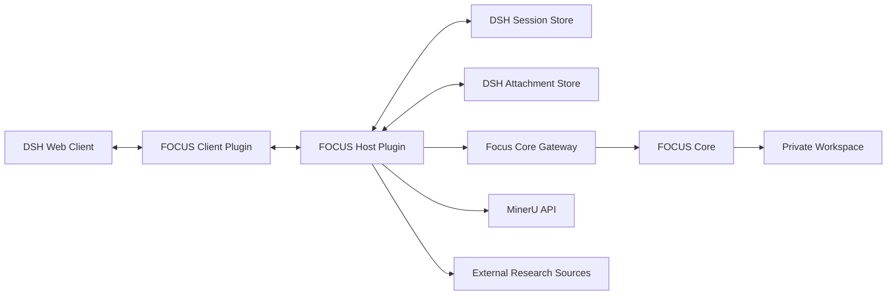

# FOCUS Phase 2：DeepSeek Harness 迁移与部署边界

> 状态：Proposed，等待 Phase 1 原型验收
>
> 更新日期：2026-08-24
>
> 前置设计：[Phase 1 Skills 快速跑通](./FOCUS_Phase1_Skills_Quickstart_Architecture.md)
> 产品语义：[FOCUS Reading Workspace](../CONTEXT.md)

## 1. 目标

Phase 2 把已经通过真实试读的 FOCUS Reading Workspace 接入 DeepSeek Harness（DSH），提供：

- Topic 与 Paper 导航；
- Parser、Blog、Map、Guide 和 Explain 入口；
- 论文 Markdown、公式、表格和原图展示；
- Guided Reading 与 Explanation 的独立会话体验；
- Continue Reading 与 Continue Explanation 的明确上下文；
- 跨会话恢复和本地私人数据管理。

迁移对象不是旧 Paper Companion，也不是 Scout/Study/Mastery 学习流程。DSH 插件不得恢复用户评价、理解确认、认知画像或掌握状态。

## 2. Phase 1 不是兼容承诺

Phase 1 是可推翻原型。Phase 2 开始前必须根据真实试读结果做一次协议冻结评审：

1. 哪些 Workspace 字段被真实交互证明必要；
2. `chunks.jsonl` 的整文件更新是否仍合适；
3. Explanation JSONL 是否迁移到 DSH Session Log；
4. 单写入者假设是否仍成立；
5. Python 核心是否继续保留；
6. 是否需要正式 schema、revision 或冲突处理。

不得仅因为 Phase 1 已经落盘就把其格式当作永久公共协议。若 Phase 2 改变格式，应提供一次明确、可验证的本地迁移，而不是长期兼容两套模型。

## 3. 保持不变的产品语义

无论 Phase 2 如何调整文件格式，以下语义不能改变：

- Topic 组织 Paper，但不复制论文资产；
- Parser Bundle、Blog Output 和 Reading 数据职责分离；
- Reading Cursor 只由 Continue Reading 推进；
- Inline Reading Discussion 不自动变成 Explanation Session；
- Explanation Session 不拥有或修改 Reading Cursor；
- Reader Note、Discussion Note 与 Emphasis Note 不代表用户能力；
- 外部检索用于解释，不生成来源账本或用户评价；
- 私人 Workspace 数据不进入公开 Git；
- 产品不使用内容哈希作为 Paper、Plan 或 Chunk 身份。

这些是领域决策，不是 Phase 1 实现偶然产生的格式。

## 4. 目标架构



### 4.1 Client Plugin

负责：

- Topic/Paper 侧边栏；
- Parser、Blog、Map、Guide 和 Explain 入口；
- Markdown、公式、表格、图片与 caption 渲染；
- Guided Reading 中的“继续阅读”、备注、强调和重新翻译操作；
- Explanation 中的“继续解释”、新建与历史选择；
- Paper、Plan、Chunk 和 Explanation 切换；
- 直接、简洁地展示错误。

Client 不直接编辑 Workspace 文件，也不自行推断游标变化。

### 4.2 Host Plugin

负责：

- 调用 FOCUS Core；
- 注册 Guided Reading 与 Explanation 两套明确能力；
- 调用 `paper-parser` 和 `paper2blog`；
- 管理 DSH Session 与 Attachment；
- 为新 Explanation 检索论文全文及必要外部资料；
- 把领域错误转换为 Remote API 结果；
- 保证 Explanation 工具集不包含 Reading Cursor 写操作。

Host 不建立统一语义路由器。Guide 与 Explain 使用不同 Agent Preset、工具权限和 UI 操作。

### 4.3 FOCUS Core

负责稳定领域操作：

- Topic、Paper 与 Parser Bundle；
- Blog Output 位置；
- Reading Plan、Chunk Record 与 Plan Glossary；
- Workspace pointers；
- 翻译缓存与三类 Notes；
- Continue Reading；
- Explanation Session 的创建、选择和追加。

Phase 2 是否继续使用 Python，通过协议冻结评审决定。DSH 类型、Cordis 类型和 UI Slot 类型不得进入领域核心。

## 5. 会话边界

### 5.1 Guided Reading

Guided Reading Session 可以：

- 读取当前 Chunk；
- 缓存或重新生成翻译；
- 展示绑定图片和 caption；
- 回答简短追问并写 Discussion Note；
- 写 Reader Note 与 Emphasis Note；
- 修改当前 Plan Glossary；
- 执行 Continue Reading。

它不能创建或推进 Explanation 的内部对话，也不能生成用户评价。

### 5.2 Explanation

Explanation Session 可以：

- 搜索整篇论文；
- 读取相关公式、表格、图片与 caption；
- 必要时研究外部资料；
- 直接回答、继续解释或在证据不足时拒绝；
- 保存用户与模型的可见问答。

它不能调用 Continue Reading、设置 Chunk、重置 Plan 或写任何用户评价。

### 5.3 DSH Session Log 与 Explanation JSONL

Phase 1 使用每会话一个 JSONL，只保存 `role` 和 `content`。DSH 自身也拥有追加式 Session Log，因此 Phase 2 不应长期维持两个等价会话权威。

协议冻结评审必须二选一：

- 把 Phase 1 Explanation JSONL 一次性迁移为 DSH Session；或
- 明确 JSONL 是领域归档、DSH Log 是交互日志，并证明二者不会产生双写漂移。

首选前者：完成一次迁移后让 DSH Session Log 成为 Explanation 对话权威，Workspace 只保存稳定 Session 引用。此项是 Phase 2 决策，不回写为 Phase 1 复杂度。

## 6. 指针与并发

Phase 1 的根级 `pointers.yaml` 保存当前 Paper 以及各 Paper 的 Plan、Chunk 和 Explanation 引用，并假设每篇 Paper 只有一个写入者。

Phase 2 接入 Web 后可能出现：

- 多浏览器标签页；
- Guide 与 Explain 同时运行；
- 重复点击 Continue Reading；
- 后台 Parser/Blog 任务并行。

协议冻结评审应基于真实 UI 行为决定是否增加最小 revision 或串行命令队列。不得预先恢复旧 Paper Companion 的锁、route、事务账本和多阶段状态机。

无论实现方式如何，更新 Explanation 引用不能同时更新 Reading Cursor；重复 Continue Reading 不能跳过多个 Chunk。

## 7. Parser 与 Blog

### 7.1 Parser

DSH 中解析仍需逐篇取得 MinerU 云端上传授权。Token 继续只存在于受控环境配置，不进入 Session、日志、命令行或 Workspace。

Parser 成功后直接形成目标 Paper 的规范 `parser-bundle/` 并注册 Topic/Paper。上传或任务创建不等于成功。超时可使用非敏感 `batch_id` 恢复。

Parser 不计算或保存内容哈希。已有 Parser Bundle 不覆盖；再次解析创建新的 Paper ID。

### 7.2 Blog

Blog 位于：

```text
papers/<paper_id>/blog/
```

它只读取同 Paper 的 Parser Bundle。Host Plugin 必须通过工具权限确保 Blog 无法写入 pointers、plans、chunks、glossary 或 explanations。

## 8. Explanation 检索

DSH Host 为 Explanation 提供论文全文检索和必要外部研究：

```text
搜索 paper.md 标题与关键词
→ 读取相关段落、公式、表格和图片
→ 必要时研究外部一手资料
→ 判断能否可靠解释
→ 能：直接回答
→ 不能：拒绝回答
```

不要求默认展示来源分类或检索过程，不建立来源账本、查询审计或用户画像。用户显式要求出处时，可以在可见回答中给出相应来源。

是否采用更复杂检索，只能由真实论文规模和质量问题驱动。Phase 2 不因接入 DSH 自动引入向量库、知识图或 RAG。

## 9. Remote API 方向

协议冻结后，Host 至少需要以下语义操作：

```text
list_topics
list_papers
get_paper
parse_paper
build_blog
map_paper
get_current_chunk
continue_reading
write_reader_note
write_discussion_note
write_emphasis_note
update_glossary
retranslate_chunk
create_explanation
select_explanation
append_explanation
```

命名必须使用完整 `continue_reading` 与 `continue_explanation` 语义；不得暴露一个含义依赖模型猜测的 `continue`。

错误仍优先采用小型结构化结果。只有在 Web 并发证明需要后，才增加冲突类错误。

## 10. 私人数据与部署

部署必须确保：

- Workspace 挂载到受控持久化目录；
- `/workspace/` 不进入公开 Git 或公开镜像层；
- PDF、Parser Bundle、Blog、翻译、Notes、Explanation 与 pointers 均视为私人数据；
- MinerU Token 和其他凭据只存在于部署 Secret；
- DSH Session Store 与 Attachment Store 采用与 Workspace 相同的私人数据边界；
- 导出、备份、同步和删除由用户显式控制。

Phase 2 不自动把私人数据上传到外部分析服务。Explanation 主动使用外部资料时，属于用户显式进入该能力后的模型研究行为，不产生额外来源账本。

## 11. 迁移步骤

### P0：验收 Phase 1

- 使用真实论文完成 Phase 1 十一项验收；
- 记录用户体验问题和真实文件规模；
- 不在验收前实现 DSH 插件。

### P1：冻结协议

- 保留、修改或替换 Phase 1 文件格式；
- 决定 Explanation JSONL 到 DSH Session 的迁移；
- 决定 Python Core 是否保留；
- 决定是否需要最小并发控制；
- 形成一次性迁移与回滚说明。

### P2：Host 纵向切片

- Topic/Paper 查询；
- 当前 Chunk 展示；
- Continue Reading；
- 新建 Explanation；
- 验证 Explanation 无 Cursor 写权限。

### P3：Client 交互

- Topic/Paper 导航；
- Guide 与 Explain 独立 UI；
- 图片、caption、翻译和 Notes；
- Explanation 历史选择；
- Blog 打开与 Parser 授权。

### P4：迁移与部署

- 迁移一份真实 Phase 1 Workspace；
- 验证私人数据边界；
- 验证多标签或明确禁止多写入者；
- 完成安装、升级、备份和恢复说明。

## 12. Phase 2 完成标准

1. DSH 能按 Topic 浏览和选择 Paper；
2. Guide 与 Explain 使用不同工具权限和操作语义；
3. Continue Reading 只推进一个 Chunk；
4. Continue Explanation 不改变 Reading Cursor；
5. Parser 授权、异步恢复和无哈希 Bundle 正常工作；
6. Blog 与 Reading 数据完全隔离；
7. Notes、glossary 和重新翻译行为与 Phase 1 领域语义一致；
8. Explanation 能检索全文与必要外部资料，并在无法可靠解释时拒绝；
9. Phase 1 私人数据完成一次明确迁移，不长期维护两套语义；
10. 公开代码、部署镜像和日志均不包含 Workspace 私人数据；
11. 旧 Paper Companion 学习模型没有通过 DSH 重新进入产品。

## 13. 当前边界

本文不声称当前 DSH API、插件 Slot 或部署结构已经验证为最新可用接口。正式实施 Phase 2 前必须针对选定 DSH 版本重新核对官方源码和文档，并把所有宿主依赖限制在适配层。
