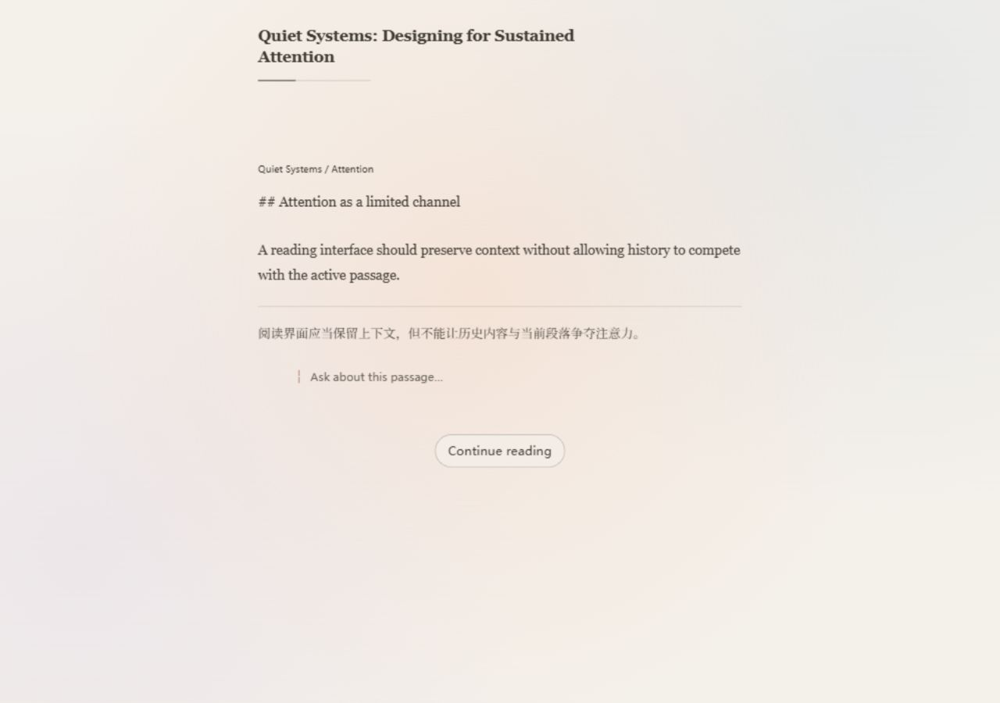

# Focus Reader current-session prototype evidence

This evidence freezes the Focus Reader prototype completed in the 2026-08-30 implementation session. It refers to the concrete `FocusReader.tsx`, `reader-shell.css`, and `FocusReader.test.tsx` implementation produced in that session. It does not refer to an older Variant D codebase; no A/B/C implementation, prototype switcher, or `?variant=` path exists in this repository baseline.

## What this prototype established

- A single-column continuous Reading Chunk stream is viable behind the existing `ReaderHost` Interface.
- The current Reading Chunk can act as the visual and semantic focus while complete history remains in the same keyed stream.
- Distance-derived history depth communicates recency better than one flat history opacity.
- A low-saturation diffusion field works when its brightest field is geometrically anchored to the current Reading Chunk.
- Continue Reading benefits from a short spatial handoff in which the settling and entering Reading Chunks overlap.
- Reader conversation works as subordinate marginalia inside the current Reading Chunk.
- Phrase-level emphasis is unnecessary for the selected hierarchy.

## Rejected directions

- Flat history opacity, because it represents a disabled state rather than distance.
- Decorative diffusion unrelated to the Reading Cursor, because it reads as wallpaper.
- Immediate content replacement, because it breaks spatial continuity.
- An independent chat panel, because it competes with the Reading Source.
- Phrase-level emphasis, because it adds another attention system without improving the reading hierarchy.

## Browser evidence

The standalone Fixture Adapter was checked at desktop and 390px widths. Continue Reading kept settling and entering chunks mounted together, the marginalia path did not move the Reading Cursor, and the browser console reported no warnings or errors.

## Known limits

- This is Fixture-verified and browser-verified only. It has not been verified against a live ReaderHost or private Workspace data.
- The screenshot shows the standalone synthetic English fixture and its fixture translation; it is not the user's Chinese Reading Source.
- Markdown is still rendered as preserved source text rather than through a production Markdown renderer.
- Exact colors, motion duration, diffusion intensity, and mobile density remain subject to formal UI review.
- Loading, error recovery, completed state, operation races, and visual regression coverage require formal quality gates.
