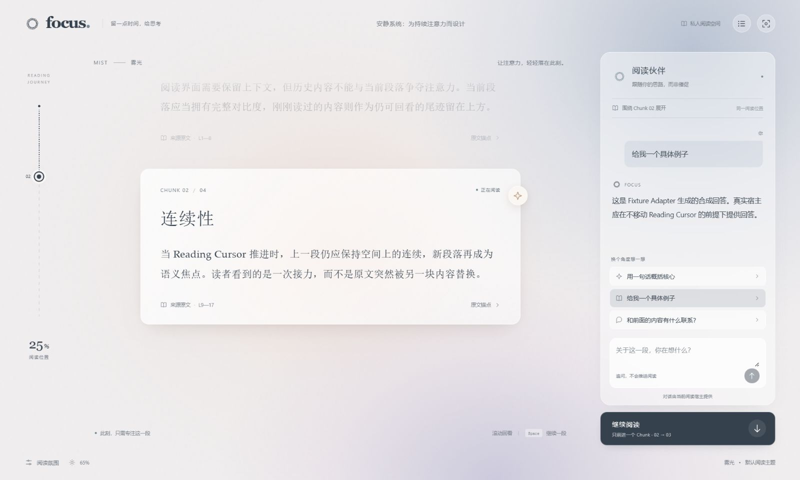
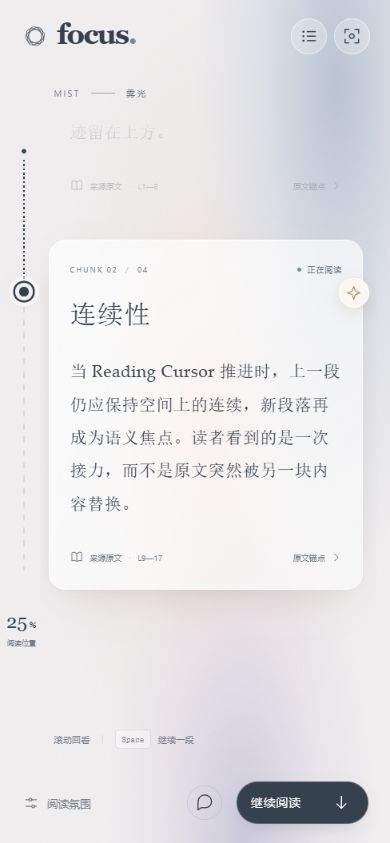

# Formal Focus Reader UI specification

Status: 雾光 / Mist is the default, selected on 2026-08-31.

This specification promotes the first retained Lightfield prototype into the formal Reader Module. It replaces the initial visual layout and collapsed-marginalia choice in ADR 0005. ADR 0004 and the existing ReaderHost authority remain unchanged. All five prototypes remain isolated references for later skin integration; the formal application has no prototype picker, variant URL, or production theme switcher.

## Module and authority

`FocusReader({ host: ReaderHost })` remains the only public Reader UI Interface. ReaderChrome, ReadingChunk, and the transition projection are internal. No production Reader UI file imports the prototype host or its scripted replies.

The host supplies `ReadingWindow`, including complete ordered `history`, `current`, and `conversation`. Focus Core owns the Reading Cursor. The UI holds only the host projection, a temporary transition between returned windows, and local presentation state. Changing light, text size, particles, focus mode, or the reviewed historical chunk neither reloads the host nor moves the Cursor. An unsent question remains intact. Appearance preferences currently last for the mounted Reader, not across reloads.

## Layout and hierarchy

1. A quiet FOCUS header, actual Source Title, loaded-content directory, and focus control.
2. A vertical dashed Chunk progress rail: dark for the completed portion, light ahead, with a current marker. The percentage represents reading position, not comprehension.
3. A wide continuous reading area. The current chunk has a translucent warm card and full contrast; complete history remains above it, progressively gray.
4. A desktop companion panel showing the current chunk's host-projected conversation, suggested questions, and composer.
5. One Continue Reading action. Its subtitle makes the single-Chunk advance explicit.
6. A quiet footer with Mist identity and reading-atmosphere controls.

The directory and rail revisit only chunks already projected by the host. Plans larger than 24 chunks use the directory rather than overlapping rail buttons. Review highlights a historical chunk without moving the Cursor; “回到当前阅读位置” returns to the actual current chunk. Source dialogs show the actual `sourceMarkdown` and line anchors, without generating a summary.

## Visual system

- Paper `#f0eeef`, primary ink `#35414d`, muted slate, warm peach focus light, and cool blue/violet surroundings.
- Low-saturation radial gradients supply diffusion without large blur filters. A bounded desktop companion surface uses backdrop blur; grain is decorative and static.
- Light intensity starts at 65%, adjustable from 0–100%. Twenty-four slow ambient particles are optional and off by default.
- Main text uses system serif fonts, roughly 17–20px with generous line height; the reading card is capped at 760px. Large-text mode increases body size without changing content.
- Nearest, middle, and far history use opacity 0.4, 0.28, and 0.18 respectively. All full text remains selectable and available to assistive technology. Explicit review restores full contrast; fine-pointer hover also increases contrast.
- No phrase-level emphasis or generated claims are inserted into source text.
- Styles are scoped to `.focus-reader`; the standalone app owns its body reset.

## Continue Reading and conversation

Continue captures the settled window's Cursor Receipt, acquires one operation lock, and calls `ReaderHost.continueReading` with an AbortSignal. The returned current chunk enters from a short vertical offset while the same keyed previous chunk settles into history. Native interruptible scrolling brings a short chunk to the center; a chunk taller than the viewport lands near the top and stays scrollable. The warm field follows the current card geometry.

The initial handoff is 280ms with `cubic-bezier(0.23, 1, 0.32, 1)`. After settling, focus moves to the new heading without another scroll. Resize observation updates geometry without cancelling the initial smooth handoff. Wheel and touch scrolling only review loaded content: they do not call Continue.

Sending text or a suggested question calls `ReaderHost.sendMessage` with the current receipt and never calls Continue. The sidebar renders the returned current-chunk conversation rather than maintaining its own transcript. Sending a suggestion preserves an existing draft. Successful direct submission clears the submitted draft. No live AI or Codex conversation connection is introduced by this theme change.

## State and recovery

| State | Behavior |
| --- | --- |
| Loading | Busy feedback; no stale reading action can start. |
| Ready | Continue, composer, and suggestions available when a current chunk exists. |
| Continuing | Single-operation lock; Continue is busy; all message actions disabled. |
| Sending | Single-operation lock; composer, suggestions, and Continue disabled. |
| Error | One alert and retry action; reading mutations remain disabled. Retry reloads the authoritative projection. |
| Cursor changed | Reload the host projection through the same recovery path. |
| Completed | Full history remains reviewable; completion replaces the current card; Continue and message actions disabled. |
| Host replaced / unmounted | Abort the previous operation and clear transition callbacks; late results cannot replace the new host's content. |

## Responsive and accessible interaction

- Wide desktop: progress, reader, and companion in three columns. Focus mode hides the companion without unmounting or clearing it.
- At 850px and below: a compact progress rail, full reading area, persistent Continue action, and a toggleable conversation panel with close and Escape controls. Opening it focuses the composer; closing it restores trigger focus.
- Space advances once outside interactive controls, dialogs, and the open narrow-screen conversation. Repeated keydown and IME composition are ignored. Enter sends in the composer; Shift+Enter inserts a newline; IME confirmation does not submit.
- Native source/directory dialogs trap focus and restore the trigger on close. Buttons and atmosphere controls have keyboard focus styles and accessible names.
- Reduced motion removes smooth scrolling, positional handoff, and particles. Reduced transparency replaces translucent materials; higher contrast raises historical visibility.
- Hover effects apply only on fine pointers with hover support.

## Verification boundaries

Contract and fixture tests cover host-only advancement, stable history nodes, reduced motion, operation locks, error recovery, completion, appearance/draft isolation, suggested questions, keyboard isolation, and stale results after a host change. Browser checks use the existing Chinese synthetic Fixture Adapter; no private Workspace data is loaded.

Verified locally on 2026-08-31:

- `pnpm reader:test`: 20 tests passed; `pnpm reader:typecheck` and `pnpm reader:build` passed.
- Formal build output contains no Lightfield demo host, prototype picker, or other skin implementation.
- In-app browser: 1600 × 960, 1280 × 720, and 390 × 844 layouts; no horizontal page overflow.
- Continue and Space advance once; current landing measured within one CSS pixel of the reading viewport center. Four chunks end at 100%, preserve all four historical articles, disable mutations, and focus the completion heading.
- History review, source/directory dialogs and focus return, question submission, mobile conversation open/close, light controls, optional particles, larger text, and focus mode exercised. Appearance changes and suggested questions preserve a typed draft and the current Cursor.
- Browser warning/error log was empty during these checks.

Desktop and narrow-screen screenshots below document this implementation, not a permanent visual regression baseline. Live-host projection, real model responses, physical-device acceptance, production Markdown/images/glossary rendering, and long-source performance remain separate work.

