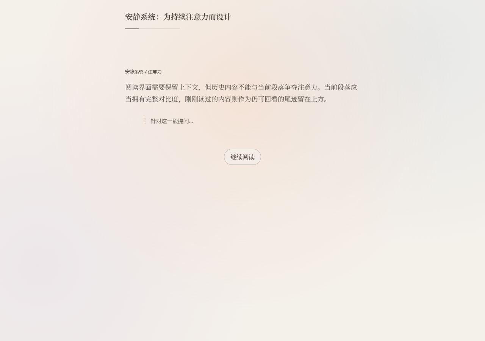
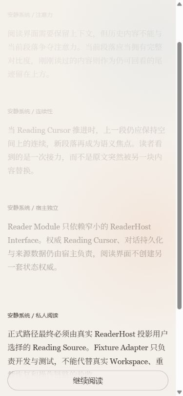

# Formal Focus Reader UI specification

Status: initial implementation specification

This specification promotes the decisions proven by the current-session diffusion prototype. It defines the formal Reader Module presentation without changing the `ReaderHost` seam or claiming that a real host path is complete.

## Module and authority

`FocusReader` is the only public Reader UI entry point. Its Interface remains `FocusReader({ host: ReaderHost })`. Internal rendering and transition modules are implementation details and are not exported from `@focus/reader-ui`.

`ReadingWindow` is always supplied by the host. `ReadingWindow.history` is the complete ordered list of Reading Chunks before `current`. The Reader UI may hold a temporary visual transition frame containing two host-returned windows, but it must not synthesize, persist, or independently advance a Reading Cursor. While a Continue Reading operation is active, no second Continue Reading or message operation may start.

## Information hierarchy

1. Source Title and a thin Reading Cursor position indicator.
2. Complete historical Reading Chunks in source order.
3. The current Reading Chunk at full contrast.
4. Collapsed marginalia attached to the current Reading Chunk.
5. Continue Reading as the only primary action.

There is no brand eyebrow, numeric `index / total` label, phrase-level emphasis, standalone chat panel, prototype switcher, or variant URL.

## Reading Chunk states

| State | Rule |
| --- | --- |
| Current | `data-depth="0"`; full contrast; owns marginalia and focus target. |
| Nearest history | `data-depth="1"`; nearest historical tone and strongest historical opacity. |
| Middle history | `data-depth="2"`; lower contrast and lighter weight. |
| Far history | `data-depth="3"`; all depths of three or more collapse to the faintest visual token but remain selectable in the DOM. |
| Settling | `data-settling`; same keyed Reading Chunk remains mounted while it becomes history. |
| Entering | `data-entering`; the new host-returned current Reading Chunk enters from a short vertical offset. |

Depth is a presentation derivation from array position. It is not stored as product state.

## Continue Reading

1. Capture a Hot Cursor Receipt from the settled `ReadingWindow`.
2. Acquire the single-operation lock, set `aria-busy`, and call `ReaderHost.continueReading` with an `AbortSignal`.
3. On success, render the previous current Reading Chunk as settling history and the returned current Reading Chunk below it.
4. Use CSS transitions limited to transform, opacity, and color. Smooth-scroll the new current Reading Chunk toward the visual center.
5. Commit the returned `ReadingWindow`, release the lock, and move programmatic focus to the new section heading.
6. On `cursor-changed`, discard the visual frame and reload the host's authoritative `ReadingWindow`.
7. On other failure, expose one inline alert and one retry action without mutating the Reading Cursor.

The initial duration is 280ms with `cubic-bezier(0.23, 1, 0.32, 1)`. These values remain subject to design review.

## Diffusion field

- The warm field center follows the current Reading Chunk geometry.
- Cool secondary fields remain low-saturation environmental color, not independent animation.
- No large `filter: blur` surface is allowed; radial-gradient falloff provides softness.
- Continue Reading may briefly lower the warm field opacity while its transform moves to the next Reading Chunk.
- The field is decorative, ignores pointer input, and is hidden from assistive technology.

## Marginalia and conversation

- Marginalia belongs inside the current Reading Chunk and is collapsed by default.
- Sending a message uses the current Hot Cursor Receipt but never invokes Continue Reading.
- Host-returned conversation replaces the visible projection; the Reader UI does not persist a transcript.
- Continue Reading closes the previous marginalia before the next Reading Chunk becomes current.

## State matrix

| State | Required behavior |
| --- | --- |
| Loading | `aria-busy`; no stale action can start. |
| Ready | Current Reading Chunk, marginalia trigger, and Continue Reading are available. |
| Continuing | Operation lock held; settling/entering handoff visible; Continue button busy and disabled. |
| Sending | Operation lock held; message controls and Continue Reading disabled. |
| Error | Inline `role="alert"`; retry reloads the host projection. |
| Completed | Full history remains; completed copy replaces the current Reading Chunk; Continue Reading disabled. |

## Responsive and accessibility rules

- Desktop measure: 66ch; source body 17.5px/1.8.
- Below 40rem: 16.5px/1.75, two diffusion fields, 110vw warm field, full-width sticky Continue action.
- All controls must be keyboard reachable. Enter on the focused Continue button invokes one operation only.
- After Continue Reading, focus moves to the new current heading with `tabIndex={-1}`.
- `prefers-reduced-motion: reduce` removes positional animation and smooth scrolling, commits the returned window immediately, and retains a short opacity/color state change.
- Hover styling is gated by `hover: hover` and `pointer: fine`.

## Performance

- No animation library is required.
- No large-area blur filter or continuous animation is allowed.
- Motion uses compositor-friendly transforms and opacity; the position bar uses `scaleX` rather than width animation.
- Long-history and production Markdown performance remain a formal quality-gate item until measured against a live ReadingWindow.

## Acceptance evidence levels

- Contract verified: ReaderHost/ReadingWindow Interface and Adapter contract tests pass.
- Fixture verified: state, operation locking, history depth, conversation, error recovery, and reduced motion pass with synthetic data.
- Browser verified: desktop, 390px, keyboard, motion, and console checks pass.
- Production build verified: the built application contains no switcher or variant path.
- Live-host verified: a real host projects and mutates real ReadingWindow data correctly.
- Production accepted: reserved for deployed-environment acceptance after Live-host verification.

## Initial browser evidence

The formal initial implementation was checked with the Chinese synthetic Fixture Adapter. Desktop and 390px screenshots are retained as implementation evidence, not as a permanent visual-regression baseline.

