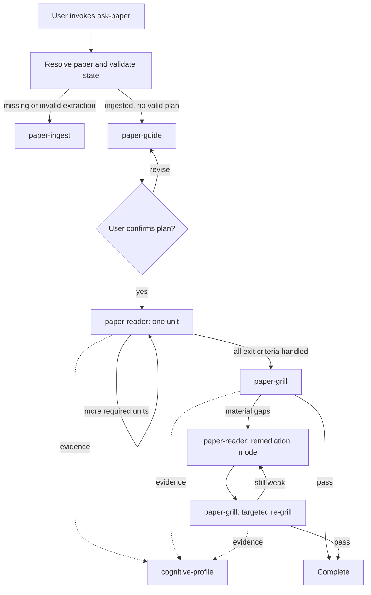

# Paper Companion Skill Suite：设计评审与实施方案

> 状态：设计冻结稿（已完成 grilling 决策）  
> 适用范围：以本地 `knowledge-base/` 为 workspace 的长期论文精读  
> 目标入口：`$ask-paper`  
> Skill 安装范围：仅项目内 `.agents/skills/`，不安装到用户级或全局目录

## 1. 结论先行

原方案的核心方向是正确的：把论文精读拆成解析、导读、陪读、答辩和认知证据五类职责，并用文件保存跨会话状态，适合 20～30 页的系统、编译器、体系结构和 MLsys 论文。

但若要真正成为“根据阅读阶段自动跳转的状态机”，第一版方案还缺少几个关键边界：

1. 缺少唯一的用户入口和路由 Skill。五个阶段 Skill 并不会自行组成状态机。
2. `state.json` 与本项目已有 `paper.yaml` 会形成两个状态真相源。
3. `paper-ingest` 的“全文理解”和 `paper-guide` 的“论文理解”职责重叠。
4. `cognitive-profile` 不是阅读生命周期的最后一站，而是贯穿阅读和答辩的证据层。
5. “用户说懂了”与“已经掌握”虽被区分，但还没有完整的证据状态和升级规则。
6. 原方案默认生成逐页 Markdown、独立公式和表格文件，但现有 `paper-parser` 的稳定输出并不包含这些强制产物。
7. 缺少幂等、来源哈希、状态恢复、计划变更和解析失败后的回退规则。
8. 缺少 plan confirmation、remediation 和 targeted re-grill 之间的正式转移条件。

因此建议将架构调整为：

- 1 个显式路由器：`ask-paper`；
- 4 个生命周期 Skill：`paper-ingest`、`paper-guide`、`paper-reader`、`paper-grill`；
- 1 个横切证据 Skill：`cognitive-profile`；
- 1 份每篇论文的权威状态：`paper.yaml`；
- 1 个可从调用位置发现、创建或复用的 workspace：`knowledge-base/`；
- 1 份由 `ask-paper` 签发、供内部阶段 Skill 消费的路由凭证；
- 1 条答辩失败后的闭环：`grill -> remediation -> targeted re-grill`。

这仍然是六个 Skill 目录，但只有 `$ask-paper` 是正常用户入口。其余五个 Skill 是由 Agent 调用的内部 primitive，类似上层 flow 对 `grilling` 的调用；人为直调只保留受控的 diagnostic/repair 模式。

## 2. 与 MemExplorer 现状的对齐

本项目已经把论文精读知识库与科研探索侧明确隔离：

- `literature/`、`scoop_runs/`、根 `gap-ledger.md` 属于科研探索与 novelty 证据链；
- `knowledge-base/research-corpus/` 属于个人论文精读知识库；
- 精读产生的解释、问答和认知档案不得自动改写探索侧文件；
- 认领论文时复制 PDF，不移动或改写探索侧原件；
- `paper.yaml` 已经承担稳定身份、来源、产物和阅读状态的职责。

因此本套 Skill 不应再创建平行的根目录 `papers/`，而应直接扩展现有布局。

当前 Voxel 论文已经具备：

```text
knowledge-base/research-corpus/
└── Exploring_the_Efficiency_of_3D-Stacked_AI_Chip_Architecture_for_LLM_Inference_with_Voxel/
    ├── source.pdf
    ├── paper.md
    ├── images/
    ├── metadata.json
    ├── paper.yaml
    └── notes/
```

它应作为 MVP 的第一篇端到端验收论文，而不是先为测试另造一套样例数据。

## 3. 设计原则

### 3.1 单一入口，单步路由

用户只需调用 `$ask-paper`。路由器每次读取很小的状态文件和产物清单，选择且只选择一个下一阶段 Skill。

“自动路由”是自动决定下一职责，不是一次调用后无条件跑完整条流水线。遇到下列情况必须停下：

- 需要用户确认阅读计划；
- 正在等待用户回答 checkpoint 或答辩题；
- 输入论文不明确；
- 状态与文件不一致；
- 解析质量未通过；
- 来源 PDF 已改变；
- 用户主动暂停或要求修改路线。

### 3.2 一个状态真相源

每篇论文的 `paper.yaml` 是路由权威。不要再创建并行的 `state.json`。

- `paper.yaml` 保存当前状态快照；
- `reading/events.jsonl` 保存追加式的状态审计记录；
- `reading/responses.jsonl` 和 `assessment/interview.jsonl` 保存用户回答证据；
- `profile.yaml` 是从证据派生出的物化视图，不是原始证据。

### 3.3 推理与确定性操作分离

Agent 负责：

- 识别论文问题、机制、假设和贡献；
- 设计教学依赖；
- 解释、追问、评估和诊断；
- 判断某条用户回答支持何种能力证据。

脚本负责：

- PDF 认领和 SHA-256 计算；
- 状态迁移、revision 检查和原子写入；
- YAML/JSONL schema 验证；
- 产物存在性和引用路径检查；
- 追加 evidence event；
- 从 evidence 重建 profile。

### 3.4 不把精读退化为翻译

阅读单元默认包含来源锚点、必要的短摘录、机制解释和理解检查，不默认复制整段原文或生成整段逐句翻译。只有用户明确要求时才进入翻译模式。

### 3.5 不把自我报告当成掌握证据

“懂了”只能记录为 `self-reported`。只有用户在 checkpoint、答辩或迁移问题中产生可观察回答，才能形成 `observed` 或 `verified` 证据。

### 3.6 先保证可恢复，再追求自动化

任一阶段失败后，应能从已有产物和 `paper.yaml` 恢复，而不是重跑并覆盖全部内容。自动化不得以破坏用户笔记、回答或历史证据为代价。

### 3.7 Workspace 内写入

`ask-paper` 的所有持久状态、生成产物、保留的失败日志、锁和迁移记录都必须位于选定的 `knowledge-base/` 内。外部 PDF 只读；认领时复制到 workspace。Skill 代码不属于运行时产物，仍留在 `.agents/skills/`。

### 3.8 内部阶段必须经过路由授权

正常流程中，`paper-ingest`、`paper-guide`、`paper-reader`、`paper-grill` 和 `cognitive-profile` 不接受无状态的人为推进。`ask-paper` 必须先根据 workspace 与论文状态签发绑定目标 Skill、mode 和 revision 的一次性 route；阶段 Skill 验证 route 后才能执行。

## 4. 目标架构

### 4.1 项目内 Skill 布局

Skill 必须直接放在项目级发现目录下，不要再套一层不可发现的 `paper-companion/skills/...`：

```text
MemExplorer/
└── .agents/
    └── skills/
        ├── ask-paper/
        │   ├── SKILL.md
        │   ├── agents/openai.yaml
        │   ├── references/
        │   │   ├── state-machine.md
        │   │   └── artifact-contracts.md
        │   └── scripts/
        │       ├── state.py
        │       └── validate_workspace.py
        ├── paper-ingest/
        │   ├── SKILL.md
        │   └── references/parser-adapter.md
        ├── paper-guide/
        │   ├── SKILL.md
        │   └── references/paper-types.md
        ├── paper-reader/
        │   ├── SKILL.md
        │   └── references/teaching-protocol.md
        ├── paper-grill/
        │   ├── SKILL.md
        │   └── references/assessment-rubric.md
        └── cognitive-profile/
            ├── SKILL.md
            ├── references/level-rubric.md
            └── scripts/profile.py
```

实现时只创建实际需要的 `scripts/` 和 `references/`。每个 `SKILL.md` 保持短小，把 schema、长模板和论文类型策略放入按需读取的 reference。

### 4.2 六个 Skill 的职责

| Skill | 定位 | 可以做 | 不可以做 |
|---|---|---|---|
| `ask-paper` | 唯一正常用户入口和状态路由器 | 发现/初始化 workspace、选择论文、校验状态、签发一个 route、报告阻塞 | 解析全文、生成教学内容、替用户回答 |
| `paper-ingest` | 内部认领、解析和结构质量门 | 经 route 调用后复制 PDF、调用解析后端、生成来源锚点和质量报告 | 自行初始化 workspace、教学、判断用户理解、宣称论文贡献成立 |
| `paper-guide` | 内部论文模型和阅读路线设计 | 经 route 调用后生成 overview、claim map、依赖有向图、reading plan | 自行选论文、推进阅读进度、授予掌握等级 |
| `paper-reader` | 内部单学习单元互动陪读 | 经 route 调用后推进一个 unit、解释、提问、记录学习证据、执行 remediation | 绕过 route、一次倾倒整篇讲解、把“懂了”记为 mastered |
| `paper-grill` | 内部闭卷答辩和诊断 | 经 route 调用后冻结题集、逐题记录、结束后统一诊断、定向复测 | 绕过 route、每题后立刻泄露标准答案、边问边改历史回答 |
| `cognitive-profile` | 内部横切证据账本和派生档案 | 经 route 或同阶段受控副作用追加证据、校验引用、重建 profile | 独立猜测能力、覆盖历史 evidence、充当线性终点 |

### 4.3 生命周期与横切层



`cognitive-profile` 不拥有阅读 phase。它在新证据产生后被调用，属于状态机下方的证据服务。

## 5. Workspace 与运行时目录

### 5.1 Workspace 定义

`knowledge-base/` 是 `ask-paper` 的运行时根目录。无论用户从哪个目录调用，路由器都先解析一个 workspace，再进行论文选择和阶段路由。

当前六个 Skill 暂时只安装在 MemExplorer 的 `.agents/skills/`，因此“任意位置调用”在 MVP 中表示：只要当前 Codex 会话能够发现或显式加载这些项目级 Skill，运行时 workspace 可以位于任意本地目录。以后将 `ask-paper` 安装为全局 Skill 时，workspace schema 和论文数据无需迁移。

### 5.2 Workspace 解析顺序

按下列顺序选择 workspace：

1. 用户显式指定的 workspace；
2. 若当前目录本身是带 `workspace.yaml` 的 `knowledge-base/`，直接复用；
3. 从当前目录逐级向上，查找最近的 `<ancestor>/knowledge-base/workspace.yaml`；
4. 若没有 marker，但当前目录本身或最近祖先下存在非空 `knowledge-base/`，将它视为未标记候选并进入确认门；
5. 若完全不存在候选，则在 `$PWD/knowledge-base/` 自动初始化。

显式路径始终优先。这样从 `MemExplorer/scoop_runs/...` 调用时会复用 `MemExplorer/knowledge-base/`，而不会创建嵌套知识库。用户若确实需要新的本地库，应显式指定新 workspace。

### 5.3 初始化与兼容迁移

- workspace 不存在或目录为空：自动创建最小目录和 `workspace.yaml`；
- 目录非空但没有 marker：fail closed，先展示已有结构并请求一次确认；
- 用户确认接管后：只补 manifest、registry 和控制目录，不覆盖既有文件；
- marker 的 schema 版本高于当前实现：阻塞，不猜测降级；
- 兼容的加法迁移：允许执行，但在 `.paper-companion/migrations/` 记录变更；
- 任何破坏性迁移：MVP 不自动执行。

当前 MemExplorer 的 `knowledge-base/` 是已确认的兼容实例。首次初始化只能补充控制文件，不得移动或重写现有 Voxel 论文。

`workspace.yaml` 建议为：

```yaml
schema_version: 1
workspace_id: kb-6b17f8d2
created_at: 2026-07-15T00:00:00+08:00
defaults:
  explanation_language: zh-CN
  quote_language: original
paths:
  registry: reading-registry.yaml
  corpus: research-corpus
  profile: cognitive-profile
  control: .paper-companion
```

manifest 不保存 workspace 的绝对路径，使整个 `knowledge-base/` 可以移动。外部 PDF 原路径只作为 provenance 提示，不能替代 hash。

### 5.4 目录布局

建议在现有论文目录中增量扩展：

```text
knowledge-base/
├── workspace.yaml
├── reading-registry.yaml
├── .paper-companion/
│   ├── locks/
│   ├── routes/
│   ├── runs/
│   └── migrations/
├── cognitive-profile/
│   ├── profile.yaml
│   ├── evidence.jsonl
│   └── history/
└── research-corpus/
    └── <paper-directory>/
        ├── source.pdf
        ├── paper.md
        ├── images/
        ├── metadata.json
        ├── paper.yaml
        ├── ingest/
        │   ├── extraction-report.md
        │   ├── source-map.yaml
        │   └── validation.json
        ├── guide/
        │   ├── overview.md
        │   ├── reading-plan.yaml
        │   └── claim-map.yaml
        ├── reading/
        │   ├── events.jsonl
        │   ├── responses.jsonl
        │   ├── units/
        │   │   └── U001.md
        │   └── sessions/
        ├── assessment/
        │   ├── questions.yaml
        │   ├── interview.jsonl
        │   ├── diagnosis.md
        │   └── remediation.yaml
        └── notes/
```

说明：

- `reading-registry.yaml` 只保存论文索引、别名和 `last_used_paper` 提示，不保存 phase；
- 每篇论文的 phase 只存在于该论文的 `paper.yaml`；
- `.paper-companion/` 只保存 workspace 控制面、锁、一次性 routes、临时运行和迁移记录；
- `pages/`、独立 `tables/` 和独立 `equations/` 是解析后端支持时的可选产物，不属于 MVP 强制契约；
- `overview.svg` 暂不作为必需产物，第一版在 `overview.md` 内嵌 Mermaid 即可；
- 用户笔记与生成产物分目录，任何重建都不得覆盖 `notes/`、回答记录和 evidence。

### 5.5 输出边界与档案作用域

- 所有需要保留的临时文件和失败日志写入 `.paper-companion/runs/<run-id>/`；
- 成功后可以清理无价值的临时文件，失败诊断必须保留；
- 外部输入只读，正式副本进入 `research-corpus/`；
- workspace 内部引用优先使用相对路径；
- `cognitive-profile/` 只描述当前 workspace 的用户证据；
- 不同 workspace 之间不自动合并 profile，未来只能通过显式 export/merge 流程处理。

## 6. 权威状态模型

### 6.1 `reading-registry.yaml`

workspace 级文件只保存论文索引和最近使用提示：

```yaml
schema_version: 1
last_used_paper: voxel-187167f0
papers:
  voxel-187167f0:
    directory: Exploring_the_Efficiency_of_3D-Stacked_AI_Chip_Architecture_for_LLM_Inference_with_Voxel
    title: Exploring the Efficiency of 3D-Stacked AI Chip Architecture for LLM Inference with Voxel
    aliases:
      - Voxel
```

论文解析状态和阅读进度不得复制到 registry。`last_used_paper` 不是排他锁或路由权威；当多篇论文都可继续且用户未明确指定时，必须列出候选，不得根据最近使用记录静默猜测。

### 6.2 `paper.yaml` v2

现有 schema v1 可以迁移为下列形态；目录名不需要因迁移而改变：

```yaml
schema_version: 2
paper_id: voxel-187167f0
title: Exploring the Efficiency of 3D-Stacked AI Chip Architecture for LLM Inference with Voxel
aliases:
  - Voxel

identifiers:
  doi: 10.1145/3579371.3589048

provenance:
  exploration_pdf: scoop_runs/g03-precheck/papers/03_voxel.pdf
  source_sha256: 187167f0eb1874d78138a0e98ffa1c15c0ecd4fb3aeaa9e36725d0f2d3dcd38

related_versions: []

artifacts:
  source_pdf: source.pdf
  parsed_markdown: paper.md
  parser_metadata: metadata.json
  images: images
  ingest_report: ingest/extraction-report.md
  source_map: ingest/source-map.yaml
  reading_plan: guide/reading-plan.yaml
  claim_map: guide/claim-map.yaml
  notes: notes

ingest:
  status: validated
  parser: MinerU
  parser_version: null
  source_sha256: 187167f0eb1874d78138a0e98ffa1c15c0ecd4fb3aeaa9e36725d0f2d3dcd38
  validated_at: 2026-07-15T00:00:00+08:00
  warnings: []

reading:
  phase: guide
  status: ready
  revision: 1
  plan_revision: 0
  current_unit: null
  completed_units: []
  assessment_round: 0
  remediation_targets: []
  blocked_reason: null
  updated_at: 2026-07-15T00:00:00+08:00
```

### 6.3 枚举语义

`reading.phase`：

```text
ingest | guide | read | grill | remediate | complete
```

`reading.status`：

```text
ready | running | awaiting-user | blocked | complete
```

phase 表示当前职责；status 表示该职责当前是否可运行。不要把二者拼成大量含混状态，例如 `waiting_for_unit_three_answer`。

单元状态：

```text
planned
presented
self-reported
verified
needs-remediation
skipped
stale
```

其中：

- `self-reported` 不满足掌握证据门槛；
- `verified` 必须有回答记录和 rubric 判定；
- `skipped` 允许继续，但最终诊断必须显示为未验证；
- reading plan 变化后，受影响的旧单元标记为 `stale`，而不是静默沿用。

remediation target 状态：

```text
pending | teaching | ready-for-regrill | verified | waived
```

`remediation_targets` 中的每一项都应包含稳定 ID、concept/claim 引用、诊断证据和上述状态。只有 `pending` 或 `teaching` 目标才交给 reader；只有 `ready-for-regrill` 目标才交给 grill。`waived` 必须由用户显式选择，并保留为未验证项。

### 6.4 路由凭证

route 是 `ask-paper` 为一次内部调用签发的 workspace 级凭证，存放在 `.paper-companion/routes/<route-id>.yaml`。它不能只存在于 `paper.yaml`，因为新 PDF 在 ingest 前还没有论文 manifest。

示例：

```yaml
schema_version: 1
route_id: route-20260715-0001
workspace_id: kb-6b17f8d2
target_skill: paper-reader
allowed_helpers:
  - cognitive-profile
mode: normal
paper_id: voxel-187167f0
input_sha256: null
expected_revision: 7
status: issued
issued_at: 2026-07-15T00:00:00+08:00
```

新论文的 ingest route 可以令 `paper_id: null`，但必须绑定已计算的 `input_sha256` 和输入路径。ingest 创建正式 `paper.yaml` 后，再把最终 `paper_id` 写入 route 的消费记录。

route 状态为：

```text
issued | consumed | cancelled
```

一份有效 route 至少绑定：

- 不可复用的 `route_id`；
- 唯一 `target_skill`；
- 允许在同一语义阶段内调用的 `allowed_helpers`；
- `normal`、`diagnostic` 或 `repair` mode；
- 签发时的 `expected_revision`；
- 目标 workspace，以及已有 paper 或待 ingest 输入；
- route 状态。

route 不依赖墙钟时间判断有效性；它通过一次性消费、输入 hash 和 revision 绑定防止陈旧调用。任何相关 state revision 变化都会使尚未消费的旧 route 失效。helper 只能使用父 route 明确列出的权限，且不得自行推进 phase。

route 不承载跨对话等待。阶段 Skill 在向用户提出问题前，必须先保存 `awaiting-user` 状态、消费 route 并释放锁；用户下一次回复时由 `ask-paper` 签发新的 resume route。

### 6.5 论文身份与版本

- `source_sha256` 是论文副本去重权威，标题和文件名都不是唯一身份；
- 相同 hash：复用既有论文记录；
- 相同标题但 hash 不同：创建独立版本，绝不覆盖；
- `paper_id` 使用稳定 slug 与 hash 前缀，例如 `voxel-187167f0`；
- 新目录默认使用清晰的 sanitized title；只有重名冲突时追加 `__<hash8>`；
- 现有目录不因采用新命名规则而重命名；
- 版本可以用 `related_versions` 关联，但旧阅读证据不自动继承到新 hash。

## 7. 路由规则

### 7.1 论文选择优先级

`ask-paper` 按以下顺序解析目标：

1. 用户本轮明确给出的 PDF、目录、`paper_id` 或唯一别名；
2. 唯一一篇 `reading.status != complete` 的论文；
3. 若有多篇可继续，列出候选并等待用户选择；
4. `last_used_paper` 只能作为候选排序或提示，不能消除歧义。

### 7.2 路由前检查

每次路由都必须先检查：

1. workspace marker 存在且 schema 兼容；
2. 对既有论文，`paper.yaml` schema 可读取；对新输入，PDF 可读且 SHA-256 已计算；
3. 对既有论文，`source.pdf` 的当前 SHA-256 与 provenance/ingest 一致；
4. 对既有论文，当前 phase 所需产物存在并通过最小校验；
5. 对既有论文，`reading.revision` 没有被并发更新；
6. 目标论文或新输入 hash 没有被另一有效执行持锁；
7. 状态没有 `blocked_reason`；
8. 没有尚待用户回答的问题。

状态字段不能压过现实文件。例如 `phase: read` 但 `reading-plan.yaml` 丢失时，应路由到 guide repair，而不是继续虚构 U003。

### 7.3 路由优先级伪代码

```text
resolve or initialize workspace
resolve paper
validate manifest and source hash
acquire per-paper or input-hash lock

if blocked:
    report exact blocker
    release lock and stop

if an interaction is awaiting user:
    target = owner of the pending interaction in resume mode
else if ingest artifacts are absent or invalid:
    target = paper-ingest
else if guide artifacts are absent, stale, or invalid:
    target = paper-guide
else if plan is not confirmed:
    target = paper-guide in confirmation mode
else if required units remain:
    target = paper-reader for exactly one unit
else if no complete grill round exists:
    target = paper-grill
else if any remediation target is pending or teaching:
    target = paper-reader in remediation mode
else if any remediation target is ready-for-regrill:
    target = paper-grill in targeted mode
else:
    mark complete, present summary, release lock, and stop

issue one route bound to target and expected revision or input hash
invoke target skill
consume or cancel route
release lock
```

### 7.4 正式转移表

| 当前 phase/status | Guard | 路由 | 成功后的状态 |
|---|---|---|---|
| 无论文记录 | 用户给出可读 PDF | `paper-ingest` | `guide/ready` |
| `ingest/ready` 或解析产物失效 | 无 | `paper-ingest` | `guide/ready` |
| `guide/ready` | ingest gate 通过 | `paper-guide` | `guide/awaiting-user` |
| `guide/awaiting-user` | 等待 plan 确认或修改 | `paper-guide` confirmation mode | 确认后 `read/ready` |
| `read/ready` | 存在未处理的 required unit | `paper-reader` | `read/awaiting-user` 或下一个 `read/ready` |
| `read/awaiting-user` | 等待 checkpoint 回答 | `paper-reader` resume mode | 更新单元证据 |
| `read/ready` | 所有 required unit 已 verified/skipped | `paper-grill` | `grill/awaiting-user` |
| `grill/awaiting-user` | 仍有冻结题目未回答 | `paper-grill` | 下一题或统一 diagnosis |
| `grill/running` | 诊断存在实质缺口 | 写入 diagnosis 和 remediation targets | `remediate/ready`，targets 为 `pending` |
| `remediate/ready` | 存在 `pending/teaching` target | `paper-reader` remediation mode | 等待回答，或把 target 置为 `ready-for-regrill` |
| `remediate/ready` | 存在 `ready-for-regrill` target | `paper-grill` targeted mode | 通过则 `verified`；未通过则回到 `pending` |
| `complete/complete` | 用户未显式 reopen | 无自动阶段 | 展示档案与可选回顾 |
| 任意 `blocked` | blocker 未解除 | 不前进 | 精确报告 blocker |

### 7.5 内部 Skill 调用契约

正常调用：

1. `ask-paper` 解析 workspace 和论文；
2. 校验状态并选择一个目标 Skill；
3. 在 workspace 控制面写入 route 凭证；
4. Agent 加载并执行目标 Skill；
5. 目标 Skill 验证 workspace、paper、route id、mode 和 revision；
6. 成功时提交状态并消费 route，失败时记录诊断并取消或保留可恢复状态。

缺少有效 route 时：

- 普通直调：拒绝状态推进，并引导用户使用 `$ask-paper`；
- `diagnostic` 直调：必须显式请求、指向既有 workspace，且严格只读；若需要写入则升级为 repair；
- `repair` 直调：阶段 Skill 先保持只读并把请求交回 `ask-paper`；只有 `ask-paper` 完成 schema/权限检查并签发 `mode: repair` route 后才能写入；
- repair 完成后写入审计事件并交回 `ask-paper` 重验，不能自行跨 phase；
- 阶段 Skill 永远不自行初始化 workspace。

一次 `$ask-paper` 调用只执行一个语义阶段。状态脚本、锁处理、evidence 追加和 profile 物化是该阶段的受控副作用，不算额外阶段。

## 8. `paper-ingest` 的完善方案

### 8.1 与现有 `paper-parser` 的关系

不要直接修改全局 `paper-parser` Skill。建议在项目内建立 `paper-ingest` 适配层，复用其解析引擎或 CLI，并改变以下工作流边界：

1. 输出进入 `knowledge-base/research-corpus/<paper-directory>/`；
2. 先按 SHA-256 去重，再决定新建或复用；
3. 在 `knowledge-base/.paper-companion/runs/<run-id>/` 解析并校验，通过后再提升到正式目录；
4. 不默认覆盖已存在的论文目录；
5. 重解析只替换生成产物，不碰 notes、responses、assessment 和 profile evidence；
6. 记录 parser 名称、版本、时间、source hash 和警告；
7. 解析失败时保留诊断产物，不把状态写成 validated。

`paper-parser` 当前稳定产物是 `paper.md`、`images/`、`metadata.json` 和 PDF 副本。MVP 应以这些真实产物为契约，不应假设一定能得到逐页 Markdown、独立公式或表格文件。

### 8.2 职责边界

`paper-ingest` 可以输出：

- 章节层级和标题顺序；
- figure/equation/table 的可用数量与路径；
- Markdown 锚点；
- 缺失页、乱码、断裂公式、孤立图片等质量警告；
- 解析后端无法确认的信息。

`paper-ingest` 不应输出：

- “作者真正的核心贡献”；
- 教学顺序；
- 用户可能困难的概念推断；
- 论文机制正确性判断；
- 用户是否理解。

原方案 `extraction-report.md` 中的 `Paper Type`、`Main Components` 和 `Difficult Sections` 属于 `paper-guide`，应从 ingest 报告移出。

### 8.3 `source-map.yaml`

来源锚点必须允许 page 缺失，不能制造伪精确页码：

```yaml
schema_version: 1
source_sha256: 187167f0eb1874d78138a0e98ffa1c15c0ecd4fb3aeaa9e36725d0f2d3dcd38
anchors:
  - id: sec-3-2
    kind: section
    heading: Voxel Overview
    markdown_heading: "## 3.2 Voxel Overview"
    page: null
  - id: fig-3
    kind: figure
    asset: images/figure_003.png
    caption: null
    page: null
```

### 8.4 ingest 质量门

只有同时满足以下条件才能转移到 guide：

- `source.pdf` 存在且 hash 已记录；
- `paper.md` 非空且能识别至少一个标题或正文块；
- `metadata.json` 可解析；
- `paper.md` 中的本地图像引用不存在明显断链；
- `validation.json` 的 blocking errors 为空；
- extraction report 明确列出非阻塞警告。

解析成功不等于语义完整。公式或表格严重损坏时，可以进入 `blocked`，要求人工查看 PDF，而不是让 guide 基于残缺文本继续推理。

## 9. `paper-guide` 的完善方案

### 9.1 核心任务

`paper-guide` 负责把论文重构为“作者的问题—机制—证据—限制”模型，并设计学习依赖，而不是简单按原文章节顺序重述。

它生成：

- `guide/overview.md`；
- `guide/claim-map.yaml`；
- `guide/reading-plan.yaml`。

`overview.svg` 延后。第一版在 `overview.md` 中使用 Mermaid，便于版本化和修订。

### 9.2 Claim map 必须区分来源类型

```yaml
schema_version: 1
claims:
  - id: C01
    kind: author-claim
    statement: Voxel enables end-to-end exploration across software and hardware choices.
    source_anchors:
      - sec-3-2
    supported_by:
      - E01
    assumptions:
      - A01
    limitations:
      - L01
    confidence: high

  - id: I01
    kind: guide-inference
    statement: The execution graph is the central seam connecting compiler decisions to simulation.
    source_anchors:
      - sec-3-3
      - sec-3-4
    confidence: medium
```

至少区分：

```text
author-claim | reported-evidence | guide-inference | open-question
```

Agent 的教学性概括不能冒充作者原文结论。

### 9.3 Reading plan 是依赖图，不是章节目录

```yaml
schema_version: 1
paper_id: voxel-187167f0
plan_revision: 1
units:
  - id: U01
    title: Why distributed 3D memory changes the exploration problem
    required: true
    depends_on: []
    objective: Explain why conventional chip-level exploration tools are insufficient.
    source_anchors:
      - sec-2-3
      - sec-2-5
    entry_check: Describe the conventional memory wall in one sentence.
    exit_criteria:
      - Distinguish bandwidth capacity from distributed placement constraints.
      - Name one limitation of existing tools identified by the paper.
    assessment_dimensions:
      - motivation
      - mechanism

  - id: U02
    title: Execution graph as the software-hardware seam
    required: true
    depends_on:
      - U01
    objective: Reconstruct how software intent becomes a simulation workload.
    source_anchors:
      - sec-3-3
      - sec-3-4
    exit_criteria:
      - Trace one operator from interface to simulator.
      - Explain what information would be lost without the graph.
    assessment_dimensions:
      - mechanism
      - tradeoff
```

注意：

- 无依赖使用 `[]`，不用字符串 `none`；
- objective 必须可验证；
- 每个 unit 必须有 source anchors；
- 每个 required unit 必须有退出标准；
- plan revision 必须固定；
- guide 先生成计划，不提前生成所有冗长的 unit 讲义。

### 9.4 计划确认门

进入 reader 前必须让用户看到：

- 论文的一句话问题；
- 预计 unit 数量；
- 必修与可选单元；
- 推荐顺序及原因；
- 预计重点；
- 可调整选项，例如“先机制后背景”“跳过已熟悉背景”。

用户确认后记录 `PLAN_CONFIRMED`。如果用户修改路线，增加 `plan_revision`，不得静默改写已经产生的学习证据。

## 10. `paper-reader` 的完善方案

### 10.1 每次只推进一个可观察动作

“一个 unit”可以跨多个对话轮次。一次响应不应同时完成讲解、提问、替用户假设答案并标记通过。

推荐单元协议：

1. 激活已有知识或提出 entry check；
2. 给出本 unit 的问题框架；
3. 引用必要的 source anchor 和短摘录；
4. 解释机制、因果链和 tradeoff；
5. 给出一个 checkpoint；
6. 停止并等待用户回答；
7. 记录原始回答；
8. 按 rubric 判定 evidence；
9. 决定通过、追问、补救或允许跳过。

### 10.2 Unit 文件建议

```markdown
# U02 — Execution graph as the software-hardware seam

## Learning goal

能够从软件接口追踪到模拟器输入，并说明 execution graph 保留了哪些关键信息。

## Source anchors

- sec-3-3
- sec-3-4
- fig-3

## Mental model

这里写因果模型，不做整段翻译。

## Mechanism trace

1. ...
2. ...
3. ...

## Checkpoint

如果删除 execution graph 中的通信边，后续模拟结果会失去什么信息？

## Exit criteria

- 能追踪一条完整路径；
- 能说明至少一个丢失的信息类别。
```

用户回答不要反复覆盖 Unit 文件，而应追加到 `reading/responses.jsonl`。

### 10.3 用户指令语义

| 用户表达 | 行为 |
|---|---|
| `继续` | 若没有待回答问题，进入下一教学动作；否则提醒当前 checkpoint，不假装已回答 |
| `为什么` | 暂停推进，针对当前因果链解释，并保留 current unit |
| `懂了` | 记录 `self-reported`，不记为 verified |
| `跳过` | 标记 `skipped`，记录原因，允许前进但在 diagnosis 中保留缺口 |
| `回顾` | 总结当前 unit 的模型与未解决问题，不改变状态 |
| `状态` | 交回 `ask-paper` 展示进度、证据和下一动作 |

### 10.4 Checkpoint 证据等级

单次回答先判定：

```text
no-evidence | misconception | partial | sufficient | transfer
```

`sufficient` 才能使 unit 成为 `verified`。`transfer` 表示用户能把机制应用到一个新情境，但是否升级长期能力仍由 cognitive-profile 的跨证据规则决定。

## 11. `paper-grill` 的完善方案

### 11.1 答辩前冻结

答辩开始前生成并冻结：

- 覆盖维度；
- 问题顺序或允许的分支；
- 每题 source anchors；
- expected points；
- misconception indicators；
- 通过和 remediation 规则。

冻结后不得根据用户已给出的答案偷偷降低标准。允许的追问必须记录为该题的 follow-up。

### 11.2 覆盖维度

MVP 至少覆盖：

1. Motivation：为什么需要这篇论文；
2. Problem formulation：作者具体解决什么，不解决什么；
3. Mechanism：核心设计为什么有效；
4. Figure/dataflow：能否从图中重建关系；
5. Formula/model：关键项、假设和适用边界；
6. Evidence：实验是否真的支持 claim；
7. Tradeoff：代价、约束和退化情形；
8. Criticism/transfer：换条件后是否仍成立。

并非每篇论文都必须有公式题。题型应由 claim map 和 source map 决定，不能为了模板完整虚构内容。

### 11.3 交互纪律

```text
Question
  -> User answer
  -> Record verbatim answer
  -> Optional clarification/follow-up
  -> Next question
  -> All required questions complete
  -> Diagnosis
  -> Remediation plan
```

在整轮完成前：

- 不给标准答案；
- 不做长篇纠错；
- 不把用户后来的答案回填成早先已会；
- 可以澄清题意，但不能把解题关键作为“澄清”泄露。

### 11.4 诊断和通过规则

不要只给一个总分。诊断至少按 concept/claim 列出：

- verdict；
- 用户回答证据引用；
- 缺失的 expected points；
- misconception；
- 影响到的 claim 或后续 unit；
- remediation target。

任何核心 mechanism 存在 misconception 时，不得判整篇完成。进入 remediation 后由 `paper-reader` 重新教学，再由 `paper-grill` 做 targeted re-grill。补救后的“自称理解”仍不能替代复测。

## 12. `cognitive-profile` 的完善方案

### 12.1 Evidence 是权威，Profile 是派生

`knowledge-base/cognitive-profile/evidence.jsonl` 只追加，不覆盖。修正错误时追加 superseding event。

该 evidence ledger 和派生 profile 只属于当前 workspace。不同 `knowledge-base/` 之间不自动查询、复制或合并认知证据。

建议事件：

```json
{
  "schema_version": 1,
  "event_id": "ev-20260715-0001",
  "paper_id": "voxel-187167f0",
  "concept_id": "architecture.execution_graph",
  "evidence_type": "grill-answer",
  "verdict": "sufficient",
  "level_candidate": 3,
  "confidence": "high",
  "source_artifact": "assessment/interview.jsonl#A04",
  "rubric": "Explains the preserved dependency and communication information",
  "recorded_at": "2026-07-15T00:00:00+08:00"
}
```

不要在 evidence 中复制大段用户回答；保存对回答记录的稳定引用。

### 12.2 能力等级

| Level | 可观察标准 |
|---|---|
| 0 | 没有可用证据，或存在根本性误解 |
| 1 | 能识别术语并给出基本定义 |
| 2 | 能解释用途及粗略因果关系 |
| 3 | 能解释机制、关键假设和至少一个 tradeoff |
| 4 | 能迁移到新情境、比较替代方案或提出有证据的批判 |

升级约束：

- self-report 不能升级 level；
- 单篇论文中的一次回答最多形成 `level_candidate`；
- Level 3 需要至少一条 verified mechanism 证据；
- Level 4 原则上需要迁移题或跨论文/跨情境证据，不能因一句“我觉得这个方法有问题”授予；
- 新证据可以降低置信度或将 status 标为 `contested`；
- 长期未复用的能力可以标为 `stale`，但不要自动删除历史等级。

### 12.3 Profile 示例

```yaml
schema_version: 1
generated_from_event: ev-20260715-0001
domains:
  architecture:
    execution_graph:
      level: 3
      status: verified
      confidence: high
      evidence_refs:
        - ev-20260715-0001
      last_observed_at: 2026-07-15T00:00:00+08:00
```

Profile 重建必须由确定性脚本完成，保证同一 evidence ledger 产生同一 profile。

## 13. 状态一致性、幂等与恢复

### 13.1 来源变化

若 `source.pdf` 当前 hash 与 `paper.yaml.provenance.source_sha256` 不一致：

1. 立即进入 `blocked`；
2. 不沿用旧 claim map、plan 或 assessment；
3. 要求用户选择恢复原 PDF，或以新版本 re-ingest；
4. 若选择新版本，保留历史 evidence，但把依赖旧 source hash 的生成产物标为 stale。

### 13.2 重跑 ingest

同一 hash 的 PDF：复用已有论文，不新建重复目录。

不同 hash、相同标题的 PDF：视为不同版本，禁止静默覆盖。可在 paper_id 或版本记录中区分。

### 13.3 计划变化

reading plan 每次实质变化都增加 `plan_revision`。已完成 unit 的 source anchors 或 exit criteria 被修改时，将相关证据标记为 stale 或待复核。

### 13.4 中断恢复

每次向用户提出需要回答的问题之前，先保存：

- 当前 phase/status；
- current unit 或 current question；
- plan/assessment revision；
- 本轮 prompt 的稳定 ID。

这样新会话中的 `$ask-paper 继续` 才能恢复到“等待 U03 checkpoint”，而不是误跳到 U04。

### 13.5 状态写入

建议所有状态变化通过 `ask-paper/scripts/state.py`：

```text
inspect
select
issue-route --target <skill> --mode <mode> --expected-revision N
consume-route --route-id <id>
cancel-route --route-id <id>
transition --expected-revision N
block
unblock
validate
```

脚本使用临时文件加原子替换，并检查 expected revision。阶段 Skill 不直接用自由文本重写整个 `paper.yaml`。

### 13.6 锁与并发

- 每篇论文使用独立锁，锁文件位于 `.paper-companion/locks/`；
- 获取锁后必须重新读取 `paper.yaml`，不能沿用加锁前的 revision；
- revision 冲突或另一有效执行持锁时 fail closed；
- 过期锁只能由显式 repair 流程检查并清除，不能仅凭时间静默删除；
- 所有退出路径都必须释放当前执行持有的锁；
- 在等待用户输入前必须提交 `awaiting-user`、消费当前 route 并释放锁，不能跨对话持锁；
- route 消费和状态 revision 更新应由同一状态脚本提交，避免重复执行阶段副作用。

### 13.7 路径与迁移

- workspace 内部产物使用相对路径；
- provenance 可以记录原 PDF 的绝对路径，但只作信息提示；
- 迁移前验证 marker 和 schema，迁移记录写入 `.paper-companion/migrations/`；
- 当前 MemExplorer 只允许加法迁移：创建 `workspace.yaml`、registry、profile/control 目录并扩展 `paper.yaml`；
- 不移动现有 Voxel 目录，不删除 v1 字段，除非后续迁移规范明确提供兼容期和回滚方式。

## 14. Skill 触发与调用约定

### 14.1 用户入口

推荐调用示例：

```text
$ask-paper 认领并阅读 scoop_runs/g03-precheck/papers/03_voxel.pdf
$ask-paper --workspace /path/to/knowledge-base 继续读 Voxel
$ask-paper 继续读 Voxel
$ask-paper 状态
$ask-paper 开始答辩
$ask-paper 回顾我对 execution graph 的理解
```

`ask-paper` 的 description 应覆盖：workspace 创建/复用、论文认领、继续阅读、阅读状态、答辩、补救和认知档案查询。它是唯一需要向普通用户暴露的入口。

### 14.2 阶段 Skill 的触发边界

阶段 Skill 是可由 Agent 调用的内部 primitive。其 description 应同时写明：

- 其具体职责；
- “仅当 `ask-paper` 根据状态签发到本阶段的有效 route 时执行正常模式”；
- diagnostic 只读，以及显式 repair 请求交回 `ask-paper` 签发 route 的受控场景；
- 不得自行发现、创建 workspace 或选择另一篇论文。

普通用户直接点名 `$paper-reader`、`$paper-grill` 等阶段 Skill 时，Skill 必须校验 route；若不存在则停止并引导回 `$ask-paper`。不要把“何时使用”只写在 SKILL.md 正文，因为模型触发前看不到正文。

### 14.3 显式入口优先

MVP 首先保证显式 `$ask-paper` 路由可靠，再考虑自然语言自动触发。阶段 Skill 必须保持 model-invocable，才能被路由器作为 primitive 使用。若当前运行时支持并验证了类似 `disable-model-invocation` 的入口控制字段，它只适合控制需要人为显式触发的 `ask-paper`；不得将该字段用于内部阶段 Skill。

若 validator 或运行时不支持该扩展字段，只使用标准 `name` 与 `description`，并依靠 route 校验保证正确性。项目级安装仅影响 Skill 能否被发现，不改变 workspace 的位置解析协议。

## 15. MVP 范围

### 15.1 必须实现

- 项目内六个 Skill 目录；
- workspace 发现、空目录自动初始化和非空未标记目录确认门；
- `workspace.yaml`、控制目录和相对路径契约；
- `paper.yaml` v1 -> v2 的安全迁移；
- 多论文选择、`last_used_paper` 提示和歧义 fail closed；
- 基于 SHA-256 的去重、标题冲突和版本关联；
- route 签发/消费、内部阶段校验和 diagnostic/repair 直调策略；
- 每篇论文独立锁和 revision 冲突处理；
- 状态校验和单阶段路由；
- 复用现有 parser 产物的 ingest gate；
- guide、claim map 和可确认 reading plan；
- 单 unit 跨会话恢复；
- checkpoint evidence；
- 一轮完整闭卷 grill；
- remediation 和一次 targeted re-grill；
- append-only evidence 与可重建 profile；
- 精读侧不得自动修改科研探索侧文件。

### 15.2 暂不实现

- 自动搜索或推荐论文；
- 自动补背景课程；
- 全文逐句翻译；
- HTML 网站或 dashboard；
- 强制生成 SVG；
- spaced repetition 调度；
- 多用户同步；
- 自动把阅读结论写回 `literature/` 或 `gap-ledger.md`；
- 对所有论文强制逐页、逐公式、逐表格拆分。

## 16. 推荐实施顺序

原方案建议先实现 reader、grill 和 profile，这有助于先定义教学行为，但如果直接编码，三个 Skill 很容易各自发明不同的状态格式。

建议采用“先冻结行为契约，再做纵向切片”的顺序：

### Phase A：冻结契约

1. 定义 reader checkpoint、grill rubric 和 profile level 的语义；
2. 定义 workspace、registry、`paper.yaml` v2、route、reading plan、claim map 和 evidence schema；
3. 定义状态迁移表、内部调用契约、锁和 blocker 规则。

### Phase B：用现有 Voxel 做最薄纵向切片

1. 非破坏初始化当前 `knowledge-base` 的 workspace marker 和控制目录；
2. 实现 `ask-paper` workspace 解析、状态读取、route 和单阶段调用；
3. 将现有 Voxel `paper.yaml` 迁移为 v2；
4. 生成一个最小 guide 和 2～3 个 unit；
5. 完成一个 checkpoint；
6. 完成 3～4 题的小型 grill；
7. 写入一条 evidence 并重建 workspace-local profile。

这一阶段先证明跨 Skill 状态闭环，不追求读完整篇论文。

### Phase C：扩成完整一篇论文

1. 完整 reading plan；
2. 全部 required units；
3. 八个维度的 grill；
4. remediation 与 targeted re-grill；
5. 新会话恢复和 plan revision 测试。

### Phase D：接入新 PDF ingest

1. 建立项目内 `paper-ingest` adapter；
2. 测试 SHA-256 去重和非覆盖策略；
3. 测试 parser 失败与坏公式/坏图片阻塞；
4. 用第二篇 20～30 页论文验证多论文选择。

## 17. 验收场景

| 场景 | 预期行为 |
|---|---|
| 在没有知识库的目录调用 `$ask-paper` | 在 `$PWD` 创建最小 `knowledge-base/` |
| 从 MemExplorer 子目录调用 | 向上发现并复用根 `knowledge-base/`，不创建嵌套目录 |
| 显式指定另一个 workspace | 显式路径优先，不受最近 workspace 影响 |
| 发现非空但无 marker 的 `knowledge-base/` | 展示结构并等待确认，不自动接管 |
| 首次复用当前 MemExplorer 知识库 | 只补控制文件，不移动或覆盖 Voxel 产物 |
| 用户给出新 PDF | 认领、去重、解析、质量门，通过后停在 guide |
| 再次给出相同 hash 的 PDF | 复用既有 paper，不创建重复目录 |
| 给出同标题、不同 hash 的 PDF | 新建版本；冲突目录追加 hash，不继承旧证据 |
| 用户给出已解析 Voxel | 复用现有产物，不覆盖，路由到 guide |
| plan 未确认时说“继续” | 仍展示/确认计划，不进入 U01 |
| U03 checkpoint 等待中开启新会话 | `$ask-paper 继续` 恢复 U03 问题 |
| 用户只说“懂了” | 记录 self-reported，不记为 verified |
| 用户明确跳过一个 required unit | 允许前进，但 grill/diagnosis 保留未验证项 |
| grill 中答错核心机制 | 整轮后诊断，路由 remediation，不立即泄露答案 |
| remediation 后用户说“明白了” | 仍需 targeted re-grill 才能关闭缺口 |
| 修改 reading plan | 增加 revision，受影响证据标 stale |
| source PDF 被替换 | block，不沿用旧 guide 或 assessment |
| 同时有两篇未完成论文且用户未指定 | 列出候选并等待选择；`last_used_paper` 只排序 |
| 用户直接调用阶段 Skill | 无有效 route 时拒绝推进并引导回 `$ask-paper` |
| diagnostic 直调 | 读取既有 workspace，不创建目录、不修改状态 |
| repair 直调 | 先只读交回 `$ask-paper` 签发 repair route；修复后记录审计并重验 |
| 两个执行同时修改同一论文 | 第二个执行因锁或 revision 冲突 fail closed |
| 精读结束 | 更新 knowledge-base 内 profile，不改 `literature/`、`scoop_runs/`、`gap-ledger.md` |

## 18. Skill 级验收标准

每个 Skill 实现后至少检查：

- 文件夹名、frontmatter name 和引用路径一致；
- description 同时描述能力与触发场景；
- `SKILL.md` 使用命令式表述并保持精简；
- 详细 schema/模板只在需要时加载；
- 所有新增脚本真实执行过；
- Skill 基础校验通过；
- 从不同调用目录解析到正确 workspace；
- 普通阶段直调无法绕过 route；
- diagnostic 保持只读，repair 留下审计记录；
- 锁和 revision 冲突不会重复执行阶段；
- 状态写入不覆盖用户内容；
- 从干净的新会话执行典型请求仍能正确路由；
- 错误输入、缺失文件和重复 PDF 均能 fail closed；
- 完成一篇论文后能够从证据重建同一 profile。

## 19. 最终建议

第一版不应以“生成了五个 SKILL.md”为成功，而应以一个最小闭环为成功：

```text
从任意可调用位置解析或创建 knowledge-base
  -> 已有 Voxel 解析产物被非破坏复用
  -> ask-paper 正确定位
  -> ask-paper 签发且阶段 Skill 消费一次性 route
  -> guide 生成并确认路线
  -> reader 跨会话完成一个 unit
  -> grill 得到一条可引用的理解证据
  -> cognitive-profile 可重复地重建档案
```

这个闭环通过后，再扩展到完整论文和新 PDF ingest。这样最先验证的是系统真正困难的部分——状态、证据和教学语义——同时仍让 `paper-parser` 保持一个可替换的工具层。