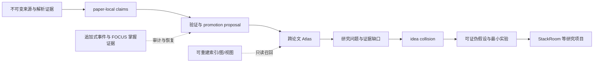
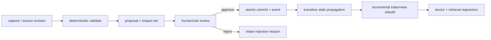

# FOCUS 研究知识系统：文件目录协议、记忆、索引与知识编译机制

> 调研日期：2026-08-12
> 目标领域：芯片架构、3D 堆叠架构、数据流编译器，以及三者的软硬件协同研究
> 目标：在长期、大规模论文积累下，持续形成可追溯的跨论文理解、研究问题、idea 碰撞和可证伪实验
> 证据边界：外部项目结论来自官方 GitHub 仓库、README、release、license 或第一方文档；GitHub star 只表示关注度，不作为正确性或成熟度证据
> 决策状态：架构方案已收敛，可进入小规模 tracer-bullet 试点；尚未授权实施
> 本文只做调研与方案设计；没有创建知识目录、脚本、索引、插件、数据库或自动化

## 1. 结论先行

最终目标不应是“一个 Obsidian Vault”，而应是 **一个前端无关、文件原生、可验证和可恢复的 FOCUS 研究知识系统**。Obsidian、Web、CLI、MCP、QMD 或其他工具都只是可替换客户端。

推荐方案可概括为：

> **一个工作区，四类持久层，五类记忆，七类研究对象，一条受控知识编译循环。**

- **一个工作区**：继续以现有 `knowledge-base/` 为根，不再建立平行论文库或第二套学习状态。
- **四类持久层**：不可变来源与证据、可审查的权威知识对象、追加式事件与认知证据、可删除重建的索引/视图。
- **五类记忆**：来源记忆、科学语义记忆、学习者认知记忆、操作记忆、派生检索记忆；它们的权威性和失效条件不同。
- **七类研究对象**：Paper、Claim、Concept、Synthesis、Question、Idea、Project/Experiment；不能都写成无类型“笔记”。
- **一条编译循环**：`capture → validate → propose → review/promote → commit → invalidate → reindex → evaluate`。

核心数据流是：



最重要的架构判断是：

1. **普通文件是规范数据，数据库是派生加速器。** Markdown/YAML/JSONL/PDF 脱离任何产品仍可读、可审计、可恢复；SQLite、FTS、向量和图缓存可以整目录删除后重建。
2. **FOCUS 继续掌管来源、学习状态和掌握证据。** Atlas 不重新解释 `mastered`，也不把导读、模型记忆或检索命中升级成论文事实。
3. **LLM 负责知识维护劳动，不拥有科学真相的无门槛写权限。** 它可以生成 proposal、影响集、差异和 lint 建议；跨论文综合、概念合并、矛盾处理、idea 晋升必须留下明确审查记录。
4. **检索不是记忆本体。** exact/BM25/vector/rerank 只负责发现候选；能够被搜索到不等于证据成立、用户掌握或 idea 新颖。
5. **高层思维结构要保存为可审计的 argument trace，而非不可核验的自由式思维链。** 每一步都回到 source claim、researcher inference、假设或实验结果。

## 2. 设计边界与评价标准

### 2.1 本系统要解决什么

- 从广泛论文发现逐步收敛到少量高价值深读对象；
- 保存论文原始主张、导读解释、个人掌握和研究推断之间的边界；
- 跨论文组织概念、机制、设计权衡、矛盾、负面结果和证据缺口；
- 围绕一个方向形成高层地图，并从地图中生成可证伪的研究 idea；
- 在数百论文、数千知识对象后仍能定位、更新、审计、迁移和恢复；
- 允许不同 Agent、编辑器和查看器共享同一个可执行协议。

### 2.2 本系统不是什么

- 不是把 PDF 全部切块后聊天的一体化 RAG 产品；
- 不是用文件夹树强行表达学术本体；
- 不是把所有对话摘要自动写回的 Agent memory；
- 不是依赖 Obsidian wikilink、Canvas 坐标或某个插件才能读取的数据格式；
- 不是保存模型私有 chain-of-thought 的仓库；
- 不是“库里没找到就代表新颖”的 novelty 判断器。

### 2.3 审计项目时使用的九个维度

1. canonical storage 在哪里；
2. memory 的含义、作用域和生命周期；
3. exact、全文、向量和图索引如何组合；
4. 链接是否稳定、typed、可追溯；
5. source 变化后如何增量更新和传播失效；
6. 是否有 review、revision、history、migration 与恢复；
7. 是否有 status、doctor、lint、eval 和失败队列；
8. 是否可本地运行、导出和替换前端；
9. 哪些能力适合 clean-room 吸收，哪些会破坏 FOCUS 权威边界。

## 3. 当前 FOCUS 已经提供的可靠内核

### 3.1 现有权威边界

当前 [README](../README.md)、[artifact contracts](../.agents/skills/ask-paper/references/artifact-contracts.md) 和 [state machine](../.agents/skills/ask-paper/references/state-machine.md) 已经提供：

- `research-corpus/<paper>/source.pdf`、解析文本、metadata、source map 和校验报告；
- 来源 SHA、稳定 paper/node/claim 身份与精确 source anchor；
- `paper.yaml` 作为单篇论文唯一可变的路由/状态快照；
- claim map、knowledge DAG/tree projection 和 reading plan；
- 锁、revision 检查、原子事务、追加式事件/回答/答辩/证据账本；
- 可从证据重建的 cognitive profile；
- `provisional` 与 `mastered` 的证据门，不用“感觉懂了”代替可观察/迁移证据。

因此，新增知识系统不能复制 `paper.yaml`、claim map 或 mastery state。它只能消费这些已提交 revision，并把跨论文产物写到新的、受控的 Atlas 层。

### 3.2 当前实例的状态边界

截至本次调研，FlexSA 仍为 `guide/awaiting-user`，阅读计划为第 2 版，八个节点均为 `planned`。已有导读和知识图不代表已经掌握。本次只更新研究设计文档，没有推进该学习状态。

### 3.3 需要补齐的能力

FOCUS 的单论文证据和学习闭环已经较强，缺口主要在：

- 主题级 paper landscape 与筛选 frontier；
- 跨论文 canonical concepts、mechanisms 和 syntheses；
- 关系的时效、矛盾、反证和影响传播；
- question → idea → experiment → project 的可审计链；
- 大规模 exact/full-text/typed/hybrid 检索；
- Atlas 的 review queue、schema migration、doctor 和 retrieval regression。

## 4. GitHub LLM Wiki 与成熟知识/记忆项目调研

### 4.1 Karpathy 原始模式：方向正确，但只是模式

[Karpathy 的 LLM Wiki Gist](https://gist.github.com/karpathy/442a6bf555914893e9891c11519de94f) 明确提出：不可变 raw sources、由 LLM 维护的互链 wiki、规定结构和工作流的 schema，以及 ingest/query/lint、内容索引和追加日志。Obsidian 在原文中只是 IDE；wiki 才是持久产物。

可直接采用：

- raw 与 compiled knowledge 分离；
- 把跨来源综合持久化，而不是每次查询从 chunks 重做；
- ingest/query/lint 形成维护循环；
- index 负责内容入口，log 负责时间线；
- 人负责来源、研究方向和判断，Agent 负责交叉引用与维护劳动。

必须补强：

- prose schema 不能只靠 prompt 遵守，需要机器验证；
- query 结果不能直接写回为新真相；
- 缺少事务、revision、精确失效、review queue 和 retrieval eval；
- “LLM 拥有 wiki”不适合掌握证据、概念合并和科学结论升级。

### 4.2 直接实现项目矩阵

| 项目 | 已核验的长处 | 不适合直接移植的部分 | 对 FOCUS 的结论 |
|---|---|---|---|
| [atomicstrata/llm-wiki-compiler](https://github.com/atomicstrata/llm-wiki-compiler) | typed pages、claim/段落引用、lifecycle profile、runtime trust gates、review queue、fresh/stale/orphan 状态、增量 refresh、lint/eval、OKF/JSON-LD/GraphML 等导出 | 项目 README 仍称 early software；引入整套 compiler/profile 会形成第二运行时和第二状态机 | **核心机制首要参考**：吸收证据级引用、生命周期门、review-first、freshness、health eval 与可移植导出，不依赖其 runtime |
| [zosmaai/pi-llm-wiki](https://github.com/zosmaai/pi-llm-wiki) | immutable source packet、标准 Markdown/OKF、稳定 source citation、权威事件与可重建 registry/backlink/index/log 分离、search-before-create、lint、project/personal recall | 主体验绑定 Pi；个人与项目 memory 若自动合并会污染作用域；事件流不能与 FOCUS 账本并列为第二权威 | **文件层设计首要参考**：吸收 source packet、确定性投影、portable links 和 stale lint，复用 FOCUS 事件内核 |
| [JanYork/llm-wiki-cli](https://github.com/JanYork/llm-wiki-cli) | SQLite 事务/WAL/migration、不可变 source revisions、CJK+Latin FTS5/BM25、分层 span recall、stale span fail-closed、changeset/checkpoint、project/global scope、结构边与语义边分离 | SQLite 是唯一权威，Markdown 只是 projection；这与“文件目录即规范数据”和现有 FOCUS 文件权威冲突 | **事务与索引参考，不作底座**：吸收 stale locator、scope、migration 和 fail-closed 语义 |
| [ZeroDot1/LLMWikiNG](https://github.com/ZeroDot1/LLMWikiNG) | raw/wiki/config 三层、SQLite FTS5 分片、file watcher、页面版本、审计日志、备份、Web 图和管理面 | 单体产品、容器/权限/自更新复杂；claim-level provenance 较弱；其 UI 和数据库会扩大核心边界 | **仅作产品运维对照**：借鉴 watcher、备份、审计和增量同步状态 |
| [BackendGameSetMatch/sourcebook](https://github.com/BackendGameSetMatch/sourcebook) | Markdown+Git、schema validation、source hash、stale/contradiction lint、bounded context、每次变更有归因 | 项目早期、无认证、fan-out ingest 非原子、关键词检索和规模证据有限 | **维护机制参考**：吸收 reader-driven verification、`last_verified`、幂等 ingest；不部署其服务 |
| [andresbuonaiuto/cerebro](https://github.com/andresbuonaiuto/cerebro) | source note → concept/entity/synthesis；矛盾不静默覆盖；idea validation 使用 Supports / Contradicts / Not covered / Verdict | 更接近 blueprint/templates，更新和 lint 多依赖 prompt，缺少强事务与增量失效 | **研究语义参考**：将反证、未知和未覆盖证据纳入 idea gate |
| `Ss1024sS/LLM-wiki` | 历史缓存曾展示 `raw → wiki → code`、manifest、delta/stale/provenance 思想 | 2026-08-12 仓库/API 已返回 404，缓存版本信息相互冲突 | **排除当前依赖和事实引用**；不可验证项目不能作为实现基础 |

直接实现中，没有一个项目应被原样安装为 FOCUS 核心。最值得组合的是：

> `pi-llm-wiki` 的文件/事件/派生层分界 + `llm-wiki-compiler` 的证据、生命周期、freshness 和 eval + LWC 的事务、作用域和 stale-locator 语义 + Cerebro 的反证式 idea rubric。

### 4.3 本地检索项目：QMD

[QMD](https://github.com/tobi/qmd) 将原 Markdown 保持为真相，SQLite/FTS/vector/LLM cache 作为本地索引；提供 BM25、vector、hybrid+rerank、MCP、`status`、`doctor`、score explanation 和自定义 benchmark fixture。它还记录内容 hash、embedding fingerprint、chunk 位置，并能按 path/docid/line 返回正文。

适合吸收：

- 文件为真、索引可删除重建；
- BM25 与 vector 分开评测，再做融合；
- 搜索结果返回路径、行号、docid 和评分解释；
- `status/doctor/cleanup/bench` 是索引的必要运维面；
- embedding/chunker/model fingerprint 不同的索引不能静默混用。

不能由 QMD 负责：typed relation、source revision、claim provenance、mastery、promotion 或知识对象 lifecycle。它最多是后续可选的只读索引后端。

### 4.4 Agent memory 与 temporal knowledge graph

| 项目 | 值得借鉴 | 风险与 FOCUS 边界 |
|---|---|---|
| [Graphiti](https://github.com/getzep/graphiti) | episode 保留原始来源；fact 有 validity window；旧事实被 invalidated 而非删除；增量图；semantic+BM25+graph hybrid retrieval | 自动 entity/fact 抽取不是科学证据；需要外部 graph backend 和自建治理。只吸收时态、episode provenance 和 supersede 模型 |
| [Cognee](https://github.com/topoteretes/cognee) | pipeline 状态、增量 ingestion、relational/vector/graph 组合、traceability 和本地部署 | 多数据库运维过重；自动 ontology/graph 可能把模型推断真相化。仅参考 pipeline 状态与显式 rerun |
| [Mem0](https://github.com/mem0ai/mem0) | user/agent/run scope、显式 add/search/update/delete/history | 从对话压缩出的 memory 不可成为论文事实；history 不是 source provenance。只用于低风险 operational memory |
| [Letta](https://github.com/letta-ai/letta) / [Letta Code](https://github.com/letta-ai/letta-code) | stateful context、memory blocks/MemFS、Git audit、bounded context 和 doctor | Agent 自改 memory/prompt/skills 适合代理连续性，不适合科学知识权威。只能借鉴 context tier 与审计 |

最有价值的 Graphiti 思想不是“上图数据库”，而是：**新事实出现时保留旧事实及其有效期，所有派生关系仍可追到原始 episode。** 对论文知识的映射是：source revision、claim validity、supersedes、contradicts 和 `as_of`，而不是自动建一个不可解释的大图。

### 4.5 产品化知识/RAG 系统

| 产品/项目 | 成熟产品能力 | 可借鉴点 | 为什么不作 canonical store |
|---|---|---|---|
| [Khoj](https://github.com/khoj-ai/khoj) | 多文档类型、本地/云模型、语义搜索、Desktop/Obsidian/Web 客户端、自动同步 | 多前端访问、文件同步、私有自托管 | 产品 DB/embedding 是派生状态；缺少 FOCUS 的 typed relation、source revision 和 mastery contract |
| [AnythingLLM](https://github.com/Mintplex-Labs/anything-llm) | 本地优先、文档管线、引用、workspace memory、multi-user、agent 和多种模型/vector DB | 低摩擦 ingestion、workspace UX、权限与来源展示 | workspace/global memory 偏聊天抽取；应用数据库和 chunks 不构成可移植学术知识协议 |
| [Onyx](https://github.com/onyx-dot-app/onyx) | 50+ connectors、keyword+vector、后台同步 worker、暂停/重试/全量重建、失败历史、RBAC/审计 | **最佳运维参考**：connector state、attempt ledger、retry/pause/reindex、同步健康 | 个人研究使用完整企业服务栈过重；外部连接器和索引产品不表达学习/科学证据语义 |
| [Onyx Agent Wiki](https://github.com/onyx-dot-app/agent-wiki) | Markdown+filesystem+Git、路径继承策略、trigger/event、agent/API/人工更新 | 文件/Git、作用域策略、事件驱动维护 | 自然语言 auto-update policy 不能决定科学真相；Elastic License 2.0 是 source-available，不能笼统称为 OSI 开源 |

这些成熟产品的价值主要在 **摄取、同步、权限、失败重试和用户界面**，不是知识真相模型。未来即使使用其中任一产品，也应以只读方式索引规范目录，并把其数据库/cache 放在派生边界之外。

## 5. 横向提炼：哪些机制真正匹配 FOCUS

| 方面 | 采用的机制 | 拒绝的做法 |
|---|---|---|
| 记忆 | 五类记忆分型；project/global scope；事件可回放；旧事实 supersede 而非删除 | 将聊天摘要、Agent 自我记忆、embedding chunk 当科学知识 |
| 索引 | exact registry → metadata filter → BM25 → typed traversal → optional vector/rerank；全部可重建、有 fingerprint 和 benchmark | 向量优先；索引数据库成为唯一真相；不同模型索引静默混用 |
| 链接 | 稳定 ID、标准 Markdown 相对链接、typed relation、source anchor、alias/redirect | 以路径/标题为身份；bare wikilink 猜测；把 backlink 或相似度当语义边 |
| 更新 | hash/revision 驱动 impact set；proposal/review；stale propagation；原子 commit；增量重建 | file watcher 直接重写知识；LLM 通过自然语言策略判断“已更新” |
| 管理 | schema migration、locks、attempt ledger、status/doctor/lint/eval、失败队列、备份与全量重建演练 | 只有成功日志；把 Git commit 当业务 revision；全库无界自动写 |
| 研究判断 | Supports / Contradicts / Not covered；claim、inference、mastery、idea 分离；可证伪 gate | 用一个 confidence 数字压缩新颖性、证据、成熟度和个人理解 |

## 6. 推荐的逻辑架构

### 6.1 四类持久层

| 层 | 典型格式 | 权威性 | 修改机制 |
|---|---|---|---|
| Source & Evidence | PDF、图片、解析 Markdown、YAML source map/claim map、证据 JSONL | 论文来源与学习证据权威 | 只由 FOCUS ingest/reader/grill 的受控事务写入；旧版本保留 |
| Canonical Knowledge | Markdown + YAML frontmatter；少量 schema/alias/redirect YAML | 跨论文语义对象权威 | proposal → validate → review/promote → atomic commit |
| Event & Operational State | append-only JSONL/YAML event、route/frontier、transaction record | 变更历史和恢复权威；工作状态可撤销 | 稳定 event ID、幂等、revision lock、事务写入 |
| Derived Retrieval & Views | SQLite FTS、vectors、graph adjacency、generated MOC、HTML/Obsidian adapter | **无权威性** | 消费 committed revision；可整目录删除重建 |

Git 用于 diff、review、备份和回滚，但不能代替 object revision、event ledger、schema migration 或 exactly-once 语义。

### 6.2 五类记忆

| 记忆类型 | 保存什么 | 不保存什么 | 失效/保留规则 |
|---|---|---|---|
| 来源记忆 | 原始论文、版本、解析产物、author claims、reported evidence | 跨论文猜测和个人理解 | source SHA/parser 改变时重新验证；旧 revision 永久可追溯 |
| 科学语义记忆 | concept、mechanism、synthesis、question、idea、experiment | 无 source/inference 标记的陈述 | 依赖 claim/revision 变化时标 stale；不得自动覆盖 |
| 学习者认知记忆 | 原回答、rubric、mastery contract、transfer/defense evidence、remediation | “模型认为用户懂了” | 追加式证据为真；source/map/contract revision 变化时精确 stale |
| 操作记忆 | 当前 focus、resume pointer、review queue、最近任务、可撤销偏好 | 科学结论和 mastery | TTL、任务结束或 supersede；按 workspace/project 隔离 |
| 派生检索记忆 | FTS、embedding、rerank cache、自动图、generated views | 任何不可从前三类恢复的唯一信息 | 输入 hash/schema/parser/model fingerprint 改变即增量或全量重建 |

这五类记忆应至少在 schema 和目录边界上分开。结论必须始终成立：

> 检索到了 ≠ 来源支持；模型记住了 ≠ 用户掌握；图中有边 ≠ 科学关系已验证。

## 7. 推荐的物理目录协议

以下是目标布局，不是本次已经创建的目录。它在不破坏当前 FOCUS 路径的前提下扩展 `atlas/` 与派生索引；不建议现在把 `.paper-companion` 重命名为新的控制目录。

```text
knowledge-base/
├── workspace.yaml                         # 现有 FOCUS workspace authority
├── reading-registry.yaml                  # 现有论文 registry
├── research-corpus/                       # 现有来源、paper-local claims/DAG/plan/evidence
├── cognitive-profile/                     # 现有可重建认知投影与证据入口
├── atlas/                                 # 新增：前端无关的跨论文 canonical knowledge
│   ├── 00-system/
│   │   ├── schema.yaml                    # object/field/relation/lifecycle contract
│   │   ├── aliases.yaml                   # 受控缩写和中英文别名；解决歧义
│   │   ├── redirects.yaml                 # merge/rename tombstone，不静默删 ID
│   │   ├── policies.md                    # promotion、merge、stale、archive 规则
│   │   └── migrations/                    # versioned migration declarations
│   ├── 10-maps/                           # 人维护的 landscape/problem/evidence/frontier maps
│   ├── 20-objects/
│   │   ├── papers/                        # FOCUS paper projection，不复制全文
│   │   ├── claims/                        # 只提升高复用 paper-local claims
│   │   ├── concepts/                      # canonical terminology/mechanism
│   │   ├── syntheses/                     # 跨来源综合、争议和边界
│   │   └── questions/                     # evidence gap 与关闭条件
│   ├── 30-ideas/                          # hypothesis、falsifier、novelty/evidence state
│   ├── 40-projects/                       # StackRoom 等消费视图，只链接 canonical IDs
│   └── 90-archive/                        # retired/superseded 的可读归档，不删除历史
└── .paper-companion/                      # 继续作为统一控制与机器产物边界
    ├── routes/ locks/ transactions/ runs/ migrations/   # 现有
    ├── review/atlas/                      # 未来：promotion/merge proposals
    └── indexes/atlas/                     # 未来：可删除重建
        ├── manifest.json                  # corpus/schema/parser/model fingerprints
        ├── registry.json                  # ID/path/title/alias 投影
        ├── search.sqlite                  # metadata + FTS5/BM25
        ├── graph.json                     # typed adjacency projection
        ├── vectors/                       # 可选，不是第一阶段必需
        └── eval/                          # retrieval fixtures 与结果
```

设计理由：

- canonical Atlas 对象放在可读、可 diff 的普通目录；
- 审查候选和运行产物不混进长期知识；
- 所有索引放在明显可丢弃的机器边界；
- 项目不复制论文摘要，而是引用稳定 paper/concept/question/idea ID；
- 目录层级只负责地址和所有权，不表达唯一学术分类。

## 8. 对象、身份和关系协议

### 8.1 七类对象

| 类型 | 作用 | 进入条件 |
|---|---|---|
| Paper | 来源身份、版本、FOCUS 状态和 artifact 入口 | FOCUS 已认领并通过 ingest validation |
| Claim | 论文在一个 source revision 下的主张、证据、假设、限制或 open question | 跨论文会被复用；有 paper-local claim ID 和 source anchor |
| Concept | 稳定术语、机制或设计轴 | 搜索既有 alias 后仍需要独立 canonical identity |
| Synthesis | 多来源比较、因果机制、权衡、争议或 `as_of` 结论 | 至少有来源集、支持/反驳/未覆盖和适用边界 |
| Question | 尚未关闭的研究问题和 evidence gap | 写明重要性、缺失证据和关闭/改写条件 |
| Idea | 新机制假设和预测 | provenance、transfer risk、falsifier、最小实验完整 |
| Project/Experiment | 实施、实验和论文输出视图 | 引用 canonical IDs；不复制知识真相 |

### 8.2 稳定身份

- 复用现有 `paper_id`、paper-local `claim.*` 和 `node.*`；不建立第二套 paper identity。
- Atlas 对象使用短、无语义漂移的 ID，例如 `C-000123.md`、`S-000041.md`、`Q-000017.md`、`I-000009.md`。
- 文件名只承载稳定 ID；可读 title、中文名、英文名和 acronym 放在 frontmatter。
- title、目录位置和 UI 可以改变，ID 不变；merge 后旧 ID 进入 redirect/tombstone。
- 完整论文题名只属于 metadata，不进入深层路径。
- 所有机器引用以 ID 为主，标准 Markdown 相对链接用于人类浏览；不依赖 Obsidian `[[shortest path]]` 猜测。

### 8.3 标准对象头

规范格式使用标准 YAML frontmatter 和 Markdown 正文，不受 Obsidian flat-properties 限制。示意：

```yaml
---
schema_version: 1
id: S-000041
type: synthesis
title: 3D bandwidth relief can move the bottleneck into thermal-constrained scheduling
aliases:
  - 3D 带宽—热调度转移
status: active
as_of: 2026-08-12
source_refs:
  - paper:flexsa#claim.12@sha256:...
  - paper:other#claim.07@sha256:...
relations:
  - predicate: supports
    to: Q-000017
    evidence_refs: [paper:flexsa#claim.12]
    origin: researcher-inference
    status: reviewed
revision: 3
---
```

嵌套 relation 可以保持 predicate、目标、证据、origin 和 review state 在一起；若未来 Obsidian 需要 flat properties，由 adapter 生成只读投影，不反向限制 canonical schema。

### 8.4 边的分级

- **结构边**：`paper_has_claim`、`idea_tests_question`、`experiment_tests_idea`，可由确定性规则生成。
- **来源边**：`derived_from`、`reported_by`，必须回到 source anchor/revision。
- **语义边**：`supports`、`contradicts`、`extends`、`requires`、`trades_off_with`、`limited_by`、`applies_to`，必须有 origin 和证据。
- **探索边**：LLM/向量发现的潜在关系，只能是 `proposed`，不能进入 verified graph。

长期不使用含义不明的 `related` 作为主要边。自动图只能发现候选，不能解锁 `mastered`、覆盖 author claim 或决定研究结论。

## 9. 索引和检索协议

### 9.1 分级检索顺序

```text
L0  stable ID / alias / redirect registry
L1  type + domain + status + source revision metadata filter
L2  local FTS5/BM25 full-text search
L3  bounded typed-relation traversal
L4  optional local vector recall
L5  optional rerank / query expansion
```

默认只实现到 L3。L4/L5 只有在真实 benchmark 表明 exact+BM25+typed traversal 的 Recall@k 不足时才启用。

### 9.2 为什么 BM25 应先于向量

芯片架构论文中有大量精确术语、缩写、指标、workload、架构名和 figure/table 引用，lexical search 的可解释性很重要。向量适合召回措辞不同但语义相近的候选，却容易混淆：

- 论文主张与导读解释；
- 相似机制与真正依赖；
- 相关工作与反证；
- 已掌握内容与只是出现过的内容。

因此向量只能扩召回，不能生成 canonical link 或支持关系。

### 9.3 索引 manifest

每次构建至少记录：

- committed corpus revision/watermark；
- 每个文件的 content hash 与 object revision；
- schema、parser、normalizer、chunker 版本；
- embedding/reranker 模型和参数 fingerprint（若启用）；
- indexed/updated/unchanged/removed/tombstoned/failed 数量；
- last successful build、失败队列和重建原因。

任何 fingerprint 不一致都应标为 stale 或创建新 index generation，不能静默混合。

### 9.4 查询返回的是 evidence packet

查询不能只返回生成答案，至少返回：

- stable object ID、type、title、path；
- source/claim anchor 与 revision；
- 命中的段落/行号；
- retrieval stage 与 score/explanation；
- typed relation path；
- freshness/review/mastery 三种独立状态；
- 未覆盖、矛盾和低置信召回。

如果检索低于阈值，应明确报告“无足够证据”，不能把一次无来源回答写回 Atlas。

## 10. 增量更新、失效和知识编译协议

### 10.1 更新状态机



### 10.2 内容依赖驱动，而不是 mtime 驱动

当 source、claim、schema 或对象 revision 变化时：

1. 比较稳定 ID、content hash 和 dependency revision；
2. 通过 reverse-dependency index 计算 impact set；
3. 先把受影响 synthesis/question/idea 标为 `stale` 或 `review_due`；
4. 在隔离 run 中生成修复 proposal 和差异；
5. 通过 schema/provenance/relation/lifecycle 验证；
6. 审查后用 event ID、expected revision 和锁做原子 commit；
7. 只重建 touched objects 的派生索引；
8. 运行 doctor 与预置 retrieval regression；
9. 保存成功或失败 attempt，不把“启动过”当成功。

旧 source revision、旧 relation 和旧 synthesis 不物理删除；使用 `valid_to`、`superseded_by` 或 archive 保留历史语义。

### 10.3 promotion gate

建议两个论文级 promotion 时点：

- **Guide validated**：允许创建 Paper projection 和少量高复用 Claim proposal；个人 mastery 仍显示 planned/provisional。
- **Reader/defense evidence updated**：更新认知投影，并允许个人解释成为 Synthesis proposal；不会改变原论文 claim 的科学可信度。

任何 query、对话摘要、Canvas 卡片或 Agent memory 都只能先进入 inbox/proposal。没有 source/inference 标记、对象类型和审查结果，不得成为 canonical knowledge。

### 10.4 概念合并与重命名

- create 前必须查 registry、aliases、redirects 和 exact/BM25；
- merge 先生成受影响对象、链接和查询的预览；
- 旧 ID 写 tombstone，历史 relation 和 project link 仍可解析；
- migration 有 schema version、前置版本、幂等 ID 和验证结果；
- 不用手工全局替换后假设所有链接成功。

## 11. 面向 FOCUS 的实际使用机制

### 11.1 主题 frontier：广度与深度分开

每个研究方向先建立 Theme Map，包含：范围、canonical terms、设计轴、关键论文族、争议、5–10 个 open questions 和当前筛选标准。

论文覆盖状态独立记录：

```text
discovered → screened → mapped → deep-read → defended
```

- 大规模搜索结果保留在可再生 run/evidence，不为每条命中建页面；
- 只有进入 frontier 的候选才成为轻量记录；
- 只有认领论文才进入 FOCUS；
- `deep-read/defended` 表示阅读深度，不表示论文结论已复现或已被学界确认。

### 11.2 单论文学习

沿用 FOCUS：ingest → guide → 依赖有序 reader → checkpoint → grill/remediation。Atlas 不旁路这条流程，也不从 PDF 自动生成“已掌握概念”。

### 11.3 跨论文编译

在 promotion checkpoint：

1. 从 paper-local claims 产生候选；
2. search-before-create，优先更新既有 Concept/Synthesis；
3. 显式列出 Supports、Contradicts、Not covered、boundary 和 `as_of`；
4. 建立或更新 Question；
5. 提交 proposal、影响集和 lint 结果；
6. 通过后写 canonical object/event，再更新派生索引。

### 11.4 高层地图

每个主题维护四种人可读入口：

1. **Landscape Map**：论文族、术语和研究边界；
2. **Problem–Mechanism Map**：瓶颈 → 约束 → 机制 → 指标 → 代价；
3. **Evidence/Dispute Map**：支持、矛盾、适用条件和负面结果；
4. **Frontier/Idea Map**：open questions、evidence gaps、idea 和实验状态。

Map 是策展入口，不是自动全图截图。它引用 canonical IDs；可从 registry/relations 生成部分视图，但研究主线与取舍由人维护。

### 11.5 “思维链”的持久化边界

不保存不可审计的自由式 chain-of-thought。保存以下 argument/decision trace：

```text
source claim A + source claim B/negative result
→ 明确共同假设、冲突或 transfer boundary
→ problem / design tension / evidence gap
→ researcher-inference mechanism
→ 可证伪 prediction
→ 最小 experiment、metric 和 rejection criterion
→ observed result 与 decision
```

每一步标注 `source-asserted`、`guide-inference`、`researcher-inference`、`user-hypothesis` 或 `observed-evidence`。这既支持 idea 碰撞，也避免把模型推理过程伪装成事实。

### 11.6 Idea collision

一次 collision 围绕一个 Question，在有限 frontier 内选 2–4 条 claims，至少包含一条 limitation、negative result 或反例，并跨至少三个设计轴：

| 设计轴 | 典型对象 |
|---|---|
| workload/operator | attention、MoE、sparse/dense GEMM、training/inference |
| architecture/dataflow | array partition、mapping、pipeline、morphing、dataflow switching |
| 3D physical stack | die partition、TSV/hybrid bonding、thermal、power delivery、yield |
| memory/interconnect | SRAM/HBM、NoC/NoP、inter-die bandwidth、coherence |
| compiler/control | IR contract、placement/scheduling、runtime policy、reconfiguration safety |
| evaluation | latency、energy、utilization、area、thermal/SLO、correctness |

idea 只有在问题、机制、证据链、边界、可推翻预测和最小实验完整后，才从 `spark` 进入 `candidate`。`maturity`、`novelty_status`、`evidence_status`、`mastery_status` 四轴分开，不能压成一个 confidence 数字。

### 11.7 Idea 生命周期

```text
spark → candidate → challenged → scoped → experiment-ready
      ↘ retired       ↘ blocked
experiment-ready → supported | refuted | inconclusive
```

- prior-art 未检查时 `novelty_status=unknown`；
- 被证伪的 idea 保留反证和决策，不从系统删除；
- experiment result 不能因“效果不理想”被改写成只有成功路线；
- Project 只消费 Idea/Experiment 和 canonical knowledge，不反向复制为第二套知识库。

## 12. 管理、健康检查与恢复

### 12.1 `status`

面向人快速显示：

- 当前 theme/paper/project frontier；
- review/stale/failed 队列数量和最老等待时间；
- 最近 committed revision/event；
- index generation、水位和最后成功构建；
- 只给一个明确 next action。

### 12.2 `doctor/lint`

至少检查：

1. schema/version 不兼容、缺失或重复 ID；
2. broken links、ambiguous aliases、redirect loop、orphan objects；
3. unknown/untyped relation、缺 evidence_refs、origin 不合法；
4. source anchor 不可解析、source SHA 或 dependency revision 不一致；
5. hard-dependency cycle、未完成的 stale propagation；
6. mastery contract/evidence/source-map revision 不一致；
7. event ID 重复、object revision 与 event ledger 不一致、投影不可重建；
8. index manifest/fingerprint/watermark 不一致、missing chunks、tombstone 未清理；
9. 失败队列积压、长期无 review 的 synthesis/idea；
10. 查询回归中的 Recall@k、MRR、source-anchor accuracy、stale-result rate 退化。

### 12.3 可观测更新任务

借鉴 Onyx 的管理语义，每个 ingest/index/compile/migration 有：

```text
pending → running → succeeded
                  ↘ failed → retrying
pending/running → paused → resumed
```

记录 attempt、输入/输出 revision、last error、开始/结束时间和是否需要全量重建。超时、启动进程或产生部分文件都不等于成功。

### 12.4 备份与恢复

- canonical files、event ledgers 和 source artifacts 纳入 Git/备份；
- locks、cache、vectors 和 search DB 不作为唯一备份；
- 定期演练：删除 derived index 后重建；从 event/evidence 重建 projection；恢复中断 transaction；
- 导出优先选择标准 Markdown/YAML/JSONL，必要时再生成 OKF/JSON-LD/GraphML 等交换格式。

## 13. StackRoom 案例对方案的反向约束

对 [StackRoom](https://github.com/kongxiangcong/StackRoom) commit `04bbb9c1b93cbfb8901b3232a354eb7bd055e2fc` 的只读核验显示：

- 主题、phase、collision、失败记录和实验 stop record 有很高长期价值；
- Git tree 有 362 个文件、83 个 Markdown、最深相对层级 7；
- 多层 run/provider/fulltext 与完整论文题名叠加，当前 Windows checkout 出现 `Filename too long`；Git 报告的长路径中至少 10 个达到 180 字符、8 个达到 220 字符，最长显示 290。

因此本方案明确：

- 保留 phase 历史、失败证据、rejected idea 和决策；
- 机器搜索结果/provider fulltext 留在 run/evidence，不提升为每条一个知识对象；
- 新对象用短 ID 和浅目录，完整题名只放 metadata；
- StackRoom 作为 Project/Experiment consumer，链接 paper/concept/question/idea IDs；
- 不把项目目录原样当 Atlas，也不把 Atlas 内容复制回每个项目。

## 14. 大规模故障模式与预防

| 故障模式 | 规模化表现 | 预防机制 |
|---|---|---|
| 路径/标题即身份 | rename/move 后日志、YAML、外部工具失联 | 稳定 ID filename；title 可变；redirect/tombstone |
| 同义词和 acronym 冲突 | `SA`、`mapping`、`stacking` 指向多个对象 | aliases registry；上下文限定；ambiguous alias lint |
| 纯文件夹树 | 跨 3D/架构/编译对象复制或频繁搬家 | 目录只寻址；typed graph 表达多归属 |
| backlink 毛线团 | 无法区分支持、反驳、先修和偶然提及 | typed relation + evidence；backlink 仅作发现候选 |
| 自动图真相化 | LLM 抽取错误关系后被下游反复引用 | 自动边只进 proposed；verified 边必须有 evidence/origin |
| tag explosion | 中英文、缩写、粒度产生数十种标签 | 学科语义使用 canonical objects；tag 仅保留低基数 workflow |
| 过度原子化 | 数万 claim 文件却没有可读综合 | paper-local claims 留在 YAML；只提升高复用 claim |
| stale synthesis | 新 source 反驳旧结论但旧页仍像真相 | dependency revision、reverse impact、validity window、review_due |
| Agent memory 污染 | 聊天摘要被当论文事实或个人掌握 | 五类记忆物理/语义分离；对话只进 proposal |
| 索引成为真相 | 数据库损坏或换模型后知识不可恢复 | derived 整目录可删；manifest/fingerprint；重建演练 |
| 实时 watcher 越权 | 文件变化触发无审查全库重写 | watcher 只生成 task/impact set，不直接 promote |
| 多 runtime 分叉 | FOCUS、wiki 工具、RAG 产品各有一套状态 | 单一文件协议；外部产品只读索引或 adapter |
| mastery 与真值混淆 | “我会解释”被当作论文正确 | source evidence、mastery、idea evidence 独立状态轴 |
| 项目复制知识 | 每个研究项目复制一套论文摘要 | Project 只引用 canonical IDs 与特有实验产物 |

## 15. 最小可行试点

主题选择“3D 堆叠 × 数据流/编译协同”，规模限制为：

- 1 个 Theme Map 和四种高层视图；
- 5–10 篇经 FOCUS 认领的论文；
- 10–30 个 canonical concepts/mechanisms/syntheses；
- 只提升真实跨论文复用的 claims；
- 3–5 个 research questions；
- 1 个完整 idea collision；
- 至少 1 个被 `refuted/retired` 的反例；
- 1 组 exact/BM25/typed retrieval fixtures。

试点通过标准：

1. 任一 synthesis/idea 可回溯到多篇 paper claims 和 source anchors；
2. 替换一个 source/解析 revision，只标记正确的依赖对象和 mastery contracts；
3. 删除 `indexes/atlas/` 后能完整重建 registry、FTS、graph view 和 health report；
4. benchmark 能解释检索失败属于未收录、未提升、alias、relation、BM25 还是 vector 问题；
5. concept rename/merge 后历史 ID、project link 和查询仍可解析；
6. broken link、duplicate alias、stale source、fingerprint drift 和中断事务均能被 doctor 检出；
7. idea 同时包含 negative evidence、transfer boundary、falsifier 和最小实验；
8. StackRoom 引用稳定 research IDs，而不是复制无法追踪的摘要。

## 16. 分阶段实施建议（本次未实施）

### 阶段 0：冻结协议

只确定 object types、ID、schema、relation vocabulary、memory scopes、promotion/merge/stale contract 和 path budget。不装产品，不批量迁移。

### 阶段 1：单主题 tracer bullet

手工可审查地打通 `FOCUS claim → Atlas synthesis → Question → Idea → Experiment/Project`，优先验证矛盾、失效、merge、refuted idea 和恢复路径。

### 阶段 2：确定性维护内核

实现 registry、proposal/review、event、impact set、stale propagation、doctor、migration 和 generated MOC。复用 FOCUS 锁、revision、事务与事件语义，不另造平行 runtime。

### 阶段 3：本地全文索引

实现或接入可删除的 SQLite FTS5/BM25，建立 query fixtures 和 regression。只有数据证明需要时，再试验 QMD 或等价 hybrid backend。

### 阶段 4：可选客户端

按需增加 Obsidian、Web、CLI/MCP 或只读 RAG adapter。每个客户端必须通过同一协议测试：不创建第二份身份、不越过 promotion gate、不把 cache 当真相。

## 17. 最终架构决策

采用以下不变式：

1. **文件目录和操作协议是系统本体，Obsidian/产品/数据库都是可替换客户端。**
2. **FOCUS 是来源、学习路由和掌握证据的唯一权威。**
3. **Atlas 是跨论文编译知识，不是第二份 paper truth。**
4. **Source、Claim、Synthesis、Question、Idea、Mastery 和 Project 分型。**
5. **Stable ID 决定身份；路径只负责寻址；typed relation 负责语义。**
6. **Semantic relation 必须有 origin、evidence、review state 和时间有效性。**
7. **查询结果先成为 evidence packet/proposal，不直接写回 canonical knowledge。**
8. **旧事实失效而不消失；source revision 变化精确传播 stale。**
9. **索引、embedding、图和视图均可删除重建，并有 manifest、doctor 和 regression。**
10. **操作记忆、Agent memory、科学证据和 learner cognition 不能相互替代。**
11. **idea 必须包含反证、边界、可证伪预测和最小实验；novelty 默认 unknown。**
12. **先证明单主题维护性和恢复性，再扩大规模或引入复杂产品。**
13. **短 ID、浅目录和 path budget 是跨平台协议的一部分。**

该方案保留了 Karpathy LLM Wiki 最有价值的“知识会编译和复利”的思想，同时用 FOCUS 已有的 source identity、DAG、掌握证据、锁、revision、追加账本和事务机制补齐其可靠性。它也吸收了成熟项目在检索、时态记忆、同步运维和健康检查上的经验，但不会把个人研究系统交给某个不可替换的 UI 或数据库。

## 18. 一手资料索引

### 原始模式与直接实现

- Andrej Karpathy: [LLM Wiki original Gist](https://gist.github.com/karpathy/442a6bf555914893e9891c11519de94f)
- atomicstrata: [llm-wiki-compiler](https://github.com/atomicstrata/llm-wiki-compiler)
- zosmaai: [pi-llm-wiki](https://github.com/zosmaai/pi-llm-wiki)
- JanYork: [llm-wiki-cli / LWC](https://github.com/JanYork/llm-wiki-cli)
- ZeroDot1: [LLMWikiNG](https://github.com/ZeroDot1/LLMWikiNG)
- BackendGameSetMatch: [sourcebook](https://github.com/BackendGameSetMatch/sourcebook)
- andresbuonaiuto: [cerebro](https://github.com/andresbuonaiuto/cerebro)

### 索引、记忆与知识图

- tobi: [QMD](https://github.com/tobi/qmd)
- getzep: [Graphiti](https://github.com/getzep/graphiti)
- topoteretes: [Cognee](https://github.com/topoteretes/cognee)
- mem0ai: [Mem0](https://github.com/mem0ai/mem0)
- letta-ai: [Letta](https://github.com/letta-ai/letta)、[Letta Code](https://github.com/letta-ai/letta-code)

### 产品化系统与案例

- Khoj: [khoj](https://github.com/khoj-ai/khoj)
- Mintplex Labs: [AnythingLLM](https://github.com/Mintplex-Labs/anything-llm)
- Onyx: [Onyx](https://github.com/onyx-dot-app/onyx)、[Agent Wiki](https://github.com/onyx-dot-app/agent-wiki)
- User case: [StackRoom](https://github.com/kongxiangcong/StackRoom)

### 方法论补充

- flomo: [用自己的话写卡片](https://help.flomoapp.com/method/use-card.html)、[连接知识](https://help.flomoapp.com/thinking/link.html)、[导出](https://help.flomoapp.com/basic/storage.html)
- Andy Matuschak: [Evergreen notes](https://notes.andymatuschak.org/About_these_notes)
- Zettelkasten.de: [Introduction](https://zettelkasten.de/introduction/)、[Identity](https://zettelkasten.de/posts/add-identity/)
- Johnny.Decimal: [Introduction](https://johnnydecimal.com/documentation/introduction)

flomo 在这里仅作为低摩擦捕捉、原子表达、稍后整理和主动回顾的方法参考；截至调研日没有核验到其官方开源仓库，因此未把它作为开源实现证据或 canonical store 候选。
